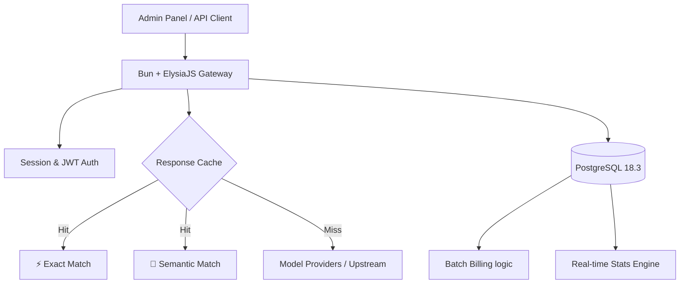
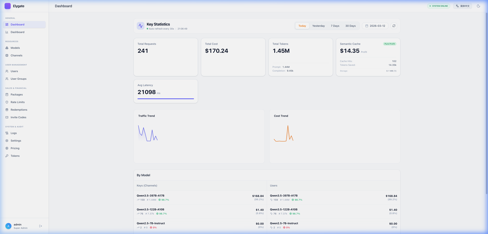
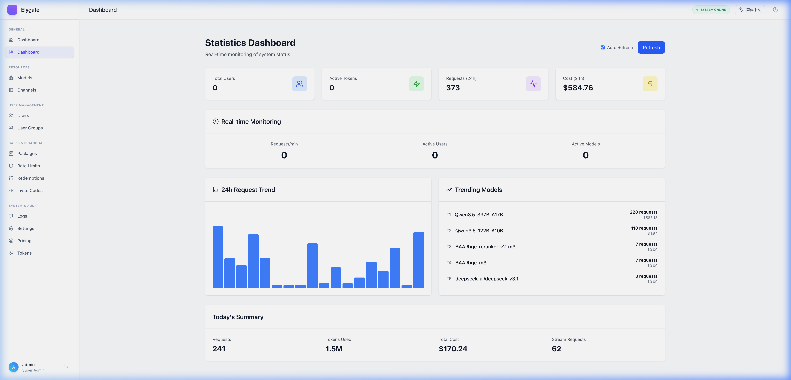
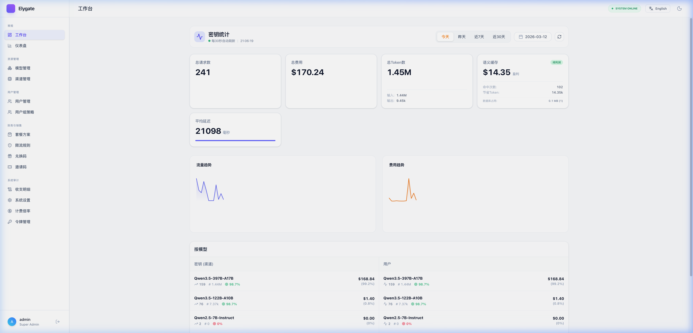
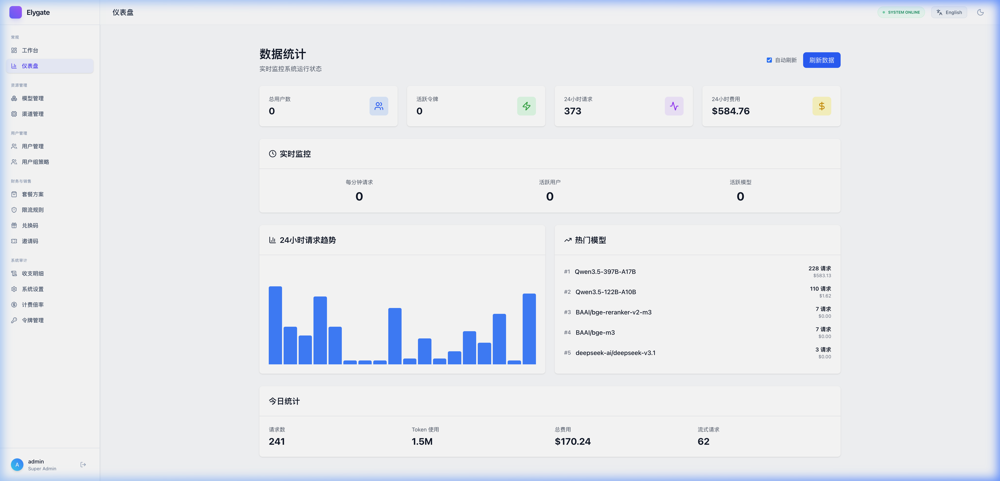

# Elygate 🚀

[English](#english) | [简体中文](#chinese)

---

<a name="english"></a>
## English

### ✨ Key Features

- **🚀 Extreme Performance**: Powered by Bun & ElysiaJS, delivering 3.6x more throughput than Gin (Go).
- **☁️ Redis-Free Architecture**: High-concurrency rate limiting and billing powered entirely by PostgreSQL 18.3, simplifying deployment.
- **🧠 Dual-Mode Semantic Cache**: Features both **Exact Match** (instant lightning hits ⚡) and **Vector Semantic Match** (intelligent breeze hits 🍃) to save costs and reduce latency.
- **🔐 Enterprise-Grade Security**: HttpOnly Cookie sessions, server-side session management, and CSRF/XSS protection by default.
- **💰 Robust Billing**: High-concurrency batch billing with support for dual-currency (USD/RMB) and dynamic price ratios.
- **📊 Professional Analytics**: Real-time monitoring, 24h trends, interactive charts, and detailed latency tracking.
- **🌍 I18n Ready**: Full multi-language support (English/Chinese) with automatic browser locale detection.

### 🏗️ Architecture Overview

Elygate is designed as a modern, unified gateway that consolidates billing, caching, and model management into a single high-performance engine.



---

### 📖 API Usage Guide

Elygate is fully compatible with both OpenAI and Anthropic API standards. You can use any library or tool designed for these services.




#### 1. OpenAI Compatibility (Default)
Most tools (NextChat, ChatBox, OpenAI SDK) work with the base URL.
- **Base URL**: `http://your-elygate/v1`
- **Key**: Your generated `sk-...` token.

#### 2. Anthropic (Claude) Compatibility
Works natively with the Anthropic SDK and **Claude Code**.
- **Base URL**: `http://your-elygate/v1` (Note: the SDK appends `/messages` automatically)
- **Key**: Your generated `sk-...` token.

**Anthropic SDK Example (Node.js):**
```javascript
import Anthropic from '@anthropic-ai/sdk';

const anthropic = new Anthropic({
  apiKey: 'your-sk-token',
  baseURL: 'http://your-elygate/v1' 
});

const msg = await anthropic.messages.create({
  model: "claude-3-5-sonnet-20240620",
  max_tokens: 1024,
  messages: [{ role: "user", content: "Hello, Claude" }],
});
```

#### 3. Using with Claude Code
```bash
export ANTHROPIC_BASE_URL=http://your-elygate/v1
export ANTHROPIC_API_KEY=your-sk-token
claude
```

#### 4. Using with OpenClaw
- **Provider**: Select `Anthropic (Messages API)`
- **Base URL**: `http://your-elygate/v1`
- **API Key**: `your-sk-token`

---

**High-performance AI Gateway. Build on Bun + PostgreSQL 18.**

### 📦 Quick Start (Docker Compose) - Recommended

Launch the entire stack (Database, Gateway, and Web UI) with one command.

#### 1. Configuration
```bash
git clone https://github.com/zuohuadong/elygate.git && cd elygate
cp .env.example .env
```

#### 2. Run (Pre-built Images)
By default, this pulls images from `ghcr.io`. 
*Note: If you are in Mainland China, see the Chinese README for mirror acceleration.*

```bash
# Download the lightweight production compose file
curl -O https://raw.githubusercontent.com/zuohuadong/elygate/main/docker-compose.prod.yml

# Check and restore "ghcr.io" if it was changed to a mirror
sed -i 's/ghcr.nju.edu.cn/ghcr.io/g' docker-compose.prod.yml

# Run the stack
docker compose -f docker-compose.prod.yml up -d
```

#### 3. Access
| Service | URL | Default Credentials |
| :--- | :--- | :--- |
| **Admin Panel** | [http://localhost:3001](http://localhost:3001) | `admin` / `admin123` |
| **API Endpoint** | [http://localhost:3000](http://localhost:3000) | Generate keys in Admin |
| **Postgres** | `localhost:5432` | `root` / `password` |

---

### ⚡ Zero-Dependency Binary (Easiest)

Inspired by New-API, Elygate provides pre-compiled single-file binaries. No Node.js, Bun, or Docker required.

1. **Download**: Go to [Releases](../../releases) and download the binary for your OS.
2. **Configure**: Create a `.env` file with your `DATABASE_URL`.
3. **Run**:
   - **Linux / macOS**:
     ```bash
     chmod +x elygate-linux-amd64
     ./elygate-linux-amd64
     ```
   - **Windows**:
     ```cmd
     elygate-bun-windows-x64.exe
     ```
   *The binary embeds both the Gateway API engine and the Svelte Admin Panel.*

---

### 🚀 Manual Production Deployment (Bare Metal)

For high-performance production use without Docker:

#### One-Command Start
```bash
# Build the web application
bun run build

# Start both Gateway and Web with one command
bun run start
```

This will start:
- **Gateway API** on port 3000
- **Web Admin Panel** on port 3001

#### Access Points
| Service | URL | Default Credentials |
| :--- | :--- | :--- |
| **Admin Panel** | [http://localhost:3001](http://localhost:3001) | `admin` / `admin123` |
| **API Endpoint** | [http://localhost:3000](http://localhost:3000) | Generate keys in Admin |

---

### 💻 Manual Installation (Development)

If you prefer to run services manually on your host machine:

#### One-Command Dev Start
```bash
# Install dependencies
bun install

# Start both Gateway and Web in development mode
bun run dev
```

This will start:
- **Gateway API** on port 3000 (with hot reload)
- **Web Admin Panel** on port 5173 (with hot reload)

#### Database Setup
1. Ensure PostgreSQL 15+ is running
2. Run `packages/db/src/init.sql` to initialize schema
3. Configure `DATABASE_URL` in `.env`

---

### ⚡ Performance Comparison

We chose **Bun + Elysia.js** for its exceptional throughput. While Gin is highly efficient, Elysia leverages Bun's native asynchronous I/O to push boundaries.

#### 🚀 Framework Throughput (reqs/s)

```text
Elysia  (Bun)  ███████████████████████████████████ 2,454,631  (🥇 3.6x vs Gin)
Gin     (Go)   █████████                           676,019
Spring  (Java) ███████                             506,087
Fastify (JS)   ██████                              415,600
Express (JS)   █                                   113,117    (21x slower)
```
*Numbers based on standard TechEmpower-style plaintext benchmarks.*

---

### 🔧 Performance Optimization

Elygate comes with built-in performance optimizations for PostgreSQL 18.3:

#### Quick Optimization
```bash
# Run automatic optimization script
chmod +x scripts/deploy-optimizations.sh
./scripts/deploy-optimizations.sh
```

#### Key Optimizations
- ✅ **PostgreSQL 18.3 Async Commit**: 30-50% write performance boost
- ✅ **Connection Pool**: 20 connections with optimized lifecycle
- ✅ **Performance Indexes**: 20+ indexes for query optimization
- ✅ **Semantic Cache**: Built-in vector similarity caching

#### Performance Gains
| Metric | Improvement |
|--------|-------------|
| Database Writes | +30-50% |
| Query Response | -20-40% |
| Concurrency | +50-100% |
| Memory Efficiency | +20-30% |

See [Performance Optimization Guide](./PERFORMANCE_OPTIMIZATION.md) for details.

---

### 📂 Project Structure (Monorepo)

```text
elygate
├── apps
│   ├── gateway    # Gateway engine (Elysia.js, billing, auth)
│   └── web        # Admin Panel (Svelte 5 + Tailwind 4)
├── packages
│   └── db         # Database schema, init SQL and types
├── Dockerfile.gateway
├── Dockerfile.web
├── Dockerfile.postgres
└── docker-compose.yml
```

---

### ✨ Core Innovations

- **🛡️ Apache 2.0**: Open-source and enterprise-ready.
- **☁️ Zero Shell Dependencies**: Unlike New API which requires Redis for high-concurrency rate limiting, Elygate is **Redis-free**. All logic is handled by Bun + PostgreSQL, simplifying your stack.
- **🔐 Secure Cookie Session**: HttpOnly Cookie-based authentication with server-side session management. Supports multi-device login, server-side logout, and automatic session expiration.

---

### 📊 Comparison: Elygate vs. New API

| Feature | Elygate (Bun + PG) | New API (Go + Redis) | Advantage |
| :--- | :--- | :--- | :--- |
| **Engine** | Bun + ElysiaJS | Go + Gin | 🚀 3.6x Throughput |
| **Dependencies** | **PostgreSQL Only** | MySQL + **Redis** | 🔋 Zero Redis Setup |
| **Billing** | O(1) Atomic Batch | Continuous SQL Hits | 💾 No Lock Contention |
| **Semantic Cache** | Built-in (Vector) | Not Integrated | 🧠 Cost Saving |
| **Authentication** | Cookie Session (HttpOnly) | localStorage Token | 🔐 XSS Protection |
| **Tech Stack** | Svelte 5 + Tailwind 4 | React / Vue | 💎 Premium UI/UX |
| **License** | Apache 2.0 | GPL-3.0 | 🛡️ Commercial Friendly |

---

---

<a name="chinese"></a>
## 简体中文

### 📖 API 使用指南

Elygate 同时兼容 OpenAI 和 Anthropic (Claude) 的 API 标准，您可以无缝对接现有的各类客户端和 SDK。




#### 1. OpenAI 标准接口 (默认)
适用于大多数工具（如 NextChat, ChatBox, OpenAI SDK 等）。
- **Base URL**: `http://your-elygate/v1`
- **密钥 (Key)**: 后台生成的 `sk-...` 令牌。

#### 2. Anthropic (Claude) 标准接口
原生支持 Anthropic SDK 以及 **Claude Code** 命令行工具。
- **Base URL**: `http://your-elygate/v1` (SDK 会自动拼接 `/messages`)
- **密钥 (Key)**: 后台生成的 `sk-...` 令牌。

**Anthropic SDK (Node.js) 调用示例:**
```javascript
import Anthropic from '@anthropic-ai/sdk';

const anthropic = new Anthropic({
  apiKey: '您的-sk-令牌',
  baseURL: 'http://your-elygate/v1' 
});

const msg = await anthropic.messages.create({
  model: "claude-3-5-sonnet-20240620",
  max_tokens: 1024,
  messages: [{ role: "user", content: "你好" }],
});
```

#### 3. 对接 Claude Code
```bash
export ANTHROPIC_BASE_URL=http://your-elygate/v1
export ANTHROPIC_API_KEY=您的-sk-令牌
claude
```

#### 4. 对接 OpenClaw
- **提供商**: 选择 `Anthropic (Messages API)`
- **Base URL**: `http://your-elygate/v1`
- **API Key**: `您的-sk-令牌`

---

**高性能AI分发网关与计费系统。基于 Bun + PostgreSQL 18。**

### 📦 快速部署 (Docker Compose) - 推荐

只需简单几步，即可一键启动全栈环境。

#### 1. 环境准备
```bash
git clone https://github.com/zuohuadong/elygate.git && cd elygate
cp .env.example .env
```

#### 2. 一键启动 (预编译镜像部署)

得益于 GitHub Actions，您**无需在服务器编译**即可极速拉取并启动应用。

**对于国内服务器（默认已开启南京大学 GHCR 镜像加速）：**
```bash
# 下载专为线上优化的轻量级编排文件
curl -O https://raw.githubusercontent.com/zuohuadong/elygate/main/docker-compose.prod.yml

# 一键启动（享受国内镜像高速拉取）
docker compose -f docker-compose.prod.yml up -d
```

**对于海外服务器（需要换回官方源）：**
```bash
curl -O https://raw.githubusercontent.com/zuohuadong/elygate/main/docker-compose.prod.yml
sed -i 's/ghcr.nju.edu.cn/ghcr.io/g' docker-compose.prod.yml
docker compose -f docker-compose.prod.yml up -d
```

#### 3. 服务看板
| 服务 | 访问地址 | 默认凭据 |
| :--- | :--- | :--- |
| **管理后台 (Web)** | [http://localhost:3001](http://localhost:3001) | `admin` / `admin123` |
| **分发网关 (API)** | [http://localhost:3000](http://localhost:3000) | 使用后台生成的 sk- 密钥 |
| **数据库 (DB)** | `localhost:5432` | `root` / `password` |

---

### ⚡ 单文件预编译包部署 (极简无依赖)

致敬 New-API，Elygate 在 Release 页面提供了包含了网关接口与 Svelte 后台的**跨平台单体二进制文件**。您不需要安装 Docker、Bun 或 Node.js 也能直接运行。

1. **下载**: 访问 [Releases](../../releases) 页面，下载对应您的操作系统的文件。
2. **配置**: 准备好 PostgreSQL 并同级目录下创建 `.env` 配置 `DATABASE_URL`。
3. **运行**:
   - **Linux / Mac**:
     ```bash
     chmod +x elygate-linux-amd64
     ./elygate-linux-amd64
     ```
   - **Windows**:
     直接双击运行下载好的 `.exe` 软件，或通过 CMD 执行：
     ```cmd
     elygate-bun-windows-x64.exe
     ```

---

### 🔧 性能优化

Elygate 内置了针对 PostgreSQL 18.3 的性能优化配置：

#### 快速优化
```bash
# 运行自动优化脚本
chmod +x scripts/deploy-optimizations.sh
./scripts/deploy-optimizations.sh
```

#### 核心优化项
- ✅ **PostgreSQL 18.3 异步提交**: 写入性能提升 30-50%
- ✅ **连接池优化**: 20个连接，优化生命周期管理
- ✅ **性能索引**: 20+ 个索引优化查询性能
- ✅ **语义缓存**: 内置向量相似度缓存

#### 性能提升
| 指标 | 提升幅度 |
|------|----------|
| 数据库写入 | +30-50% |
| 查询响应 | -20-40% |
| 并发处理 | +50-100% |
| 内存效率 | +20-30% |

详见 [性能优化指南](./PERFORMANCE_OPTIMIZATION.md)。

---

### 🚀 手动生产部署 (宿主机源代码运行)

如果您希望在宿主机以最佳性能运行（非 Docker 环境）：

#### 一键启动
```bash
# 构建 Web 应用
bun run build

# 一键启动网关和管理后台
bun run start
```

这将启动：
- **网关 API** - 端口 3000
- **Web 管理后台** - 端口 3001

#### 访问地址
| 服务 | 访问地址 | 默认凭据 |
| :--- | :--- | :--- |
| **管理后台** | [http://localhost:3001](http://localhost:3001) | `admin` / `admin123` |
| **API 网关** | [http://localhost:3000](http://localhost:3000) | 使用后台生成的 sk- 密钥 |

---

### 💻 手动安装 (开发模式)

如果您希望在宿主机手动运行各项服务：

#### 一键开发启动
```bash
# 安装依赖
bun install

# 一键启动开发服务器
bun run dev
```

这将启动：
- **网关 API** - 端口 3000（支持热重载）
- **Web 管理后台** - 端口 5173（支持热重载）

#### 数据库准备
1. 确保已安装 PostgreSQL 15+
2. 执行 `packages/db/src/init.sql` 初始化表结构
3. 在 `.env` 中正确配置 `DATABASE_URL`

---

### ⚡ 性能对比

选择 **Bun + Elysia.js** 是为了追求极致的吞吐量。虽然 Go (Gin) 已经非常高效，但 Elysia 利用 Bun 的原生异步 I/O 将 Web 性能提升到了新的高度。

#### 🚀 框架绝对吞吐量对比 (reqs/s)

```text
Elysia  (Bun)  ███████████████████████████████████ 2,454,631  (🥇 3.6倍于 Gin)
Gin     (Go)   █████████                           676,019
Spring  (Java) ███████                             506,087
Fastify (JS)   ██████                              415,600
Express (JS)   █                                   113,117    (慢 21 倍)
```

---

### 📂 项目目录结构 (Monorepo)

```text
elygate
├── apps
│   ├── gateway    # 网关核心引擎 (Elysia.js, 计费, 鉴权)
│   └── web        # 管理后台 (Svelte 5 + Tailwind 4)
├── packages
│   └── db         # 数据库 Schema, 初始化 SQL 及类型定义
├── Dockerfile.gateway
├── Dockerfile.web
├── Dockerfile.postgres
└── docker-compose.yml
```

---

### 🛠️ 核心优势

- **🛡️ Apache 2.0**: 协议友好，支持商业化二次开发。
- **☁️ 极简无依赖**: 相比 New API 在高并发下必须依赖 Redis 进行限流和缓存，Elygate 实现了 **Redis-free（无 Redis 依赖）**。所有逻辑均由 Bun + PostgreSQL 承载，大幅简化了部署运维复杂度。
- **🔐 安全 Cookie 会话**: 基于 HttpOnly Cookie 的服务端会话认证，支持多端登录、服务端注销和自动会话过期，有效防止 XSS 攻击。

---

### 📊 核心对比：Elygate vs. New API

| 特性 | Elygate (Bun + PG) | New API (Go + Redis) | 优势说明 |
| :--- | :--- | :--- | :--- |
| **核心引擎** | Bun + ElysiaJS | Go + Gin | 🚀 3.6倍 绝对吞吐量 |
| **外部依赖** | **仅需 PostgreSQL** | MySQL + **Redis** | 🔋 运维更简单 (无需Redis) |
| **计费性能** | O(1) 原子批量更新 | 连续 SQL 写入 | 💾 彻底解决数据库锁竞争 |
| **语义缓存** | 原生内置 (向量检索) | 无此功能 | 🧠 显著降低 Token 成本 |
| **认证安全** | Cookie 会话 (HttpOnly) | localStorage Token | 🔐 防止 XSS 攻击 |
| **前端架构** | Svelte 5 + Tailwind 4 | React / Vue | 💎 极致流畅的交互体验 |
| **开源协议** | Apache 2.0 | GPL-3.0 | 🛡️ 商业二次开发更友好 |

---

### 🧩 语义缓存动态配置
语义缓存默认开启，支持在数据库 `options` 表中实时调整：
```sql
-- 调整相似度阈值 (默认 0.95，越高越严格)
INSERT INTO options (key, value) VALUES ('SemanticCacheThreshold', '0.96')
ON CONFLICT (key) DO UPDATE SET value = '0.96';
```

## 🛡️ License & Acknowledgements
Deep gratitude to the [New-API] community for their pioneering exploration.
项目基于 Apache 2.0 协议开源，部分设计思路致敬 New-API 及其开源生态。
