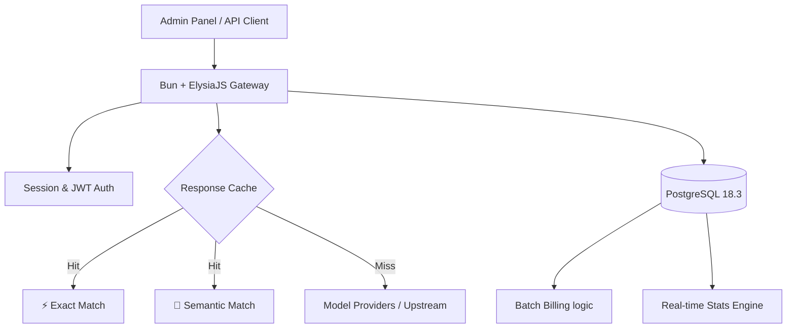

# Elygate 🚀

[English](#english) | [简体中文](#chinese)

---

<a name="english"></a>
## English

### ✨ Key Features

- **🚀 Extreme Performance**: Powered by Bun & ElysiaJS, delivering 3.6x more throughput than Gin (Go).
- **☁️ Redis-Free Architecture**: High-concurrency rate limiting and billing powered entirely by PostgreSQL 18.3, simplifying deployment.
- **⚡ Exact Response Cache**: Deterministic request hashing avoids repeated upstream calls without reusing answers across merely similar prompts.
- **🔐 Enterprise-Grade Security**: HttpOnly Cookie sessions, server-side session management, and CSRF/XSS protection by default.
- **💰 Robust Billing**: High-concurrency batch billing with support for dual-currency (USD/RMB) and dynamic price ratios.
- **📊 Professional Analytics**: Real-time monitoring, 24h trends, interactive charts, and detailed latency tracking.
- **🌍 I18n Ready**: Full multi-language support (English/Chinese) with automatic browser locale detection.

### 🏗️ Architecture Overview

Elygate is designed as a modern, unified gateway that consolidates billing, caching, and model management into a single high-performance engine.



### 🧩 Three-Layer Product Model

Elygate is organized as a three-layer monorepo product:

- **Elygate Basic Gateway**: OpenAI-compatible proxy, provider adapters, routing, rate limits, billing, logs, cache, and Agent Memory.
- **Elygate Panel**: general-purpose management UI for channels, models, API keys, usage, logs, and system settings. It remains usable for single-node, private, and lightweight team deployments.
- **Elygate Enterprise**: SupaCloud + SupAuth + svadmin powered enterprise layer for IAM, gateway app lifecycle, tenant isolation, enterprise policy, audit, and control-plane operations.

Enterprise control-plane APIs live under `/api/enterprise/*`. Gateway `sk-*` keys remain data-plane credentials for `/v1`; SupAuth JWT/service tokens are required for enterprise control-plane APIs. In enterprise mode, the data plane can install an optional runtime governance hook that reads gateway instance, policy, and budget projections before cache/upstream dispatch, lazily rolls over due budget periods, then records successful request quota back into the matched enterprise budget projections. The basic dispatcher only depends on a neutral hook interface. The enterprise console is built as a separate app and is served from `/enterprise/` in production builds.

Initial enterprise resources include SupaCloud install/uninstall lifecycle callbacks, gateway instance projections, provider channels, model routes, gateway API keys, request logs, Agent Memory, identity policies, policy evaluations, usage attribution, budgets, budget evaluations, and audit events. The enterprise console can update instance status, create identity policies, evaluate enterprise policies, create/update budgets, evaluate budget enforcement, inspect gateway resources, review usage attribution, and inspect audit trails without coupling `apps/admin` to SupaCloud/SupAuth.

Architecture decisions for the three-layer boundary, enterprise resource projection semantics, and the `@postgresx/noredis` pilot gate are tracked in `docs/ARCHITECTURE_DECISIONS.md`.

---

### 📖 API Usage Guide

Elygate is fully compatible with both OpenAI and Anthropic API standards. You can use any library or tool designed for these services.


#### 1. OpenAI Compatibility (Default)
Most tools (NextChat, ChatBox, OpenAI SDK) work with the base URL.
- **Base URL**: `http://your-elygate/v1`
- **Key**: Your generated `sk-...` token.

#### 2. Anthropic (Claude) Compatibility
Works natively with the Anthropic SDK and **Claude Code**.
- **Base URL**: `http://your-elygate/v1` (Note: the SDK appends `/messages` automatically)
- **Key**: Your generated `sk-...` token.

**Anthropic SDK Example (Node.js):**
```javascript
import Anthropic from '@anthropic-ai/sdk';

const anthropic = new Anthropic({
  apiKey: 'your-sk-token',
  baseURL: 'http://your-elygate/v1' 
});

const msg = await anthropic.messages.create({
  model: "claude-3-5-sonnet-20240620",
  max_tokens: 1024,
  messages: [{ role: "user", content: "Hello, Claude" }],
});
```

#### 3. Using with Claude Code
```bash
export ANTHROPIC_BASE_URL=http://your-elygate/v1
export ANTHROPIC_API_KEY=your-sk-token
claude
```

#### 4. Using with OpenClaw
- **Provider**: Select `Anthropic (Messages API)`
- **Base URL**: `http://your-elygate/v1`
- **API Key**: `your-sk-token`

---

**High-performance AI Gateway. Build on Bun + PostgreSQL 18.**

### 📦 Quick Start (Docker Compose) - Recommended

Launch the entire stack (Database, Gateway, and Web UI) with one command.

**Requirements:** Docker Engine with Compose support. Node.js and Bun are not required when you use the pre-built images.

#### 1. Configuration
```bash
git clone https://github.com/zuohuadong/elygate.git && cd elygate
cp .env.example .env

# Change this before the first Docker startup
sed -i 's/ELYGATE_DB_PASSWORD=elygate_change_me/ELYGATE_DB_PASSWORD=replace-with-a-strong-password/' .env
```

#### 2. Run (Pre-built Images)
By default, this pulls images from `ghcr.io`. 
*Note: If you are in Mainland China, see the Chinese README for mirror acceleration.*

```bash
# Download the lightweight production compose file
curl -O https://raw.githubusercontent.com/zuohuadong/elygate/main/docker-compose.prod.yml

# Check and restore "ghcr.io" if it was changed to a mirror
sed -i 's/ghcr.nju.edu.cn/ghcr.io/g' docker-compose.prod.yml

# Run the stack
docker compose -f docker-compose.prod.yml up -d
```

#### 3. Access
| Service | URL | Default Credentials |
| :--- | :--- | :--- |
| **Admin Panel** | [http://localhost:3001](http://localhost:3001) | `admin` / `admin123` |
| **API Endpoint** | [http://localhost:3000](http://localhost:3000) | Generate keys in Admin |
| **Postgres** | `localhost:5432` | `root` / `password` |

---

### ⚡ Zero-Dependency Binary (Easiest)

Inspired by New-API, Elygate provides pre-compiled single-file binaries. No Node.js, Bun, or Docker required.

1. **Download**: Go to [Releases](../../releases) and download the binary for your OS.
2. **Configure**: Create a `.env` file with your `DATABASE_URL`.
3. **Run**:
   - **Linux / macOS**:
     ```bash
     chmod +x elygate-bun-linux-x64
     ./elygate-bun-linux-x64
     ```
   - **Windows**:
     ```cmd
     elygate-bun-windows-x64.exe
     ```
   *The binary embeds both the Gateway API engine and the Svelte Admin Panel.*

Release versions are managed automatically with Release Please. Use Conventional Commits such as `feat:`, `fix:`, `perf:`, `refactor:`, `docs:`, or `chore:`; merging the generated release PR creates the GitHub Release and triggers binary publishing.

---

### 🚀 Manual Production Deployment (Bare Metal)

For high-performance production use without Docker:

**Requirements:** Bun 1.3+. Node.js does not need to be installed separately for source deployment; Bun runs the build and server commands. GitHub Actions still pins Node.js 24 for the CI runner environment.

#### One-Command Start
```bash
# Install dependencies
bun install

# Build the web application
bun run build

# Start both Gateway and Web with one command
bun run start
```

This will start:
- **Gateway API** on port 3000
- **Web Admin Panel** on port 3001

#### Access Points
| Service | URL | Default Credentials |
| :--- | :--- | :--- |
| **Admin Panel** | [http://localhost:3001](http://localhost:3001) | `admin` / `admin123` |
| **API Endpoint** | [http://localhost:3000](http://localhost:3000) | Generate keys in Admin |

---

### 💻 Manual Installation (Development)

If you prefer to run services manually on your host machine:

**Requirements:** Bun 1.3+ and PostgreSQL 15+. Node.js does not need to be installed separately when using Bun.

#### One-Command Dev Start
```bash
# Install dependencies
bun install

# Start both Gateway and Web in development mode
bun run dev
```

This will start:
- **Gateway API** on port 3000 (with hot reload)
- **Web Admin Panel** on port 5173 (with hot reload)

#### Database Setup
1. Ensure PostgreSQL 15+ is running
2. Run `packages/db/src/init.sql` to initialize schema
3. Configure `DATABASE_URL` in `.env`

---

### ⚡ Performance Comparison

We chose **Bun + Elysia.js** for its exceptional throughput. While Gin is highly efficient, Elysia leverages Bun's native asynchronous I/O to push boundaries.

#### 🚀 Framework Throughput (reqs/s)

```text
Elysia  (Bun)  ███████████████████████████████████ 2,454,631  (🥇 3.6x vs Gin)
Gin     (Go)   █████████                           676,019
Spring  (Java) ███████                             506,087
Fastify (JS)   ██████                              415,600
Express (JS)   █                                   113,117    (21x slower)
```
*Numbers based on standard TechEmpower-style plaintext benchmarks.*

---

### 🔧 Performance Optimization

Elygate comes with built-in performance optimizations for PostgreSQL 18.3:

#### Quick Optimization
```bash
# Run automatic optimization script
chmod +x scripts/deploy-optimizations.sh
./scripts/deploy-optimizations.sh
```

#### Key Optimizations
- ✅ **PostgreSQL 18.3 Async Commit**: 30-50% write performance boost
- ✅ **Connection Pool**: 20 connections with optimized lifecycle
- ✅ **Performance Indexes**: 20+ indexes for query optimization
- ✅ **Agent Memory**: PostgreSQL-native long-term memory with pgvector recall and pg-boss async writes
- ✅ **Exact Response Cache**: Deterministic request hashing for identical non-streaming requests

#### Performance Gains
| Metric | Improvement |
|--------|-------------|
| Database Writes | +30-50% |
| Query Response | -20-40% |
| Concurrency | +50-100% |
| Memory Efficiency | +20-30% |

See [Performance Optimization Guide](./PERFORMANCE_OPTIMIZATION.md) for details.

---

### 📂 Project Structure (Monorepo)

```text
elygate
├── apps
│   ├── gateway              # Basic gateway + optional enterprise route composition
│   ├── admin                # Elygate Panel (general management UI)
│   ├── portal               # End-user portal
│   └── enterprise-console   # Elygate Enterprise console
├── packages
│   ├── db                   # Database schema, init SQL and types
│   ├── enterprise-contracts # Stable claims, scopes, events, manifest
│   ├── enterprise-authz     # SupAuth JWT/scope verification helpers
│   └── enterprise-adapter   # SupaCloud install/event projection helpers
├── Dockerfile.gateway
├── Dockerfile.web
├── Dockerfile.postgres
└── docker-compose.yml
```

---

### ✨ Core Innovations

- **🛡️ Apache 2.0**: Open-source and enterprise-ready.
- **☁️ Zero Shell Dependencies**: Unlike New API which requires Redis for high-concurrency rate limiting, Elygate is **Redis-free**. All logic is handled by Bun + PostgreSQL, simplifying your stack.
- **🧭 New API Parity**: Responses, Completions, Files metadata, Batches metadata, Images edits/variations, channel health fields, and token-level controls are available without adding Redis.
- **🧠 Elygate Memory**: Optional Postgres-native Agent Memory with user/token isolation, admin governance, and provider extension points for external memory backends.
- **🔐 Secure Cookie Session**: HttpOnly Cookie-based authentication with server-side session management. Supports multi-device login, server-side logout, and automatic session expiration.

---

### 📊 Comparison: Elygate vs. New API

| Feature | Elygate (Bun + PG) | New API (Go + Redis) | Advantage |
| :--- | :--- | :--- | :--- |
| **Engine** | Bun + ElysiaJS | Go + Gin | 🚀 3.6x Throughput |
| **Dependencies** | **PostgreSQL Only** | MySQL + **Redis** | 🔋 Zero Redis Setup |
| **Billing** | O(1) Atomic Batch | Continuous SQL Hits | 💾 No Lock Contention |
| **Agent Memory** | Optional Postgres-native memory | Not Integrated | 🧠 Stateful Agents |
| **Exact Response Cache** | Built-in deterministic cache | Redis-backed cache recommended | ⚡ Repeat-request savings |
| **Authentication** | Cookie Session (HttpOnly) | localStorage Token | 🔐 XSS Protection |
| **Tech Stack** | Svelte 5 + Tailwind 4 | React / Vue | 💎 Premium UI/UX |
| **API Compat** | OpenAI Responses/Chat/Completions/Files/Batches + Anthropic + Gemini + Ali + Baidu | OpenAI + Anthropic | 🌐 Multi-Provider Native |
| **Admin Controls** | Channel health, request overrides, token model/IP/RPM/expiry controls | Mature ops panel | 🧩 New API-compatible operations |
| **License** | Apache 2.0 | GPL-3.0 | 🛡️ Commercial Friendly |

---

---

<a name="chinese"></a>
## 简体中文

### 📖 API 使用指南

Elygate 同时兼容 OpenAI 和 Anthropic (Claude) 的 API 标准，您可以无缝对接现有的各类客户端和 SDK。


#### 1. OpenAI 标准接口 (默认)
适用于大多数工具（如 NextChat, ChatBox, OpenAI SDK 等）。
- **Base URL**: `http://your-elygate/v1`
- **密钥 (Key)**: 后台生成的 `sk-...` 令牌。

#### 2. Anthropic (Claude) 标准接口
原生支持 Anthropic SDK 以及 **Claude Code** 命令行工具。
- **Base URL**: `http://your-elygate/v1` (SDK 会自动拼接 `/messages`)
- **密钥 (Key)**: 后台生成的 `sk-...` 令牌。

**Anthropic SDK (Node.js) 调用示例:**
```javascript
import Anthropic from '@anthropic-ai/sdk';

const anthropic = new Anthropic({
  apiKey: '您的-sk-令牌',
  baseURL: 'http://your-elygate/v1' 
});

const msg = await anthropic.messages.create({
  model: "claude-3-5-sonnet-20240620",
  max_tokens: 1024,
  messages: [{ role: "user", content: "你好" }],
});
```

#### 3. 对接 Claude Code
```bash
export ANTHROPIC_BASE_URL=http://your-elygate/v1
export ANTHROPIC_API_KEY=您的-sk-令牌
claude
```

#### 4. 对接 OpenClaw
- **提供商**: 选择 `Anthropic (Messages API)`
- **Base URL**: `http://your-elygate/v1`
- **API Key**: `您的-sk-令牌`

---

**高性能AI分发网关与计费系统。基于 Bun + PostgreSQL 18。**

### 📦 快速部署 (Docker Compose) - 推荐

只需简单几步，即可一键启动全栈环境。

**依赖要求：** 服务器只需要 Docker Engine 和 Docker Compose 支持。使用预编译镜像部署时，不需要安装 Node.js 或 Bun。

#### 1. 环境准备
```bash
git clone https://github.com/zuohuadong/elygate.git && cd elygate
cp .env.example .env

# 首次启动 Docker 前请改掉默认数据库密码
sed -i 's/ELYGATE_DB_PASSWORD=elygate_change_me/ELYGATE_DB_PASSWORD=replace-with-a-strong-password/' .env
```

#### 2. 一键启动 (预编译镜像部署)

得益于 GitHub Actions，您**无需在服务器编译**即可极速拉取并启动应用。

**对于国内服务器（默认已开启南京大学 GHCR 镜像加速）：**
```bash
# 下载专为线上优化的轻量级编排文件
curl -O https://raw.githubusercontent.com/zuohuadong/elygate/main/docker-compose.prod.yml

# 一键启动（享受国内镜像高速拉取）
docker compose -f docker-compose.prod.yml up -d
```

**对于海外服务器（需要换回官方源）：**
```bash
curl -O https://raw.githubusercontent.com/zuohuadong/elygate/main/docker-compose.prod.yml
sed -i 's/ghcr.nju.edu.cn/ghcr.io/g' docker-compose.prod.yml
docker compose -f docker-compose.prod.yml up -d
```

#### 3. 服务看板
| 服务 | 访问地址 | 默认凭据 |
| :--- | :--- | :--- |
| **管理后台 (Web)** | [http://localhost:3001](http://localhost:3001) | `admin` / `admin123` |
| **分发网关 (API)** | [http://localhost:3000](http://localhost:3000) | 使用后台生成的 sk- 密钥 |
| **数据库 (DB)** | `localhost:5432` | `root` / `password` |

---

### ⚡ 单文件预编译包部署 (极简无依赖)

致敬 New-API，Elygate 在 Release 页面提供了包含了网关接口与 Svelte 后台的**跨平台单体二进制文件**。您不需要安装 Docker、Bun 或 Node.js 也能直接运行。

1. **下载**: 访问 [Releases](../../releases) 页面，下载对应您的操作系统的文件。
2. **配置**: 准备好 PostgreSQL 并同级目录下创建 `.env` 配置 `DATABASE_URL`。
3. **运行**:
   - **Linux / Mac**:
     ```bash
     chmod +x elygate-bun-linux-x64
     ./elygate-bun-linux-x64
     ```
   - **Windows**:
     直接双击运行下载好的 `.exe` 软件，或通过 CMD 执行：
     ```cmd
     elygate-bun-windows-x64.exe
     ```

版本发布已接入 Release Please 自动管理。后续提交请使用 `feat:`、`fix:`、`perf:`、`refactor:`、`docs:`、`chore:` 等 Conventional Commits；合并自动生成的 release PR 后会创建 GitHub Release，并触发二进制发布。

---

### 🔧 性能优化

Elygate 内置了针对 PostgreSQL 18.3 的性能优化配置：

#### 快速优化
```bash
# 运行自动优化脚本
chmod +x scripts/deploy-optimizations.sh
./scripts/deploy-optimizations.sh
```

#### 核心优化项
- ✅ **PostgreSQL 18.3 异步提交**: 写入性能提升 30-50%
- ✅ **连接池优化**: 20个连接，优化生命周期管理
- ✅ **性能索引**: 20+ 个索引优化查询性能
- ✅ **精确响应缓存**: 相同非流式请求使用确定性哈希命中，避免相似请求误复用答案

#### 性能提升
| 指标 | 提升幅度 |
|------|----------|
| 数据库写入 | +30-50% |
| 查询响应 | -20-40% |
| 并发处理 | +50-100% |
| 内存效率 | +20-30% |

详见 [性能优化指南](./PERFORMANCE_OPTIMIZATION.md)。

---

### 🚀 手动生产部署 (宿主机源代码运行)

如果您希望在宿主机以最佳性能运行（非 Docker 环境）：

**依赖要求：** Bun 1.3+。源码部署不需要单独安装 Node.js，构建和启动命令都由 Bun 执行；GitHub Actions 仍会固定使用 Node.js 24 作为 CI runner 环境。

#### 一键启动
```bash
# 安装依赖
bun install

# 构建 Web 应用
bun run build

# 一键启动网关和管理后台
bun run start
```

这将启动：
- **网关 API** - 端口 3000
- **Web 管理后台** - 端口 3001

#### 访问地址
| 服务 | 访问地址 | 默认凭据 |
| :--- | :--- | :--- |
| **管理后台** | [http://localhost:3001](http://localhost:3001) | `admin` / `admin123` |
| **API 网关** | [http://localhost:3000](http://localhost:3000) | 使用后台生成的 sk- 密钥 |

---

### 💻 手动安装 (开发模式)

如果您希望在宿主机手动运行各项服务：

**依赖要求：** Bun 1.3+、PostgreSQL 15+。使用 Bun 运行时不需要单独安装 Node.js。

#### 一键开发启动
```bash
# 安装依赖
bun install

# 一键启动开发服务器
bun run dev
```

这将启动：
- **网关 API** - 端口 3000（支持热重载）
- **Elygate Panel** - 端口 5173（支持热重载）
- **Elygate Enterprise Console** - 端口 5175（支持热重载）

#### 数据库准备
1. 确保已安装 PostgreSQL 15+
2. 执行 `packages/db/src/init.sql` 初始化表结构
3. 在 `.env` 中正确配置 `DATABASE_URL`

#### 企业层环境变量

```bash
ELYGATE_LAYER=enterprise
ELYGATE_APP_INSTANCE_ID=agi_xxx
ELYGATE_TENANT_ID=tenant_xxx
ELYGATE_ORG_ID=org_xxx
ELYGATE_PUBLIC_BASE_URL=https://gateway.example.com
ELYGATE_ADMIN_BASE_URL=https://gateway.example.com/enterprise/
SUPAUTH_ISSUER_URL=https://auth.example.com
SUPAUTH_JWKS_URL=https://auth.example.com/.well-known/jwks.json
SUPAUTH_AUDIENCE=http://localhost:3000
```

生产环境必须配置 `SUPAUTH_JWKS_URL`。仅在非生产环境且 `ENTERPRISE_AUTH_MODE` 不是 `strict` 时，Elygate 才允许使用包含平台 claims 的未签名开发 JWT。
企业层会通过 migration 创建 `enterprise_gateway_instances`、`enterprise_identity_policies`、`enterprise_budgets`、`enterprise_audit_events` 四张投影表，用于承接 SupaCloud App 生命周期、SupAuth 授权上下文、预算策略和审计事件。

可用真实 Postgres 验证企业迁移与 CRUD：

```bash
bun run smoke:enterprise:db
```

该命令会从项目根 `.env` 读取 `DATABASE_URL`，在 gateway 的企业组合层内执行 migration、实例安装投影、实例状态更新、策略创建、预算创建、到期预算周期重置、平台事件投影、审计查询和过滤导出。默认会清理 smoke 数据；如需保留可设置 `KEEP_ENTERPRISE_SMOKE_DATA=1`。

---

### ⚡ 性能对比

选择 **Bun + Elysia.js** 是为了追求极致的吞吐量。虽然 Go (Gin) 已经非常高效，但 Elysia 利用 Bun 的原生异步 I/O 将 Web 性能提升到了新的高度。

#### 🚀 框架绝对吞吐量对比 (reqs/s)

```text
Elysia  (Bun)  ███████████████████████████████████ 2,454,631  (🥇 3.6倍于 Gin)
Gin     (Go)   █████████                           676,019
Spring  (Java) ███████                             506,087
Fastify (JS)   ██████                              415,600
Express (JS)   █                                   113,117    (慢 21 倍)
```

---

### 📂 项目目录结构 (Monorepo)

```text
elygate
├── apps
│   ├── gateway              # 基础网关 + 可选企业路由组合层
│   ├── admin                # Elygate Panel 通用管理面板
│   ├── portal               # 用户门户
│   └── enterprise-console   # Elygate Enterprise 企业控制台
├── packages
│   ├── db                   # 数据库 Schema、初始化 SQL 及类型定义
│   ├── enterprise-contracts # 稳定 claims、scope、事件、manifest
│   ├── enterprise-authz     # SupAuth JWT/scope 验证工具
│   └── enterprise-adapter   # SupaCloud 安装和事件投影工具
├── Dockerfile.gateway
├── Dockerfile.web
├── Dockerfile.postgres
└── docker-compose.yml
```

### 🧩 三层产品模型

Elygate 保持三层 monorepo 隔离：

- **Elygate Basic Gateway**：OpenAI-compatible proxy、provider adapter、路由、限流、计量、日志、缓存、Agent Memory。
- **Elygate Panel**：通用管理面板，负责渠道、模型、API Key、用量、日志、系统设置，可用于单机、私有化和轻量团队。
- **Elygate Enterprise**：基于 SupaCloud + SupAuth + svadmin，负责企业 IAM、App 生命周期、租户隔离、企业策略、审计和控制面操作。

企业控制面 API 位于 `/api/enterprise/*`；`sk-*` 仍是 `/v1` 数据面请求凭证，不允许访问企业控制面。企业模式下，数据面会通过基础层的 runtime governance hook 接入企业守卫，在缓存和上游转发前读取实例、策略和预算投影执行拦截，懒执行到期预算周期重置，并在成功计费后把实际 quota cost 回写到命中的企业预算投影；基础 dispatcher 只依赖中立 hook，不直接依赖 SupaCloud/SupAuth 企业包。企业控制台是独立应用，生产构建后由 gateway 从 `/enterprise/` 提供静态页面。

首批企业控制面资源：

- `/api/enterprise/install`、`/api/enterprise/uninstall`、`/api/enterprise/events`：SupaCloud App 生命周期和平台事件投影。
- `/api/enterprise/gateway-instances`：SupaCloud 安装投影、实例状态、域名与 entitlements 版本。
- `/api/enterprise/provider-channels`、`/api/enterprise/model-routes`、`/api/enterprise/gateway-api-keys`、`/api/enterprise/request-logs`、`/api/enterprise/agent-memories`：企业治理视角下的网关资源只读视图。
- `/api/enterprise/identity-and-policy`、`/api/enterprise/identity-policies` 与 `/api/enterprise/policy-evaluations`：SupAuth claims、角色、scope、企业策略和 deny-overrides 策略决策。
- `/api/enterprise/usage-and-budget`、`/api/enterprise/usage-attribution`、`/api/enterprise/budgets` 与 `/api/enterprise/budget-evaluations`：identity-aware budget、7 日用量归因、预算执行状态和预算执行决策。
- `/api/enterprise/audit-events` 与 `/api/enterprise/audit-events/export`：实例、平台事件、策略和预算变更审计，支持按 actor/action/resource/app instance/时间窗口过滤并导出 CSV。

企业控制台支持实例状态更新、策略创建、策略评估、预算创建/启停、预算评估、网关资源治理查看、用量归因查看和审计查看。通用 `apps/admin` 不再承载企业 IAM、SupaCloud 生命周期或租户隔离页面。

---

### 🛠️ 核心优势

- **🛡️ Apache 2.0**: 协议友好，支持商业化二次开发。
- **☁️ 极简无依赖**: 相比 New API 在高并发下必须依赖 Redis 进行限流和缓存，Elygate 实现了 **Redis-free（无 Redis 依赖）**。所有逻辑均由 Bun + PostgreSQL 承载，大幅简化了部署运维复杂度。
- **🧭 New API 对齐**: 已补齐 Responses、Completions、Files 元数据、Batches 元数据、图片 edits/variations、渠道健康字段与令牌维度控制，并保持无 Redis 架构。
- **🔐 安全 Cookie 会话**: 基于 HttpOnly Cookie 的服务端会话认证，支持多端登录、服务端注销和自动会话过期，有效防止 XSS 攻击。

---

### 📊 核心对比：Elygate vs. New API

| 特性 | Elygate (Bun + PG) | New API (Go + Redis) | 优势说明 |
| :--- | :--- | :--- | :--- |
| **核心引擎** | Bun + ElysiaJS | Go + Gin | 🚀 3.6倍 绝对吞吐量 |
| **外部依赖** | **仅需 PostgreSQL** | MySQL + **Redis** | 🔋 运维更简单 (无需Redis) |
| **计费性能** | O(1) 原子批量更新 | 连续 SQL 写入 | 💾 彻底解决数据库锁竞争 |
| **精确响应缓存** | 原生内置 (确定性哈希) | 推荐 Redis 缓存 | ⚡ 重复请求降本 |
| **认证安全** | Cookie 会话 (HttpOnly) | localStorage Token | 🔐 防止 XSS 攻击 |
| **前端架构** | Svelte 5 + Tailwind 4 | React / Vue | 💎 极致流畅的交互体验 |
| **API 兼容** | OpenAI Responses/Chat/Completions/Files/Batches + Anthropic + Gemini + 阿里 + 百度 | OpenAI + Anthropic | 🌐 原生多协议支持 |
| **管理能力** | 渠道健康、请求覆盖、令牌模型/IP/RPM/过期控制 | 成熟运营后台 | 🧩 对齐 New API 常用运营能力 |
| **开源协议** | Apache 2.0 | GPL-3.0 | 🛡️ 商业二次开发更友好 |

---

### 🧠 Agent Memory
Agent Memory 默认关闭，启用后会按用户/令牌隔离长期记忆，写入通过 pg-boss 异步执行，管理员可在后台查看、软删除、清理过期或永久清空已删除记录。

```sql
INSERT INTO options (key, value) VALUES
  ('MemoryEnabled', 'true'),
  ('MemoryReadDefault', 'false'),
  ('MemoryWriteDefault', 'false'),
  ('MemoryMaxInjectedItems', '6'),
  ('MemoryMinWriteChars', '24'),
  ('MemoryScope', 'user')
ON CONFLICT (key) DO UPDATE SET value = EXCLUDED.value;
```

单次请求也可以使用 `memory` 字段显式控制：`off`、`read`、`write`、`read_write`。内置 pgvector 表固定使用 1024 维向量，默认选择 bge-m3 兼容 embedding 渠道；显式配置其他维度模型时会降级为纯文本检索。TencentDB Agent Memory、Mem0、Zep、Qdrant 等外部后端保留为未来 provider 插件，不作为默认依赖。

## 🛡️ License & Acknowledgements
Deep gratitude to the [New-API] community for their pioneering exploration.
项目基于 Apache 2.0 协议开源，部分设计思路致敬 New-API 及其开源生态。
