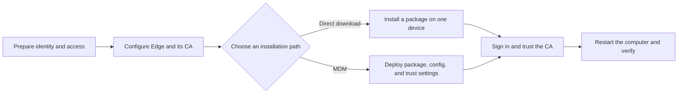

Use this section to take Bifrost Edge from an unconfigured deployment to a verified device. The setup has two parts: an administrator prepares Bifrost, then the agent is installed on each device.

## Choose an installation path

<CardGroup cols={2}>
  <Card title="Install directly" icon="download" href="/edge/install-direct">
    Download the package for one device and install it locally. Use this path for a pilot, a test device, or a device that is not managed through MDM.
  </Card>
  <Card title="Deploy with MDM" icon="cloud-arrow-up" href="/edge/install-mdm">
    Push the package and managed configuration to a fleet. On macOS, also push the Edge certificate as a device-scoped trusted root.
  </Card>
</CardGroup>

Both paths install the same Edge agent. They differ in how the device receives its Bifrost URL, how certificate trust is established, and how much the user must do during setup.

| | Direct installation | MDM deployment |
| --- | --- | --- |
| Best for | Pilots and individual devices | Managed fleets |
| Bifrost URL | Entered from the tray, or supplied in `config.json` | Supplied in managed `config.json` |
| Agent package | Installed locally | Pushed by the device-management platform |
| macOS CA trust | User approves the administrator prompt | MDM pushes a device-scoped trusted-root profile |
| User sign-in | Required for IdP mode | Required for IdP mode |

## Before you begin

You need:

- A running Bifrost Enterprise deployment with an Edge entitlement and an available device seat.
- The HTTPS URL users and devices use to reach Bifrost.
- Access to **Governance** settings and **Edge Control** in the Bifrost dashboard.
- An Edge agent package for the target operating system and architecture. Bifrost provides packages through the organization-specific download location shared during Edge onboarding.
- For the recommended identity flow, a configured identity provider and a provisioned user with access to an active virtual key.

<Note>
  If your deployment does not have an identity provider, Edge can use a user-entered Bifrost virtual key when **Allow virtual key sign-in** is enabled in Edge Settings. This is a separate sign-in path; it does not create an IdP user session.
</Note>

## Setup sequence

<Steps>
  <Step title="Prepare Bifrost identity and access">
    Configure user provisioning, roles, access profiles, and the users who will run Edge. Confirm that each intended user can resolve to an active virtual key.
  </Step>
  <Step title="Configure Edge">
    Set up the interception certificate authority, choose the initial approval behavior, and review the agent sync and sign-in settings.
  </Step>
  <Step title="Install the agent">
    Follow either the [direct installation](/edge/install-direct) or [MDM deployment](/edge/install-mdm) path.
  </Step>
  <Step title="Sign in and verify">
    After the active CA is trusted, restart the computer so the certificate change takes effect. Then confirm the tray reports a connected state, the device appears in Edge Devices, Diagnostics is healthy, and a supported AI request reaches Bifrost.
  </Step>
</Steps>

## Verify setup

Do not treat installation alone as a successful rollout. A device is ready when:

- The tray shows **Connected** or **Connected (virtual key)**.
- The computer was restarted after the active CA was first trusted or last changed.
- Edge Diagnostics confirms that the service, credential, configuration, certificate, traffic capture, and gateway checks are healthy.
- The device appears under **Edge Control → Devices** with the expected owner and hostname.
- A request from a [supported application](/edge/supported-applications) is visible in Bifrost.

## Next step

Start with [Prepare Bifrost](/edge/setup-bifrost).
