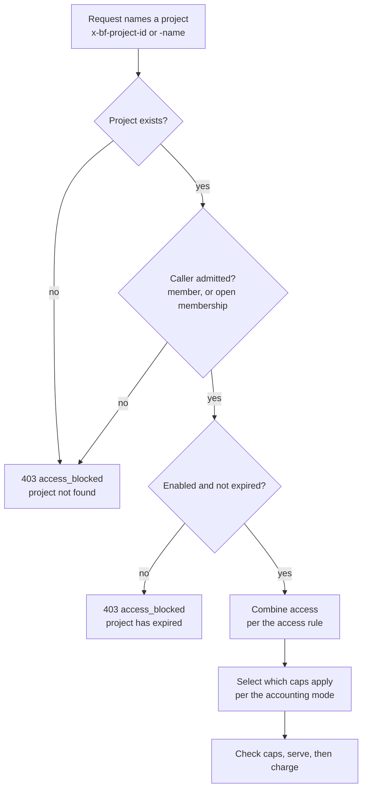

## Overview

Bifrost Enterprise already answers **who is calling**. Virtual keys, teams, customers, business units and access profiles are all attributes of the caller: they are fixed the moment a request authenticates, and spend flows up one ownership tree.

A **project** answers a different question: **what is this call for?**

A project is a per-request access gate and accounting scope, activated by a header. It sits deliberately outside the ownership hierarchy. A caller keeps their own identity and their own access; naming a project re-shapes what that one request may reach and where its spend lands.

A project never authenticates anything. It is not a credential, and it does not replace the caller. It composes with an already-authenticated principal, which is what keeps it orthogonal to everything else on this page.

**Key benefits:**

- **Chosen per request.** The same person, with the same key, can bill one call to an evaluation and the next to production support.
- **One shared pot, with per-member slices.** A project holds a single budget that everyone draws from, and can cap each member's share of it at the same time.
- **Can widen access, not only narrow it.** A project can add providers, models and MCP tools on top of what the caller already holds, for the duration of that request only.
- **Can pay instead of the caller.** Spend can be taken off the caller's key, profile, team and customer limits entirely.
- **A first-class reporting dimension.** Every log row, span, metric and warehouse export carries the project, so "what did this initiative cost" is a query rather than an inference.

A project carries three parts, and nothing obliges it to use all three: an optional **access** rule composed into the request, an optional **ledger** of budgets and rate limits, and an **attribution** dimension that is always on. Switching different parts on gives the three shapes this page returns to throughout:

| Shape | Access rule | What it does |
|---|---|---|
| **Restrict** | `intersect` | Narrows a broadly-privileged caller while they work inside the project |
| **Extend** | `union` | Adds access the caller does not personally hold, paid for by the project |
| **Cost center** | either, with no provider or MCP config | Leaves access untouched and only attributes and caps spend |

<Info>
To create your first project, skip to [Configuration](#configuration). The sections in between explain the fields that walkthrough asks you to fill in.
</Info>

---

## When to use a project

Every other governance entity describes a person or a credential. A project describes work. That gives a single decision rule:

> Ask whether the access should apply to **every request this person makes, for as long as they hold it**. If yes, it is an access profile. If it should apply **only while they are doing a particular piece of work, and that work has its own budget**, it is a project.

So "contractors get `gpt-4o-mini` only, with \$50 a month" is an access profile and should stay one. "This evaluation has \$5,000 and these six people can draw on it" is a project.

### A worked example

An organisation has a `platform` team and a `data-science` team, both under an `acme-internal` customer. Engineers sign in with SSO and hold an "Engineer" access profile: OpenAI `gpt-4o-mini` only, \$200 per month. That is the right policy for their day-to-day work and none of it should change.

Leadership now wants to evaluate moving to Claude. Six named people, four from platform, two from data-science, plus one contractor, get \$5,000 for the quarter to run comparisons on Anthropic models. The spend must not touch their personal budgets, must report as one line item, must stop dead at \$5,000, and nobody else gets Anthropic.

As a project that is one entity: access rule **Extend** with an Anthropic provider config, accounting **Project only**, a \$5,000 quarterly budget, split policy **Equal**, and six explicit members. The engineers keep their own identity and their own profile for everything else, and add `x-bf-project-id` to eval calls only. Those calls, and only those calls, reach Anthropic; the spend lands on the project's \$5,000 and is taken off their personal, team and customer limits; every log row carries `project=claude-eval`; and the equal split caps each member near \$833 so one person cannot drain the pot.

### Why not an access profile?

An access profile is the closest alternative, and it gets part of the way. It handles "these six users only" perfectly well, and if the eval profile allows Anthropic while the Engineer profile allows only OpenAI, the spend does land on the right ledger. Five things still break:

- **Assignments create one ledger per person, not a shared pot.** A profile is a template; assigning it clones its budgets for each user. A \$5,000 profile given to six people is six \$5,000 budgets, so the initiative's real ceiling is \$30,000. Hand-setting \$833 each recreates the cap but not the pot: it applies only at the top tier, and every roster change means rewriting every ledger by hand.
- **The payer becomes unpredictable as soon as the two profiles overlap.** A caller holding several profiles has one of them picked to pay, at random among those that permit the requested provider and model. An evaluation benchmarks Claude *against* the incumbent, so the moment both profiles permit `gpt-4o` the comparison calls charge the engineer's personal budget on roughly half of requests, with nothing in the request to say which.
- **It is always on.** Access is the union of everything the caller holds, so they reach Anthropic on every request from assignment until detachment, including work unrelated to the eval. There is no per-request opt-in.
- **Nothing marks a request as eval work.** Access profiles are not a reporting dimension. "What did the eval cost" becomes "spend where provider is Anthropic", which is wrong the moment the eval touches GPT for its baseline, or anyone uses Anthropic for anything else.
- **The spend still rolls up the organisation.** When a profile pays, the teams and business units above the user pay too, so eval spend consumes the platform team's and the customer's budgets. Only a project's accounting mode can take a request off the caller's tree.

Every one of those is the same root cause in a different costume: a profile is instantiated per person and evaluated on every request that person makes.

### Why not a team or a customer?

Teams and customers model reporting lines. A user's team drives which data they can see and which budgets their ordinary spend rolls up through, so inventing a `claude-eval` team to hold an initiative distorts both. Initiatives are also concurrent and short-lived where org position is singular and durable: a person belongs to one team for years while participating in several projects at once, each ending on its own schedule. And a team cannot be chosen per request, so it can never separate two kinds of work done by the same person.

### Why not a shared virtual key?

A shared key gets the money right, since it is one pot with one cap, and loses the person. Every log row records the same key, so there is no per-person attribution and no way to cap an individual's slice. Membership is unenforced: anyone holding the secret has the access. Most importantly a key *replaces* the caller's identity rather than composing with it, so audit, RBAC and data access control all lose track of who actually ran the request.

---

## How a request resolves



### Activating a project on a request

A request names a project with one of two headers:

| Header | Value |
|---|---|
| `x-bf-project-id` | The project's id |
| `x-bf-project-name` | The project's name, which is globally unique |

The **Use project** button on a project's page shows both, with a copy-ready request that sends one of them.

<Note>
Send one or the other. If `x-bf-project-id` is present at all it decides the outcome and the name header is ignored, **including when its value is empty**. An empty or unrecognised id resolves to no project, which is refused rather than quietly falling back to the caller's own access.
</Note>

A request may name **one** project. There is no list form, and no request is placed in a project implicitly: activation is always the explicit header.

When a named project cannot scope the request, the answer is `403` with `error.type` of `access_blocked` and the message `project "<name>" not found. It does not exist or does not admit this request.` That single answer deliberately covers both "no such project" and "you are not one of its members": a caller who may not use a project has no business learning whether it exists.

A request that names no project is served exactly as it is today, against the caller's own access and ledgers.

Resolution happens once, before the request is served, and every consumer downstream reads the **resolved** project rather than the caller's header. The same funnel governs the LLM, streaming, realtime and MCP paths, so the behaviour is identical on all of them.

### Membership

`membership_mode` decides who may use the project:

- **`explicit`** (default) admits only the users on its roster.
- **`open`** admits every authenticated caller. There are no member rows, so an open project cannot divide its budgets between members.

Members are **users**, never keys or teams. A key authenticates a request; the user behind it is who belongs to a project.

<Warning>
A request authenticating with a plain virtual key never resolves to a user, so it can only use projects with `open` membership. Against an explicit roster it is refused exactly as though the project did not exist. If your callers present virtual keys directly rather than signing in, either open the project's membership or scope it through a user identity.
</Warning>

An `explicit` project with an empty roster is usable by nobody. This is a legitimate intermediate state while you set one up, and the dashboard says so rather than treating it as an error.

### Access rules

`access_rule` decides how the project's own access composes with what the caller already holds. It is **required**, it applies uniformly to providers, models, key ids and MCP tools, and there is no per-resource variant.

- **`intersect`** (Restrict) permits only what the caller **and** the project both allow.
- **`union`** (Extend) permits everything the caller already had **plus** what the project adds.

<Warning>
Under `intersect`, a project with no provider configs permits nothing at all: the intersection of "everything the caller holds" and "nothing" is empty, and every request naming it is refused. If you want a project that only attributes and caps spend, either use `union`, or give it the provider configs you intend to allow. The dashboard flags this state as **Permits Nothing** on the project list.
</Warning>

Under `union`, a project with no provider or MCP configs leaves access untouched. That is the cost-center shape: the ledger and the attribution apply, the access rule changes nothing.

Two details worth knowing. Provider **weights** do not compose, because two preferences have no meaningful intersection; where the project states a weight it wins as the more specific context, and otherwise the caller's stands. And an unrecognised access rule permits nothing, since `union` is the mode that can widen a request and an unknown value must never be read as that.

### Accounting modes

`accounting_mode` decides whose ledgers a request draws from. The deployment's own global caps always apply: no accounting mode buys a request past them.

| Mode | Project's budgets and rate limits | Member shares | Caller's own key, profile, team, customer | Deployment globals |
|---|---|---|---|---|
| `both` (default) | Charged | Charged | Charged | Charged |
| `project_only` | Charged | Charged | Not consulted | Charged |
| `principal_only` | Not consulted | Not consulted | Charged | Charged |

**`both`** enforces everything. A request has to fit inside the project's caps *and* the caller's own.

**`project_only`** takes the request off everything the caller funds, including their per-model budgets and the teams and business units above them. Use it when an initiative's spend genuinely should not count against the people doing the work, as in the evaluation example.

**`principal_only`** is pure attribution: the project keeps its caps on record but checks and charges none of them, so the request is capped only by the caller and by the deployment. The project's own Overview tab says so explicitly while this mode is set, because a funded project that charges nothing is otherwise a confusing thing to look at.

A scoped request whose caller holds no permit at all is refused under `both` and `principal_only`: those modes say the caller's money moves, and there is nothing to take it from.

---

## What a project allows

### Provider and model access

A project holds at most one configuration per provider. Each one carries:

| Field | Meaning |
|---|---|
| `provider_name` | The provider this configuration allows |
| `all_models_allowed` | Allows every model the provider offers |
| `allowed_models` | An allowlist; `["*"]` means all models |
| `blacklisted_models` | A denylist, which wins over the allowlist |
| `key_ids` | Which provider keys may serve it; `["*"]` means all, and an empty list means none |
| `weight` | Load-balancing preference for this provider inside the project |
| `budgets`, `rate_limit` | Money for this provider specifically |
| `model_budgets` | Money for individual models under this provider |

A list may not mix a wildcard with named entries: `["*", "gpt-4o"]` is refused rather than interpreted. Key ids are validated when you save, and a key that does not exist or belongs to a different provider is rejected. A provider may carry up to 100 per-model budgets, each naming a concrete model; the `*` tier belongs on the provider configuration itself.

### MCP servers and virtual MCPs

A project opens up MCP access two ways, and both only ever add: where they overlap, they union rather than cap.

**Per-client tool allowlists** name an MCP server and the tools a project may execute on it. `["*"]` allows every tool the server exposes, including ones added later; an empty list allows nothing and, importantly, still counts as the project having named that server, so a server the project deliberately closed off cannot be reopened by a default-allowed rule.

**Virtual MCPs** are assigned by reference. Assigning one also makes it addressable at its slug endpoint for that request, exactly as a direct assignment to a virtual key would.

Tool allowlists union within the project, and then compose with the caller's own MCP access through the project's access rule: `intersect` caps what the caller may execute while inside the project, `union` extends it.

---

## Budgets, limits and splits

A project's budgets and rate limits are ordinary governance rows. They share every mechanic described in [Budgets and Limits](/features/governance/budget-and-limits): reset durations, quarterly and fiscal windows, cluster-wide accounting and refusal behaviour. This section covers only what is specific to projects.

### Budget tiers

A project can hold money at three tiers, and a request is checked against all of the ones that apply to it:

- **The project's own budgets and rate limit.** Provider-agnostic: the same cap whichever provider serves the request.
- **Per-provider budgets and rate limits**, on a provider configuration.
- **Per-model budgets and rate limits**, on a model under a provider configuration.

Whichever cap binds first refuses the request, and the refusal names the tier that ran out rather than the project as a whole. A budget refusal is `402` with `error.type` of `budget_exceeded`; a rate-limit refusal is `429` as `rate_limited`, `token_limited` or `request_limited`. Rate limits are checked before budgets, so a caller who is both throttled and out of money gets the cheaper answer consistently.

### Splitting caps between members

`split_policy` decides whether the project's caps are shared as one pot or sliced per member.

- **`none`** (default) holds everyone together in the project's caps. Individual members can still be given their own caps by hand, from the Members tab.
- **`equal`** gives every member an equal slice of **every budget and rate limit the project holds, at every tier**, as a cap within it. The project's own money, each provider's, and each model's all divide by head count.

A member's slice is a **second cap, not a replacement**. The budget it slices still caps the whole, both are checked, and whichever binds first refuses. So six members sharing \$5,000 under an equal split are capped individually near \$833 and collectively at \$5,000.

Budgets divide exactly. Rate-limit token and request counts divide with whole numbers, so a small remainder can be left unallocated rather than handed to an arbitrary member. A rate limit too small to give every member a whole unit is refused rather than stored, so an equal split can never leave a member with a slice of zero: if a project's token limit will not divide by its roster, raise the limit or shrink the roster before the edit is accepted.

Adding or removing a member redivides every slice automatically. Under `equal` that work is queued and runs in the background, with progress reported in the dashboard; under `none` only the affected member's own caps change, and that happens immediately.

<Note>
Redivision moves caps, never spend. Adding a seventh member to a \$5,000 project drops everyone's slice from about \$833 to about \$714, so a member who has already spent \$900 is refused until the window resets. Removing a member widens everyone else's slice the same way.
</Note>

Per-member caps stated by hand are only available under `split_policy: none`. Under `equal` the split owns those rows, so the dashboard hides the editor and the API refuses the request. Switching a project to `equal` replaces any hand-written member caps with the equal division, and the dashboard asks before doing it.

### Calendar alignment

`calendar_aligned` moves a project's windows onto the calendar rather than running them from the moment each budget was created. It applies uniformly to the project's own money, every provider's and model's, and every member's derived share, so a member who joins mid-month still resets with everyone else.

Windows shorter than a day cannot be aligned and stay rolling even on an aligned project. The dashboard hides the toggle when no window on the project is a day or longer.

<Note>
Turning alignment **on** re-anchors existing windows and keeps the spend already recorded against them. Turning it **off** returns those budgets to windows measured from their creation, which can land the next boundary in the past and clear the current window's spend on the next sweep. Prefer creating a project with the alignment you want.
</Note>

Quarterly budgets can name the first month of their fiscal year. Only that month's position within a quarter matters, so January, April, July and October all produce plain calendar quarters; the setting shifts anything only for the other eight starts. Rate limits carry no fiscal-quarter setting and always use calendar quarters.

---

## Configuration

<Tabs>
<Tab title="Web UI">

Navigate to **Governance** -> **Projects** in the Bifrost dashboard.

The list shows every project you can see, with its providers, the budget closest to its cap, its access rule, its accounting mode, its member count, expiry and whether it is enabled. The **Budget** column shows the tightest cap across every tier, so a project whose per-model budget is nearly spent reads as nearly spent even when its overall budget is untouched.

<Frame>
  
</Frame>

### Creating a project

Click **Create Project**.

1. **Name and description.** The name is globally unique and is what `x-bf-project-name` refers to, so pick something callers can type.
2. **Enabled.** On by default. A disabled project refuses every request that names it.
3. **Expires.** Optional, with **7 days**, **30 days**, **90 days** and **1 year** presets or an explicit date. An expired project refuses every request that names it.
4. **Access.** Who may use the project: `Explicit` to admit only a roster you manage, `Open` to admit every authenticated caller.

<Frame>
  
</Frame>

5. **Access rule.** Choose **Restrict** or **Extend**. The card explains the consequence of each, including that a Restrict project with no providers permits nothing.
6. **Providers.** Add a provider, then choose all models or an explicit allowlist, optionally a denylist, which keys may serve it, a weight, and any per-provider or per-model money.

<Frame>
  
</Frame>

7. **MCP configurations.** Choose which tools the project may execute under **MCP servers**, and assign any **Virtual MCPs** it should reach.

<Frame>
  
</Frame>

8. **Project budget** and **Rate limit.** Add one or more budget lines, each with an amount and a reset window, then optionally a **Maximum tokens** and **Maximum requests** limit. **Align to calendar cycle** moves every window on the project onto the calendar.
9. **Accounting.** Choose **Both budgets**, **Project only** or **User only**, and a split of **No split** or **Equal**.

<Frame>
  
</Frame>

Save with **Create Project**, or **Create & Add Members** when membership is explicit, which lands you on the new project's Members tab ready to add its roster.

### The project detail view

A project's page has five tabs, in this order: **Overview**, **Budgets & limits**, **Members**, **Providers** and **MCPs**. Each of the last three carries a count, and the **Use project** button beside them shows the headers a caller sends to reach the project.

**Overview** opens with a **Finish Setting Up** checklist while anything essential is missing, then tiles for spend, tokens, requests, members, providers, MCP servers, the access rule, the accounting mode and when the project was created. A **Needs attention** card lists caps near or past their limit, and flags members left holding no slice of a cap under an equal split.

<Frame>
  
</Frame>

<Frame>
  
</Frame>

**Budgets & limits** is the full ladder: the project's own caps, then each provider, with models nested beneath. Every row shows what has been used, what is left and when it resets. Deployment-wide caps appear when they are close to refusing, tagged **Global**. Rows that are not charged under the current accounting mode are dimmed with a footnote saying so.

<Frame>
  
</Frame>

**Providers** and **MCPs** are read-only views of what the project allows: allowed and blocked models per provider with weights, and tools per server plus assigned virtual MCPs with their slug endpoints.

<Frame>
  
</Frame>

<Frame>
  
</Frame>

### Managing members

**Members** lists the roster with each member's tightest cap for spend, tokens and requests. Open membership shows an explanation instead of a roster, since there is none.

<Frame>
  
</Frame>

**Add Members** takes users one at a time, or snapshots a team's current roster as a convenience. Under an equal split the sheet previews what every member's share becomes before and after, at every tier, so a roster change is never a surprise.

<Frame>
  
</Frame>

Clicking a member opens their usage, grouped project then provider then model. From there, **Edit Caps** gives that member their own cap on any budget or rate limit the project holds, as an amount or a percentage, with a live preview translating between the two. This is available only under `No split`.

<Frame>
  
</Frame>

<Frame>
  
</Frame>

Removing a member takes their caps with them and, under an equal split, redivides the rest.

### Enabling, expiring and deleting

The **Enabled** switch is on the list row and in the edit sheet; disabling asks for confirmation, since every request naming the project will be refused. Expiry is a field on the edit sheet.

Deleting a project removes its providers, budgets and the spend recorded against them, and removes its members' access through it. Log rows keep the attribution they already carry.

<Frame>
  
</Frame>

</Tab>
<Tab title="config.json">

Projects can be declared in `governance.projects`, which is useful for seeding the same set of projects across environments.

```json
{
  "governance": {
    "projects": [
      {
        "name": "claude-eval",
        "description": "Q3 evaluation of Anthropic models",
        "access_rule": "union",
        "membership_mode": "explicit",
        "accounting_mode": "project_only",
        "split_policy": "equal",
        "calendar_aligned": true,
        "budgets": [
          { "max_limit": 5000, "reset_duration": "1Q" }
        ],
        "provider_configs": [
          {
            "provider_name": "anthropic",
            "all_models_allowed": true
          }
        ]
      }
    ]
  }
}
```

<Note>
Membership cannot be declared in the file. A project declared here starts with no members, and the schema rejects a `members` key. Add the roster from the dashboard or the API. Virtual MCPs can be assigned with `virtual_mcps`, but only by database-assigned id, so a file meant to be portable across environments should leave those to the dashboard or the API too.
</Note>

Projects are reconciled by **name**: a name the database does not have is created, and a name it does have is updated only when the declaration has actually changed, so dashboard edits survive until the file changes. Edits keep spend, and a child the file stops declaring is removed. With `source_of_truth` set to `config.json`, declarations always overwrite the database and projects the file does not declare are deleted, members included.

For the full field reference and the reconciliation rules, see [config.json governance](/deployment-guides/config-json/governance#projects).

</Tab>
<Tab title="API">

All routes require the `Projects` resource, with the operation implied by the method.

| Method | Path | Permission |
|---|---|---|
| `GET` | `/api/governance/projects` | `Projects:View` |
| `POST` | `/api/governance/projects` | `Projects:Create` |
| `GET` | `/api/governance/projects/{project_id}` | `Projects:View` |
| `PUT` | `/api/governance/projects/{project_id}` | `Projects:Update` |
| `DELETE` | `/api/governance/projects/{project_id}` | `Projects:Delete` |
| `GET` | `/api/governance/projects/{project_id}/members` | `Projects:View` |
| `POST` | `/api/governance/projects/{project_id}/members` | `Projects:Create` |
| `PUT` | `/api/governance/projects/{project_id}/members/{member_id}` | `Projects:Update` |
| `DELETE` | `/api/governance/projects/{project_id}/members/{member_id}` | `Projects:Delete` |
| `GET` | `/api/governance/users/{user_id}/projects` | `Projects:View` |

### Create a project

`access_rule` is required. `membership_mode`, `accounting_mode` and `split_policy` default to `explicit`, `both` and `none`. Members are not accepted here; they are their own endpoint.

```bash
curl -X POST "$BIFROST_URL/api/governance/projects" \
  -H "Authorization: Bearer $TOKEN" \
  -H "Content-Type: application/json" \
  -d '{
    "name": "claude-eval",
    "description": "Q3 evaluation of Anthropic models",
    "access_rule": "union",
    "accounting_mode": "project_only",
    "split_policy": "equal",
    "calendar_aligned": true,
    "budgets": [{ "max_limit": 5000, "reset_duration": "1Q" }],
    "provider_configs": [
      { "provider_name": "anthropic", "all_models_allowed": true }
    ]
  }'
```

### List projects

```bash
curl "$BIFROST_URL/api/governance/projects?search=eval&is_active=true&limit=25&offset=0" \
  -H "Authorization: Bearer $TOKEN"
```

**Query parameters:**

| Parameter | Type | Description |
|---|---|---|
| `limit` | integer | Page size, clamped to 100 |
| `offset` | integer | Page offset; `page` is accepted as an alternative |
| `search` | string | Matches name or description, case-insensitive |
| `is_active` | boolean | Return only enabled or only disabled projects |

### Add members

```bash
curl -X POST "$BIFROST_URL/api/governance/projects/$PROJECT_ID/members" \
  -H "Authorization: Bearer $TOKEN" \
  -H "Content-Type: application/json" \
  -d '{ "members": [{ "user_id": "usr_abc" }, { "user_id": "usr_def" }] }'
```

Under an equal split the response carries a `redivision_job_id`, because every member's slice of every cap is recalculated in the background.

### Cap one member

Only under `split_policy: none`. The body is the member's **complete** statement of caps: a source it does not name loses its cap, and an empty body clears all of them.

```bash
curl -X PUT "$BIFROST_URL/api/governance/projects/$PROJECT_ID/members/$MEMBER_ID" \
  -H "Authorization: Bearer $TOKEN" \
  -H "Content-Type: application/json" \
  -d '{
    "budget_shares": [
      { "source_budget_id": "bdg_top", "share_value": 30, "share_type": "percent" }
    ],
    "rate_limit_shares": [
      { "source_rate_limit_id": "rl_top", "token_share": 50, "token_share_type": "percent" }
    ]
  }'
```

### Update a project

Every field is optional and read-then-patch: a field you omit is left alone, while an explicit `null` clears it. Child lists are matched by id, so restate the ids you read to update them and leave out the ones you want removed. Adding `"reset_budget_usage": true` clears recorded spend on the budgets the edit restates, along with each member's slice of them.

```bash
curl -X PUT "$BIFROST_URL/api/governance/projects/$PROJECT_ID" \
  -H "Authorization: Bearer $TOKEN" \
  -H "Content-Type: application/json" \
  -d '{ "accounting_mode": "both", "is_active": false }'
```

### Delete a project

```bash
curl -X DELETE "$BIFROST_URL/api/governance/projects/$PROJECT_ID" \
  -H "Authorization: Bearer $TOKEN"
```

Members are removed with the project.

For every endpoint, body shape and error code, see the **Projects** section of the [API Reference](/api-reference).

</Tab>
</Tabs>

---

## Attribution and reporting

Every request scoped to a project carries it through the whole observability stack, using the resolved project rather than the header the caller sent.

**Logs.** Both request logs and MCP tool logs record the project's id and name. The logs list filters on projects from the sidebar and has a **Project** column, hidden by default and enabled from the column picker. A log's detail view links back to a filtered list for that project. The project filter section hides itself entirely until at least one project has appeared in your logs.

**Analytics.** `project` is a ranking dimension and the dashboard has a **Project Rankings** tab, alongside cost, token and latency histograms by project. Requests carrying no project are reported under an **Unassigned** bucket rather than dropped, so the totals reconcile with real traffic and you can see how much of your spend is attributed.

**Traces and metrics.** Spans carry `bifrost.project.id` and `bifrost.project.name`. Prometheus and OpenTelemetry metrics carry `project_id` and `project_name` labels on both request and MCP metrics. Because a request is scoped to at most one project, these are always scalar; there is no plural form as there is for teams and customers.

**Warehouse exports.** BigQuery carries `project_id` and `project_name` columns, and the Datadog and Splunk exporters carry them as tags and attributes.

---

## Visibility and permissions

Two independent controls apply, as they do everywhere in Bifrost Enterprise: RBAC decides **what operations** a role may perform, and data access control scopes **the result set**.

The `Projects` resource carries `View`, `Create`, `Update` and `Delete`. The dashboard hides what a role cannot do: without `Update` the enabled switch and edit action are disabled, and without `Create` the add-members action is unavailable.

Project visibility then follows the caller's data access scope, and projects are unusual in two ways. Membership is a visibility path in its own right, so a user sees projects they created **or belong to**, where most resources are creator-only. And the roster inside a project is scoped as well as the project row, so two administrators can open the same project and see different member lists and different per-member caps.

| Scope | What the caller sees |
|---|---|
| `own-data` | Projects they created or belong to, showing only their own membership and caps |
| `team-data` | The same, plus projects created by or holding team members, with the roster limited to team members |
| `all-data` | Every project, with every member |

See [Data Access Control](/enterprise/data-access-control) for how scopes are assigned.

---

## Examples

### An evaluation with its own funding

Six people from two teams get \$5,000 for the quarter to evaluate a provider nobody personally has access to, without their own budgets being touched.

```json
{
  "name": "claude-eval",
  "access_rule": "union",
  "membership_mode": "explicit",
  "accounting_mode": "project_only",
  "split_policy": "equal",
  "calendar_aligned": true,
  "budgets": [{ "max_limit": 5000, "reset_duration": "1Q" }],
  "provider_configs": [
    { "provider_name": "anthropic", "all_models_allowed": true }
  ]
}
```

**Extend** adds Anthropic to what each member already holds. **Project only** keeps the spend off their personal, team and customer limits. **Equal** caps each member near \$833 while the project stops at \$5,000. Add the six members from the Members tab; each one's slice is recalculated as the roster changes.

### A batch job confined to one provider

A CI principal with broad access should only reach OpenAI while running the nightly batch, with that spend reported separately.

```json
{
  "name": "nightly-batch",
  "access_rule": "intersect",
  "membership_mode": "open",
  "accounting_mode": "both",
  "split_policy": "none",
  "budgets": [{ "max_limit": 300, "reset_duration": "1d" }],
  "provider_configs": [
    {
      "provider_name": "openai",
      "allowed_models": ["gpt-4o-mini"]
    }
  ]
}
```

**Restrict** narrows the caller to the intersection, so the job reaches `gpt-4o-mini` on OpenAI and nothing else however broad its own access is. **Both** keeps the caller's own caps in force as well. Open membership means the job needs no roster, which also lets it authenticate with a plain virtual key.

### A cost center for one tool

An organisation wants everything done through a particular client capped and reported as one line item, without changing anyone's access.

```json
{
  "name": "claude-code",
  "access_rule": "union",
  "membership_mode": "open",
  "accounting_mode": "both",
  "split_policy": "none",
  "calendar_aligned": true,
  "budgets": [{ "max_limit": 5000, "reset_duration": "1M" }]
}
```

No provider or MCP configs, so **Extend** leaves access exactly as it was and only the ledger and the attribution apply. Open membership means anyone can opt in by sending the header. Configure the client to send `x-bf-project-name: claude-code` and its spend is capped at \$5,000 a month and reportable on its own.

---

## Next steps

- **[Access Profiles](/enterprise/access-profiles)** - the policy container for access that belongs to a person rather than to a piece of work
- **[Data Access Control](/enterprise/data-access-control)** - how project and roster visibility is scoped per role
- **[RBAC](/enterprise/rbac)** - assigning the `Projects` permissions
- **[Budgets and Limits](/features/governance/budget-and-limits)** - reset windows, fiscal quarters and how cluster-wide accounting works
- **[Model Limits](/features/governance/model-limits)** - per-model caps and the scope system
- **[Virtual Keys](/features/governance/virtual-keys)** - the credential a project composes with
- **[config.json governance](/deployment-guides/config-json/governance#projects)** - the full declarative field reference
