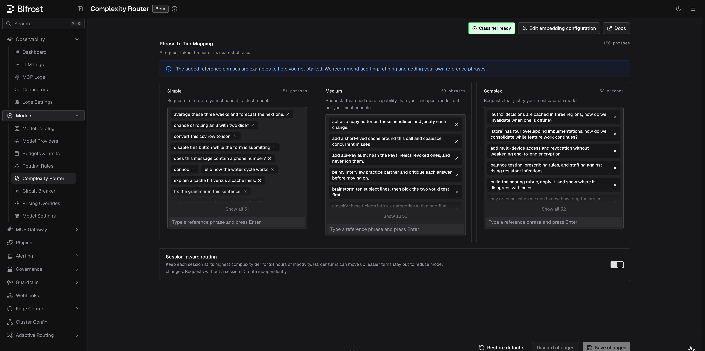
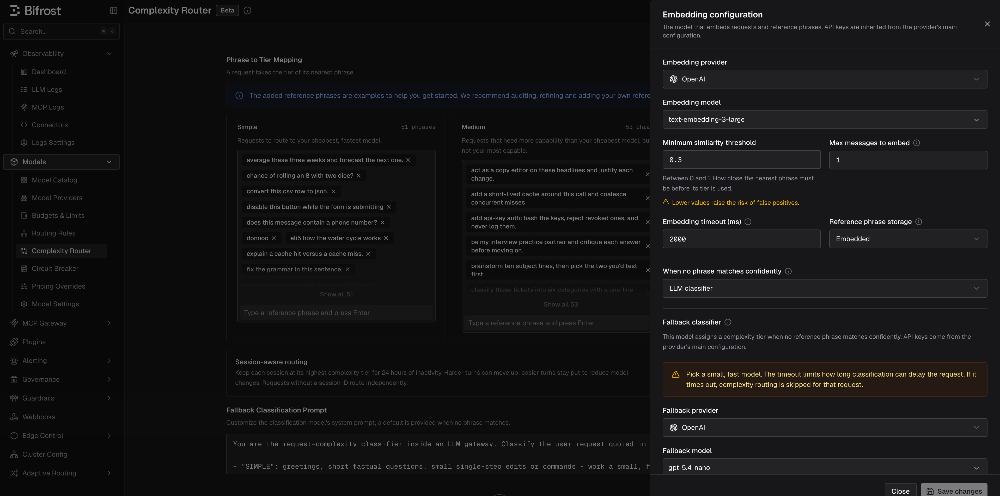

## Overview

The Complexity Router embeds each incoming request and assigns it the tier of its nearest **reference phrase**: **Simple**, **Medium**, or **Complex**. The result is exposed as a flat string variable (`complexity_tier`) in Bifrost's CEL routing engine, so you can write routing rules like:

```cel
complexity_tier == "COMPLEX"
complexity_tier in ["MEDIUM", "COMPLEX"]
```

This lets you route simple greetings to a fast, cheap model and deep reasoning tasks to a frontier model automatically, with no changes to your application code.

Classification runs only when a routing rule actually references `complexity_tier`, so requests that never touch a complexity rule pay no embedding cost. Once semantic classification is configured, a request it cannot confidently match, such as a near miss or timeout, leaves `complexity_tier` unpublished. You can optionally configure an **LLM fallback classifier** to step in after semantic classification has run and returned no tier. See [LLM fallback classifier](#llm-fallback-classifier). Without semantic classification configured at all, Bifrost keeps the request on its existing routing path instead of guessing. When [session-aware routing](#session-aware-routing) is enabled and the request carries a recognized session identity, a turn that still produces no tier of its own reuses the tier already retained for that session, so `complexity_tier` goes unpublished only when neither classification nor session state supplies one.

<Note>
Complexity classification is **semantic** (embedding-based). The older lexical keyword scorer is retired. See [Lexical keyword classifier (retired)](#lexical-keyword-classifier-retired).
</Note>



---

## How it works

1. **Extract.** Bifrost takes the latest user message (or the last `message_history_count` user messages, joined oldest-first) as the text to classify. System prompts and assistant replies are never embedded.
2. **Embed.** The text is embedded with your configured embedding provider and model, inline on the request path, bounded by `timeout` (default 1.5s).
3. **Match.** The embedding is compared against the stored reference-phrase embeddings in the vector store. The request takes the tier of the nearest phrase.
4. **Route.** The tier is published as `complexity_tier` for CEL routing rules. The matched phrase and similarity are recorded in the routing decision logs, so every decision is auditable.

If the nearest phrase scores below `min_similarity`, no tier is published. At `0` (the default), Bifrost accepts the nearest eligible match; a positive value makes the classifier abstain on weak matches. If the embedding call fails or times out, no tier is published either; in both cases the request falls through to your normal routing path rather than being blocked.

### Reference phrases

Reference phrases are example requests you label with a tier. The classifier's entire knowledge of "simple" vs "complex" comes from them. Bifrost ships **150 default phrases (50 per tier)** balanced across use cases (coding, math, writing, knowledge, conversation, extraction, translation, agentic) and writing styles, so the classifier learns *requested work* rather than subject matter or verbosity.

<Tip>
The defaults are examples to get you started. Audit them, refine them, and add phrases drawn from the prompts your users actually send. A handful of domain-specific phrases per tier usually improves routing more than any other tuning.
</Tip>

When writing your own phrases:

- **Each phrase's tier must be derivable from its own text.** "Summarize these notes" is fine; "yes, go with option 2" has no defensible tier on its own.
- **Keep phrases short and prototypical.** A long, hyper-specific phrase mostly matches near-identical requests.
- **Balance surface form across tiers.** If most Complex phrases are questions, every question routes to Complex. Mix questions, imperatives, terse and detailed phrasing in every tier.

With semantic classification configured, every tier must contain at least one phrase, each phrase must be 2,000 characters or fewer, and the three normalized lists may contain at most **750 phrases combined**. Trimming, lowercasing, and same-tier deduplication happen before that count. Bifrost also rejects the same normalized phrase in more than one tier when it saves or loads the configuration.

In split configuration mode, phrases from `config.json` are merged additively with phrases already stored in the database before the 750-phrase limit is checked. If the merged result exceeds the limit, Bifrost logs a warning, keeps the existing database configuration active, and does not apply that `config.json` phrase edit. Reduce one of the lists before restarting. **Restore defaults** remains the recovery path for a stored semantic configuration this version cannot load: it replaces the unreadable configuration with the 150 built-in phrases. Re-enter the embedding provider, model, and storage settings afterward. For a valid readable configuration, restore defaults preserves those semantic settings and only resets the boundaries and phrase lists.

### Choosing how much conversation to embed

`message_history_count` (default `1`) controls how many recent user messages are joined into the embedded text. Raising it lets a short follow-up like "and make it faster" inherit the intent of earlier turns, at the cost of diluting the latest message and embedding more tokens per request. Requests with fewer available turns embed what they have.

### Session-aware routing

Enable **Session-aware routing** to balance cost and quality with an upward-only complexity ladder inside an agent conversation. The first classifiable user turn that produces a tier establishes the session tier. Each later sequential human turn is classified normally and can raise that tier from Simple to Medium or Complex, while an easier follow-up keeps the stored higher tier. This avoids unnecessary tier-driven model changes that can reduce provider prompt-cache reuse. Once a session reaches Complex, Bifrost reuses Complex without another classifier call.

Session state expires after **24 hours of inactivity**. Each participating conversational turn refreshes that inactivity window. After expiry, the next classifiable human request starts a new session epoch and is classified normally. Bifrost stores only the effective tier under a scoped hash of the session identity; it does not store prompts, similarity scores, reference phrases, model choices, or turn history as session state.

Bifrost uses the explicit `x-bf-session-id` when supplied. For recognized agent harnesses it can also use their native, User-Agent-gated identity: `x-codex-turn-metadata.session_id` for Codex and `x-claude-code-session-id` for Claude Code. Codex background work (`prewarm`, `compaction`, and `memory`) bypasses session state. Supported conversational continuations with no new human text may reuse an existing tier, but never initialize or escalate one. Requests with no valid identity retain ordinary per-request classification.

<Warning>
Complexity Router does not currently classify Codex requests sent through native WebSocket Responses mode, so session-aware routing does not apply on that path. Codex over HTTP/SSE Responses, and WebSocket requests using Bifrost's HTTP bridge, remain supported.
</Warning>

<Note>
Session-aware routing keeps the **complexity tier** stable; it does not pin a weighted routing target, provider key, or provider prompt-cache entry. Provider cache TTLs remain provider-owned and independent of the 24-hour routing-state lifetime.
</Note>

---

## LLM fallback classifier

By default, a request that matches no reference phrase confidently simply carries no `complexity_tier`. If you'd rather have a second opinion than let those requests fall through, set semantic classification's `fallback` to `llm` and configure a chat model to name the tier instead.

The LLM fallback runs **only after** semantic classification produces no tier: never as the primary classifier, and never in parallel with it. It never sees a request that semantic classification already resolved.

<Warning>
The cost of this classifier is latency, paid on every request it runs for. A request that reaches the fallback waits on one full chat completion from the configured model before it is routed. Pick a small, fast model, and use `timeout` to cap the wait. A timed-out classification skips complexity routing for that request unless session-aware routing can reuse a tier already retained for its session, exactly like an unmatched semantic request without a fallback.
</Warning>

The fallback model is asked to answer with one of the three tier names, guided by a prompt you can edit (`prompt`, or **Fallback Classification Prompt** on the Complexity Router page). Bifrost always appends a fixed, non-editable section stating the tier names and the required JSON response shape, so your edits refine *what the tiers mean* to the model but can never break the response contract. Leaving `prompt` empty uses Bifrost's shipped default guidance.

`message_history_count` behaves the same way it does for semantic classification: it controls how many of the most recent user messages (oldest first) are sent to the fallback model, independent of the semantic classifier's own `message_history_count`.

<Note>
An LLM-classified turn carries no similarity score. A chat completion has no equivalent of embedding-distance, and a synthetic one would invite comparisons against thresholds tuned for your vector backend. `complexity_score` is therefore absent on rows where `complexity_mechanism` is `llm`. See [Observability](#observability).
</Note>

---

## Configuration

Semantic classification requires an embedding provider and model. The provider must have an enabled key in **Model Providers**. The UI warns you if the saved provider has no usable key.

<Tabs group="complexity-config">
<Tab title="Web UI">



Navigate to **Complexity Router** in the sidebar.

- **Phrase to Tier Mapping**: add a phrase by typing it and pressing **Enter** in a tier's input; remove one with the × on its chip. Counts are shown per tier.
- **Session-aware routing**: retain the highest tier reached by each identified session for 24 hours of inactivity. The toggle is off by default and requires the semantic classifier.
- **Edit embedding configuration**: opens the embedding sheet (provider, model, similarity floor, history window, timeout, budgets, and phrase storage: **Embedded** keeps phrase vectors in Bifrost's own memory; **Vector Store** keeps them in the configured vector store so they survive restarts, falling back to Embedded when none is available). Setting **When no phrase matches confidently** to **LLM classifier** reveals a **Fallback classifier** section further down the same sheet: provider, model, timeout, history window, and budgets for the fallback model. Setting it back to **None** hides that section again; its settings are preserved either way.
- When the fallback is on, a **Fallback Classification Prompt** section appears on the main page below the phrase lists, with a **Reset to default** button. The model itself is configured in the embedding sheet; only the prompt text lives here, since it needs room to iterate.
- The **Classifier status** badge in the header shows whether the classifier is ready to serve (see [Classifier status and warmup](#classifier-status-and-warmup)).

</Tab>
<Tab title="API">

<Info>The `/api/routing/*` endpoints are available in **Bifrost v2.0.0 and above**. On earlier versions use the `/api/governance/*` paths.</Info>

```bash
# Get current configuration
curl http://localhost:8080/api/routing/complexity-analyzer-config

# Update embedding configuration and reference phrases
curl -X PUT http://localhost:8080/api/routing/complexity-analyzer-config \
  -H "Content-Type: application/json" \
  -d '{
    "semantic": {
      "provider": "openai",
      "embedding_model": "text-embedding-3-small",
      "timeout": "1.5s",
      "min_similarity": 0,
      "message_history_count": 1,
      "count_toward_budgets": false,
      "vector_store": "embedded",
      "fallback": "none"
    },
    "session": {
      "enabled": true
    },
    "keywords": {
      "simple_keywords": ["what is a mutex?", "fix the grammar in this sentence."],
      "medium_keywords": ["add api-key auth: hash the keys, reject revoked ones, and never log them."],
      "complex_keywords": ["balance testing, prescribing rules, and staffing against rising resistant infections."]
    }
  }'

# Enable the LLM fallback classifier: set semantic.fallback to "llm" and add an llm block
curl -X PUT http://localhost:8080/api/routing/complexity-analyzer-config \
  -H "Content-Type: application/json" \
  -d '{
    "semantic": {
      "provider": "openai",
      "embedding_model": "text-embedding-3-small",
      "fallback": "llm"
    },
    "llm": {
      "provider": "openai",
      "model": "gpt-4o-mini",
      "timeout": "4s",
      "message_history_count": 1,
      "count_toward_budgets": false
    },
    "keywords": {
      "simple_keywords": ["what is a mutex?", "fix the grammar in this sentence."],
      "medium_keywords": ["add api-key auth: hash the keys, reject revoked ones, and never log them."],
      "complex_keywords": ["balance testing, prescribing rules, and staffing against rising resistant infections."]
    }
  }'

# Check classifier status (always includes llm readiness and the default prompt)
curl http://localhost:8080/api/routing/complexity-analyzer-status

# Restore built-in reference phrases (embedding configuration is preserved)
curl -X POST http://localhost:8080/api/routing/complexity-analyzer-config/reset
```

Reference-phrase lists are stored in the existing `keywords` fields (`simple_keywords`, `medium_keywords`, `complex_keywords`). They now hold whole example phrases rather than scoring keywords.

</Tab>
<Tab title="config.json">

```json
{
  "governance": {
    "complexity_analyzer_config": {
      "semantic": {
        "provider": "openai",
        "embedding_model": "text-embedding-3-small",
        "timeout": "1.5s",
        "min_similarity": 0,
        "message_history_count": 1,
        "count_toward_budgets": false,
        "vector_store": "embedded",
        "fallback": "llm"
      },
      "llm": {
        "provider": "openai",
        "model": "gpt-4o-mini",
        "timeout": "4s",
        "prompt": "",
        "message_history_count": 1,
        "count_toward_budgets": false
      },
      "session": {
        "enabled": true
      },
      "keywords": {
        "simple_keywords": ["what is a mutex?", "fix the grammar in this sentence."],
        "medium_keywords": ["add api-key auth: hash the keys, reject revoked ones, and never log them."],
        "complex_keywords": ["balance testing, prescribing rules, and staffing against rising resistant infections."]
      }
    }
  }
}
```

| Field | Type | Default | Description |
|---|---|---|---|
| `semantic.provider` | string | Required | Provider used for embedding calls; must have an enabled key |
| `semantic.embedding_model` | string | Required | Embedding model (e.g. `text-embedding-3-small`) |
| `semantic.timeout` | duration | `1.5s` | Ceiling on the inline embedding call; exceeding it skips tier routing for that request |
| `semantic.min_similarity` | number | `0` | Similarity floor. Below it no tier is published. `0` accepts the nearest eligible match |
| `semantic.message_history_count` | integer | `1` | Number of recent user messages joined into the embedded text (1–10) |
| `semantic.count_toward_budgets` | boolean | `false` | Count embedding usage toward virtual-key budgets (record-only, never enforced) |
| `semantic.vector_store` | string | `embedded` | Where phrase vectors are kept. `embedded` uses Bifrost's built-in in-memory store, which is private to one node and re-embeds every phrase on restart. `vector_store` uses the configured top-level `vector_store`; with a shared backend (Qdrant, Weaviate, Redis, Pinecone) vectors are shared between nodes and survive restarts, while a Chromem backend stays node-local and only persists when its `path` is set. If no vector store is configured it falls back to `embedded` and says so in the status response and the log. See [Where phrase vectors live](#where-phrase-vectors-live). |
| `semantic.fallback` | string | `none` | What answers when semantic classification produces no tier: `none` records the request as skipped; `llm` asks the model configured in `llm` below. Requires `llm` to be set |
| `llm.provider` | string | Required when `fallback` is `llm` | Provider used to run the classification chat completion; must have an enabled key |
| `llm.model` | string | Required when `fallback` is `llm` | Chat model asked to name the tier. Pick a small, fast one; every fallback classification waits on one completion |
| `llm.timeout` | duration | `4s` | Ceiling on the classification completion; exceeding it skips tier routing for that request |
| `llm.prompt` | string | Shipped default guidance | Replaces the shipped classification guidance (max 4,000 characters). The tier-name and response-format reinforcement is appended by Bifrost regardless and cannot be edited |
| `llm.message_history_count` | integer | `1` | Number of recent user messages sent to the classifier, oldest first (1–10) |
| `llm.count_toward_budgets` | boolean | `false` | Count classification completion cost toward virtual-key budgets (record-only, never enforced) |
| `session.enabled` | boolean | `false` | Retain the highest observed tier across normally sequential turns for 24 hours of inactivity. Requires `semantic`; overlapping requests for the same session are best-effort |
| `keywords.simple_keywords` | string[] | 50 built-in phrases | Reference phrases for the Simple tier |
| `keywords.medium_keywords` | string[] | 50 built-in phrases | Reference phrases for the Medium tier |
| `keywords.complex_keywords` | string[] | 50 built-in phrases | Reference phrases for the Complex tier |

<Warning>
Chromem is a node-local embedded backend, including when its `path` option persists data to disk. In a multi-pod deployment, give every pod its own path or volume. Do not mount one writable Chromem directory into multiple pods; use Qdrant, Redis, Pinecone, or Weaviate when replicas need a shared vector store.
</Warning>

<Note>
`min_similarity` is compared against the vector store backend's own similarity scale, which is not identical across backends: chromem, Qdrant, Pinecone, and Redis report raw cosine similarity, while Weaviate reports certainty ((cosine+1)/2). Retune the floor when switching backends.
</Note>

### Where phrase vectors live

`semantic.vector_store` decides whether the classifier keeps its reference-phrase vectors to itself or shares them.

The column below describes `vector_store` backed by a **shared** backend — Qdrant, Weaviate, Redis, or Pinecone. Chromem is a special case covered underneath.

| | `embedded` | `vector_store` (shared backend) |
|---|---|---|
| Scope | One node | Shared by every node pointed at the same backend |
| Restart | Re-embeds every phrase | Re-embeds nothing — the existing generation is adopted |
| Saving a config change | Each node embeds independently | One node embeds; the rest adopt what it wrote (requires a KV store — see below) |
| Retired generations | Dropped as soon as no request needs them | Reclaimed by the background sweep once no node claims them |

`embedded` is the right default for a single node: it needs no external service, and the cost of re-embedding on restart is bounded by your phrase count. Prefer `vector_store` with a shared backend when you run more than one Bifrost, or when your phrase lists are large enough that re-embedding on every restart is worth avoiding.

Sharing the embedding work across a save depends on nodes being able to see one another's progress, which they do through Bifrost's shared KV store. Without one configured, every node still adopts an already-warmed generation on restart, but a save makes each of them embed the phrase set independently — correct, and as costly as `embedded`.

**Chromem is the exception.** Selecting `vector_store` while the top-level `vector_store` is Chromem gives none of the sharing above: Chromem runs in-process, so each node still keeps its own copy, and nodes never adopt one another's generations. It does survive restarts, but only when `path` is set — without one it is memory-only and starts empty, re-embedding every phrase exactly as `embedded` does. Use it when you want on-disk persistence on a single node, not to share vectors between nodes.

<Note>
Vectors are shared, but configuration is not. In deployments without cluster gossip, saving a configuration change reloads the node that served the request; other nodes keep serving their existing generation until they restart. Those nodes continue to work — their generation stays in the vector store and is protected from reclamation while they are using it — but they will not pick up the new phrases until they reload.
</Note>

<Note>
When using Pinecone, the configured index dimension must match the embedding model's output dimension. Pinecone namespaces do not have independent dimensions, so changing to a model with a different dimension requires a separate Pinecone index and an updated `index_host`. Qdrant, Weaviate, and Redis create dimension-specific namespaces automatically.
</Note>

</Tab>
</Tabs>

---

## Classifier status and warmup

Reference phrases are embedded in the background (**warmup**) whenever the configuration changes. Bifrost detects the embedding dimension automatically. Within a running process, unchanged phrase vectors are reused; changing provider or model re-embeds every phrase.

The badge in the UI header and `GET /api/routing/complexity-analyzer-status` report:

| State | Meaning |
|---|---|
| `disabled` | No semantic embedding configuration; no tier is ever published |
| `warming` | Reference phrases are being embedded (`loaded` / `total` tracks progress). If `serving_previous` is true, the previous generation continues routing requests. |
| `ready` | The classifier is serving the current configuration |
| `failed` | The desired configuration failed to warm. When `serving_previous` is true, the previous generation keeps serving while you fix the problem |

The status response never contains phrases, embeddings, or provider secrets.

It also reports where the classifier is keeping its vectors, which is worth checking whenever storage behaves unexpectedly:

| Field | Meaning |
|---|---|
| `storage_mode` | `embedded` or `vector_store` — where phrase vectors actually are, not what was requested. Setting `semantic.vector_store` to `vector_store` without a top-level `vector_store` configured falls back to `embedded`, and this is how you tell. The gateway also logs a warning when that happens. |
| `namespace` | The namespace the serving generation queries, for example `BifrostComplexityRouter_<hash>`. Each configuration gets its own; the vector store holds no phrase text, so this is the only handle on the records the classifier owns there. |
| `cached_phrases` | Phrase vectors held in memory for the configured provider and model. The cache is in-process only, so a restart empties it while the saved phrases look unchanged; `0` means the next save re-embeds every phrase however little changed. |

### Stored generations

Every configuration change mints a new fingerprinted generation and warms it before switching over. What happens to the previous one depends on where the vectors live:

- **Embedded storage** (and any node-local chromem store) reclaims the previous generation as soon as no request is still using it. Deleting a phrase removes its vector.
- **A shared vector store** cannot drop it immediately: another Bifrost node may still be serving that generation, and no node can observe another's state. Bifrost reclaims it in the background instead — each node records which generation it is using, and a periodic sweep removes only the generations no node has claimed. A generation a stale node is still serving stays until that node moves on or stops.

Reclamation needs no configuration. A node records the generation it is using as soon as it starts building it, not only once it is serving it, so a slow warmup cannot have its half-built namespace collected. Sweeps run every 15 minutes and a generation must additionally look unused on two consecutive passes before it is removed. A node's claim expires 10 minutes after its last heartbeat. In practice a generation is collected within about three quarters of an hour of falling out of use. Each reclaimed generation is logged.

You can also inspect what a store is holding, and remove something ahead of the sweep:

```bash
# What generations exist, and which one is serving
curl http://localhost:8080/api/routing/complexity-analyzer-generations

# Remove a retired one now rather than waiting for the sweep
curl -X DELETE http://localhost:8080/api/routing/complexity-analyzer-generations/BifrostComplexityRouter_<hash>
```

The listing flags the serving generation as `active`. Deletion is refused for the serving generation, for a generation any other node has claimed, and for any namespace outside the classifier's own `BifrostComplexityRouter_` scheme — so this can neither disturb a peer nor drop an unrelated collection sharing the same backend. An unclaimed orphan deletes immediately.

The same response always also carries the LLM fallback classifier's own status, whether or not it is configured:

| Field | Values | Meaning |
|---|---|---|
| `llm.state` | `disabled`, `ready` | `disabled` means no `llm` block is configured; `ready` means it is. Unlike semantic classification, the LLM fallback has no warmup: it makes its first provider call on the first classification it runs, so it is ready as soon as it is saved. |
| `llm_default_prompt` | string | The shipped classification guidance, served so a configuration client (like the **Fallback Classification Prompt** editor) can seed itself and offer a reset without holding a copy that drifts from the gateway's. Present regardless of whether an `llm` block is configured. |

---

## Routing with `complexity_tier`

Once the classifier has a serving generation, use `complexity_tier` as a variable in any CEL routing rule expression. Bifrost evaluates it as a plain string.

`complexity_tier` is not a special standalone rule type. In the Routing Rules builder, it behaves like any other field, so you can combine it with headers, request type, team/customer scope, budgets, and other predicates in the same rule or nested rule group.

<Note>
Complexity Router only exposes `complexity_tier`; it does not create rules automatically. Add rules for the tiers you want to route. For deterministic three-tier routing, create rules for Simple, Medium, and Complex.
</Note>

### Available operators

| Operator | CEL syntax | Example |
|---|---|---|
| Equal | `==` | `complexity_tier == "COMPLEX"` |
| Not equal | `!=` | `complexity_tier != "SIMPLE"` |
| In list | `in` | `complexity_tier in ["MEDIUM", "COMPLEX"]` |
| Not in list | `!(x in [...])` | `!(complexity_tier in ["SIMPLE", "MEDIUM"])` |


### Combining with other rule conditions

You can mix complexity with any other routing condition the CEL builder supports:

```cel
headers["x-tier"] == "premium" && complexity_tier == "COMPLEX"
headers["x-region"] == "us-east" && complexity_tier in ["MEDIUM", "COMPLEX"]
request_type == "chat_completion" && complexity_tier != "SIMPLE"
team_name == "ml-research" && headers["x-env"] == "prod" && complexity_tier == "COMPLEX"
```

### Setting up a complexity-based routing rule

The best first rollout is usually a single **Complex** rule. It is easy to validate, has the smallest blast radius, and leaves Simple and Medium traffic on your existing routing path.

1. Go to **Routing Rules** in the sidebar.
2. Create a new rule and open the CEL builder.
3. Add a condition: field = **Complexity Tier**, operator = **=**, value = **Complex**.
4. Set the target provider and model to your strongest model.
5. Save and enable the rule.

Once you are happy with the classifications, add complementary rules for Simple and Medium if you want a full tier-based routing ladder.

### Use case examples

#### Start with a Complex carve-out

Route only frontier-worthy requests to your strongest model and let everything else keep using your existing routing:

```json
{
  "id": "complexity-complex",
  "name": "Complex → Frontier model",
  "enabled": true,
  "cel_expression": "complexity_tier == \"COMPLEX\"",
  "targets": [{ "provider": "anthropic", "model": "claude-opus-4-5", "weight": 1 }],
  "scope": "global",
  "priority": 0
}
```

#### Full three-tier ladder

Route every tier explicitly when you want deterministic model selection across the full spectrum:

```json
[
  {
    "id": "complexity-simple",
    "name": "Simple → Fast model",
    "enabled": true,
    "cel_expression": "complexity_tier == \"SIMPLE\"",
    "targets": [{ "provider": "groq", "model": "llama-3.1-8b-instant", "weight": 1 }],
    "scope": "global",
    "priority": 0
  },
  {
    "id": "complexity-medium",
    "name": "Medium → Balanced model",
    "enabled": true,
    "cel_expression": "complexity_tier == \"MEDIUM\"",
    "targets": [{ "provider": "openai", "model": "gpt-4o-mini", "weight": 1 }],
    "scope": "global",
    "priority": 1
  },
  {
    "id": "complexity-complex",
    "name": "Complex → Frontier model",
    "enabled": true,
    "cel_expression": "complexity_tier == \"COMPLEX\"",
    "targets": [{ "provider": "anthropic", "model": "claude-opus-4-5", "weight": 1 }],
    "scope": "global",
    "priority": 2
  }
]
```

#### Roll out to one team first

Test complexity routing with a single team before enabling it globally:

```json
{
  "id": "team-complex-pilot",
  "name": "Team pilot - complex route",
  "enabled": true,
  "cel_expression": "complexity_tier == \"COMPLEX\"",
  "targets": [{ "provider": "anthropic", "model": "claude-opus-4-5", "weight": 1 }],
  "scope": "team",
  "scope_id": "team-uuid-456",
  "priority": 0
}
```

---

## Observability

When a routing rule references `complexity_tier`, the classification outcome is recorded as structured fields on the request log:

| Field | Values | Meaning |
|---|---|---|
| `complexity_tier` | `SIMPLE`, `MEDIUM`, `COMPLEX` | The tier the request was classified into |
| `complexity_mechanism` | `semantic`, `llm`, `session`, `skipped` | How the effective tier was produced. `semantic` means an embedding match supplied it; `llm` means the fallback model named it; `session` means retained session state supplied it because the current turn was a continuation, proposed a lower tier, produced no tier, or followed the Complex ceiling; `skipped` means a rule demanded a tier but neither a classifier nor existing session state produced one |
| `complexity_score` | 0.0 – 1.0 | The similarity score of the nearest reference phrase. Set only when the effective decision is the current semantic match; absent for `llm`, `session`, and `skipped` |

The routing decision logs also record the matched reference phrase alongside the tier and similarity, so you can tell a genuine match from an accidental one. Long phrases are truncated to 120 characters in the log line.

For example, a successful semantic match is recorded as:

```text
Semantic complexity: tier=MEDIUM similarity=0.62 matched="produce a customer-facing incident summary from an already established cause and remediation."
```

A tier produced by the LLM fallback is recorded as:

```text
LLM complexity: tier=COMPLEX
```

These fields are only set when a routing rule actually referenced `complexity_tier`; requests that never touched a complexity rule carry no complexity fields.

### In the log explorer

The log detail view shows **Complexity Tier** (as a colored badge), **Complexity Mechanism**, and **Complexity Score** in the request overview. The logs filter sidebar can filter by **Complexity Tier** and **Complexity Mechanism**, so you can audit how traffic is being distributed and spot mis-classifications to tune your phrase lists or similarity floor. The same filters are available on the logs API as comma-separated query parameters:

```bash
curl "http://localhost:8080/api/logs?complexity_tiers=COMPLEX&complexity_mechanisms=semantic"
```

<Note>
The raw `complexity_score` is displayed but not filterable; tier and mechanism are the supported filter dimensions. The mechanism filter offers `semantic`, `llm`, `session`, and `skipped`. Legacy `REASONING` tiers remain available in the logs filter.
</Note>

### In telemetry

The tier and mechanism are also emitted as the span attributes `bifrost.complexity_tier` and `bifrost.complexity_mechanism`, and as low-cardinality labels on Prometheus metrics. The raw score is emitted as the span attribute `bifrost.complexity_score` and stored in request logs, but deliberately excluded from metrics because it has unbounded cardinality.

Semantic routing's own embedding overhead is tracked separately with two Prometheus counters, labeled by the embedding provider, model, and `phase` (`request` classification vs `warmup` exemplar embedding):

- `bifrost_routing_embedding_requests_total`
- `bifrost_routing_embedding_cost_total` (USD; recorded whether or not `count_toward_budgets` is set)

The LLM fallback classifier's own completion overhead is tracked separately too, with two Prometheus counters labeled by the fallback provider and model (no `phase` label; the fallback has no warmup):

- `bifrost_routing_llm_requests_total`
- `bifrost_routing_llm_cost_total` (USD; recorded whether or not `count_toward_budgets` is set)

See [Telemetry](../telemetry) and [Prometheus](../observability/prometheus) for the full attribute and label reference.

---

## Troubleshooting

### No tier is ever published (everything is `skipped`)

The most common cause is that semantic classification is not configured. Without a configured semantic classifier, no fallback runs either; the LLM fallback only ever engages after semantic classification has actually been invoked, never as a substitute for missing semantic configuration. Check the classifier status badge or `GET /api/routing/complexity-analyzer-status`:

- `disabled`: set an embedding provider and model, and make sure the provider has an enabled key.
- `warming`: warmup is embedding the reference phrases. If `serving_previous` is true, the last good generation remains available while it runs.
- `failed`: check server logs for the provider or vector-store failure. If `serving_previous` is true, the last good generation is still serving while you fix the configuration.

If semantic classification is configured and ready, but individual requests still land as skipped (a near miss, a timeout), consider configuring the [LLM fallback classifier](#llm-fallback-classifier) instead of leaving those requests unclassified.

Also verify a routing rule actually references `complexity_tier`; classification runs lazily and never runs otherwise.

### Setting `fallback` to `llm` is rejected

Semantic classification's `fallback` field requires a companion `llm` block with at least `provider` and `model` set; the update endpoint rejects `fallback: "llm"` without one. Configure the LLM fallback classifier (Web UI: the **Fallback classifier** section inside the embedding sheet; API/config.json: the `llm` block) before or in the same request that sets `fallback` to `llm`.

### LLM fallback times out or never runs

Check `llm.state` on `GET /api/routing/complexity-analyzer-status`: `disabled` means no `llm` block is saved. If it's `ready` but classifications still show `complexity_mechanism: skipped`, check `llm.timeout`: the fallback model may be too slow for the configured budget. Provider errors and timeouts are recorded in the routing decision logs alongside the cause.

### Rule not matching when complexity_tier is set

If the routing rule uses `complexity_tier` and the request is not matching, make sure the latest user message contains analyzable user text. A system prompt by itself is not enough. The classifier needs a text-bearing user prompt.

If classification is unavailable for a request (unsupported input, mixed-modal content, embedding failure, timeout, or a match below `min_similarity`), the complexity-dependent rule does not match and evaluation falls through to the next rule. This is intentional: complexity rules silently degrade rather than blocking requests.

### Which request types are supported

Complexity routing currently runs only for **text-bearing** request families. This applies identically to the LLM fallback classifier. It shares the same input extraction as semantic classification, so a request semantic classification cannot analyze reaches the fallback in the same unclassifiable state. Supported inputs include:

- Chat Completions and other messages-style requests with text-only user content
- Text Completions requests using `prompt`
- Responses API requests using text-only `input`
- Anthropic Messages, Bedrock Converse, and Gemini `contents` / `systemInstruction` shapes when they carry text-only user input

It does **not** run for:

- Image generation, embeddings, rerank, OCR, audio/speech/transcription, video, or count-tokens requests
- Chat or Responses requests where user content mixes text with image, file, or audio blocks
- Requests that contain only system or developer text and no user text

### Requests landing in the wrong tier

Read the matched reference phrase in the routing decision logs. It shows exactly which phrase the request landed on and at what similarity. Then either add phrases that look like your real traffic to the correct tier, or remove/relabel the phrase that keeps winning. If everything routes to one tier, check that the tier lists are balanced in length and writing style (see [Reference phrases](#reference-phrases)).

### Near misses you expected to match

If `min_similarity` is set above `0`, genuine matches can fall under the floor and publish no tier. The routing log records the nearest phrase and its score for these rejections. Lower the floor, or add more phrases that cover the rejected shapes.

---

## Lexical keyword classifier (retired)

<Warning>
**Retired.** Earlier Bifrost versions classified requests with weighted keyword lists for four tiers: `simple_keywords`, `code_keywords`, `technical_keywords`, and `reasoning_keywords`. The semantic router has three clearer routing tiers: Simple, Medium, and Complex. During migration, Simple stays Simple, Code and Technical merge into Medium, and Reasoning merges into Complex. User-added entries are preserved in their mapped tier.

The lexical scorer no longer runs. Semantic classification embeds complete reference phrases and assigns the tier of the nearest phrase. Numeric `tier_boundaries`, conversation blending, and Complex overrides therefore do not apply. Legacy `tier_boundaries` may be omitted; they remain accepted only so existing configurations continue to load.
</Warning>

What this means for existing deployments:

- **Boot is safe.** Legacy configurations still parse and validate, so upgrades never fail on startup because of an old complexity config. Until you configure an embedding provider and model, no tier is published (`complexity_mechanism: skipped`) and complexity rules simply fall through.
- **Your keyword lists became phrase lists.** User-added entries are retained and mapped from four tiers to three: Simple stays Simple, Code and Technical become Medium, and Reasoning becomes Complex. They are now *reference phrases* to embed, not keywords to match. Short keywords like `"debug"` or `"api"` are weak exemplars and will produce poor classifications.
- **Historical logs are unchanged.** Earlier versions also had a fourth tier, **REASONING**, merged into **COMPLEX**; old `REASONING` rows stay reachable through the logs filter, but update any routing rules that still match on `"REASONING"`.

---

## Next Steps

<CardGroup cols={2}>
  <Card title="Routing Rules" icon="chart-diagram" href="/providers/routing-rules">
    Full reference for CEL expressions, scope hierarchy, and rule chaining
  </Card>
  <Card title="Virtual Keys" icon="key" href="/features/governance/virtual-keys">
    Scope complexity routing rules to specific teams, customers, or virtual keys
  </Card>
  <Card title="Budget & Limits" icon="gauge" href="/features/governance/budget-and-limits">
    Combine complexity routing with budget limits for cost-optimal routing
  </Card>
  <Card title="Provider Routing" icon="route" href="/providers/provider-routing">
    Understand how complexity routing fits into the full request routing pipeline
  </Card>
</CardGroup>
