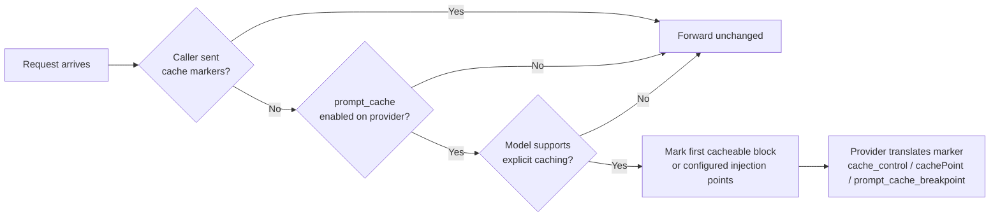

<Note>
Not to be confused with [semantic caching](/features/semantic-caching). Semantic caching is
Bifrost replaying a **response** it has already seen, so the provider is never called.
Prompt caching is the **provider** reusing the prefix of your request: the call still
happens and is still billed, but cached input is much cheaper than fresh input. The two
are independent and can both be on.
</Note>

## Overview

Providers such as Anthropic cache a prompt prefix only when the request marks where the
cacheable region ends, using a `cache_control` block on a message. Most SDKs let you add
that marker yourself, but agentic clients such as Codex send none at all. On Anthropic
models that means nothing is cached and every turn pays full price for a prompt that
barely changed. On providers that cache implicitly, the cached prefix slides onto the
newest message, so each turn writes a new cache entry and reads almost nothing back.

Bifrost can add the marker for the client. Turn on `prompt_cache.auto_inject` for a
provider and Bifrost marks the first cacheable content block of every request that
arrives without markers of its own. That block is the prefix an agent loop replays
verbatim each turn, so turn 1 writes the cache and turn 2 onward reads it.

**Key properties:**

- **Off by default** - a cache marker is a cost decision, and Bifrost never spends one the operator did not ask for.
- **Caller markers always win** - a request that already carries `cache_control` or `prompt_cache_breakpoint` is forwarded unchanged.
- **Capability gated** - a marker is only injected for models that can act on one. Implicit-caching providers are never sent a marker they would reject or ignore.
- **Per-provider** - configure it on each provider independently, from the provider config sheet, the management API, or `config.json`.
- **Overridable per request** - flip `auto_inject` for a single request with the `x-bf-prompt-cache-auto-inject` header.

---

## How it works



Injection runs on Chat Completions and Responses requests, including their streaming
variants, and on every SDK integration route that Bifrost converts into one of those
two shapes. A few rules govern what gets marked:

1. **First cacheable block.** With `auto_inject` alone, Bifrost walks the messages in order and marks the first text, image, or file block it finds. A message whose content is a plain string is promoted to a single text block so the marker has somewhere to sit. The promotion is deterministic, so the cached prefix stays byte-identical across turns.
2. **Caller markers win.** If any message already carries a marker, the request is left completely alone. Injection is a default for clients that say nothing, never an override of a client that spoke.
3. **At most four markers.** Anthropic rejects a request carrying more than four blocks with `cache_control`, and every other dialect derives from that ceiling. Injection stops at four rather than relying on a downstream clamp that would silently discard the earliest marker.
4. **Copy on write.** The request Bifrost holds is never mutated. The marker is added to a copy handed to the provider, so plugins, retries, and fallbacks never see a marker the caller did not send.
5. **Per attempt.** A fallback to a different provider re-evaluates injection against that provider's own `prompt_cache` config and model capabilities. It does not inherit the previous provider's decision.

---

## Provider support

Bifrost injects one internal marker shape and each provider translates it to its own
wire format. The capability gate is evaluated per model, not per provider, so a
provider that serves both explicit-caching and implicit-caching models only injects on
the former.

| Provider | Models that take a marker | Wire format | TTL |
|----------|---------------------------|-------------|-----|
| Anthropic | All Claude models | `cache_control: {"type": "ephemeral"}` on the content block | `5m` default, `1h` with `ttl` |
| Vertex AI | Claude models only. Gemini caches through a server-side `cachedContent` resource, so injection is a no-op there | `cache_control` | `5m` default, `1h` with `ttl` |
| Bedrock | Claude and Amazon Nova on the Converse API. gpt-5.6 ids that resolve to the Mantle surface, or that a key with `use_openai_endpoints` sends to `/openai/v1`, follow the OpenAI row. A gpt-5.6 id served by Converse (cross-region ids such as `global.openai.gpt-5.6-luna` on a default key) gets Bedrock's implicit, best-effort prefix caching with no marker at all. Mid-conversation `role: "system"` messages are inlined in place for every model family so the cached prefix stays stable across turns | `cachePoint` block | Claude only. Nova accepts only the default and returns 400 for `1h` |
| Bedrock Mantle | Claude, Amazon Nova, and the gpt-5.6 family | `cachePoint` for Claude and Nova, `prompt_cache_breakpoint` for gpt-5.6 | Same as Bedrock |
| OpenAI | gpt-5.6 family on the Responses API. Earlier models cache implicitly, and Chat Completions strips the marker for every model | `prompt_cache_breakpoint` on the block plus `prompt_cache_options.mode: "explicit"` on the request | Ignored |
| Azure OpenAI | gpt-5.6 family on the Responses API | Same as OpenAI | Ignored |
| OpenRouter | Claude models | `cache_control` (Chat) or `prompt_cache_breakpoint` (Responses), converted upstream | `5m` default, `1h` with `ttl` |
| Custom providers | Follow the base provider they wrap | Same as the base provider | Same as the base provider |
| Gemini, DeepSeek, Groq, xAI, Mistral, and other implicit-caching providers | None | Not applicable, injection is a no-op | Not applicable |

<Info>
The `Prompt Caching` tab appears in the provider sheet for every provider, including
those where injection is a no-op. Saving `auto_inject: true` on an implicit-caching
provider is harmless: the capability gate answers false for every model, so no marker is
ever sent. The setting starts working the moment that provider gains a model that
accepts explicit markers.
</Info>

See the provider guides for the full cache-control semantics of each dialect:
[Anthropic](/providers/supported-providers/anthropic#auto-inject-cache-breakpoints),
[Bedrock](/providers/supported-providers/bedrock#cache-control),
[OpenAI](/providers/supported-providers/openai),
[Vertex](/providers/supported-providers/vertex),
[OpenRouter](/providers/supported-providers/openrouter), and
[Gemini](/providers/supported-providers/gemini).

---

## Configuration

Prompt caching is configured per provider. Three settings are available:

| Field | Type | Required | Description |
|-------|------|----------|-------------|
| `auto_inject` | boolean | Yes | Mark the first cacheable content block when the caller supplied no markers. |
| `ttl` | string | No | Lifetime requested for injected markers. The only accepted value is `"1h"`. Omit it for the provider default (5 minutes on Anthropic). Providers that cannot carry a TTL ignore it. |
| `cache_control_injection_points` | array | No | Target specific messages instead of the first cacheable block. When set, this **replaces** `auto_inject` rather than adding to it. See [Injection points](#injection-points). |

<Tabs group="config-method">
<Tab title="Web UI">

1. Open **Model Providers** and select the provider you want to configure.
2. Click **Edit Provider Config** to open the provider configuration sheet.
3. Select the **Prompt Caching** tab.

<Frame>
  
</Frame>

4. Turn on **Auto-inject cache breakpoints**.
5. Optionally change **Cache TTL** from **Provider default (5 minutes)** to **1 hour**.
6. Optionally click **Add injection point** and set a **Role**, an **Index**, or both for each point. Adding any point replaces the default first-block strategy.

<Frame>
  
</Frame>

7. Click **Save Prompt Caching**.

</Tab>
<Tab title="API">

Update the provider with a `prompt_cache` block. The endpoint replaces the provider-level
configuration, so send your existing network and concurrency settings alongside it.

```bash
curl --location --request PUT 'http://localhost:8080/api/providers/anthropic' \
--header 'Content-Type: application/json' \
--data '{
    "network_config": {
        "default_request_timeout_in_seconds": 30,
        "max_retries": 0
    },
    "concurrency_and_buffer_size": {
        "concurrency": 1000,
        "buffer_size": 5000
    },
    "prompt_cache": {
        "auto_inject": true,
        "ttl": "1h"
    }
}'
```

To turn injection off again, send `"prompt_cache": {"auto_inject": false}`. To remove
the block entirely, send `"prompt_cache": null`. Omitting the field leaves the current
value untouched.

**Response:**

```json
{
  "name": "anthropic",
  "network_config": { "...": "..." },
  "concurrency_and_buffer_size": { "concurrency": 1000, "buffer_size": 5000 },
  "prompt_cache": {
    "auto_inject": true,
    "ttl": "1h"
  },
  "provider_status": "active"
}
```

A `ttl` other than `"1h"`, an unknown `role`, or a `location` other than `"message"` is
rejected with `400 Bad Request` and a message starting with
`prompt cache validation failed`.

</Tab>
<Tab title="config.json">

```json
{
  "providers": {
    "anthropic": {
      "keys": [
        {
          "name": "anthropic-key-1",
          "value": "env.ANTHROPIC_API_KEY",
          "models": ["*"],
          "weight": 1.0
        }
      ],
      "prompt_cache": {
        "auto_inject": true,
        "ttl": "1h"
      }
    }
  }
}
```

With explicit injection points instead of the default strategy:

```json
{
  "providers": {
    "bedrock": {
      "keys": [
        {
          "name": "bedrock-key-1",
          "models": ["*"],
          "weight": 1.0,
          "bedrock_key_config": {
            "access_key": "env.AWS_ACCESS_KEY_ID",
            "secret_key": "env.AWS_SECRET_ACCESS_KEY",
            "region": "us-east-1"
          }
        }
      ],
      "prompt_cache": {
        "auto_inject": true,
        "cache_control_injection_points": [
          { "location": "message", "role": "system" },
          { "location": "message", "index": -1 }
        ]
      }
    }
  }
}
```

<Note>
`prompt_cache` is part of the provider's config hash. In the default split mode, a
change to the block in `config.json` is synced into the config store on the next
restart, while an unchanged block keeps whatever was last saved from the Web UI or API.
With `source_of_truth: "config.json"` the file always wins. See
[Source of Truth & Reconciliation](/deployment-guides/config-json/source-of-truth).

The file path stores the block as written. Only the management API rejects an
unsupported `ttl` or `role`, so keep the file within the values listed above.
</Note>

</Tab>
<Tab title="Go SDK">

Set `PromptCache` on the `ProviderConfig` your account returns from
`GetConfigForProvider`:

```go
func (a *MyAccount) GetConfigForProvider(provider schemas.ModelProvider) (*schemas.ProviderConfig, error) {
	switch provider {
	case schemas.Anthropic:
		return &schemas.ProviderConfig{
			NetworkConfig:            schemas.DefaultNetworkConfig,
			ConcurrencyAndBufferSize: schemas.DefaultConcurrencyAndBufferSize,
			PromptCache: &schemas.PromptCacheConfig{
				AutoInject: true,
				TTL:        new("1h"),
			},
		}, nil
	}
	return nil, fmt.Errorf("provider %s not configured", provider)
}
```

</Tab>
</Tabs>

---

## Injection points

`cache_control_injection_points` gives you precise control over which messages are
marked. It mirrors LiteLLM's setting of the same name, so an existing LiteLLM
configuration carries over directly.

Each point has three fields:

| Field | Type | Required | Description |
|-------|------|----------|-------------|
| `location` | string | No | What to target. Only `"message"` is supported today. Reserved so tools and system targets can be added later without changing the config shape. |
| `role` | string | No | Match messages with this role: `system`, `developer`, `user`, or `assistant`. |
| `index` | integer | No | Match the message at this position. Negative values count from the end, so `-1` is the last message. |

The matching rules:

- **Role and index combine with AND.** A point with both matches only when the message at that index has that role.
- **Role alone matches every message with that role.** Four `user` messages produce four markers, which is the whole budget.
- **Index alone matches one message.** An index past either end of the conversation matches nothing. A conversation shorter than the configured index is normal in the early turns of a session, so it is not treated as an error and no other message is marked in its place.
- **A point with neither role nor index matches nothing.** It is almost certainly a mistake, and marking every message would burn the whole budget.
- **The last cacheable block of each match is marked**, not the first. A point names a message you want cached through to its end, unlike the default strategy which names a prefix boundary.
- **At most four markers are emitted**, in the order the points are listed. Points beyond the budget are ignored.
- **Any point replaces the default strategy.** `auto_inject` is still required to turn the feature on, but once at least one point is present the first-block rule no longer applies.

**Example: cache the system prompt and the latest user turn**

```json
{
  "prompt_cache": {
    "auto_inject": true,
    "cache_control_injection_points": [
      { "location": "message", "role": "system" },
      { "location": "message", "role": "user", "index": -1 }
    ]
  }
}
```

This is the shape most chat applications want: the system prompt is a stable prefix, and
marking the newest user message caches everything up to it for the next turn.

**Example: pin the first two messages**

```json
{
  "prompt_cache": {
    "auto_inject": true,
    "cache_control_injection_points": [
      { "location": "message", "index": 0 },
      { "location": "message", "index": 1 }
    ]
  }
}
```

<Warning>
Every point that matches spends one of the four markers. A `role: "assistant"` point on a
long conversation fills the budget with the first four assistant messages and leaves
nothing for the messages you actually care about. Prefer negative indexes for
"the latest" and role-plus-index for a specific slot.
</Warning>

---

## Per-request override

The `x-bf-prompt-cache-auto-inject` header flips `auto_inject` for a single request.
Send `true` to inject on a request to a provider that has it off, or `false` to leave a
request alone when the provider has it on.

<Tabs>
<Tab title="Gateway (cURL)">

```bash
curl --location 'http://localhost:8080/v1/chat/completions' \
--header 'x-bf-prompt-cache-auto-inject: false' \
--header 'Content-Type: application/json' \
--data '{
    "model": "anthropic/claude-sonnet-4-5",
    "messages": [{"role": "user", "content": "Hello!"}]
}'
```

</Tab>
<Tab title="Go SDK">

```go
ctx := context.Background()
ctx = context.WithValue(ctx, schemas.BifrostContextKeyPromptCacheAutoInject, false)

response, err := client.ChatCompletionRequest(schemas.NewBifrostContext(ctx, schemas.NoDeadline), &schemas.BifrostChatRequest{
	Provider: schemas.Anthropic,
	Model:    "claude-sonnet-4-5",
	Input:    messages,
})
```

</Tab>
</Tabs>

Two limits apply to the override:

- **It cannot manufacture opt-in.** The header only takes effect on a provider that has a `prompt_cache` block configured. A provider with no block is one whose operator has expressed no opinion, and a request header must not spend a cache marker or change the billing profile on their behalf. Configure `{"auto_inject": false}` on the provider if you want callers to opt in per request.
- **Only `auto_inject` is overridable.** The TTL and injection points stay a config-level decision. A caller that wants specific placement can send the markers itself, and caller markers always win.

The model capability gate applies either way, so the header cannot force a marker onto a
model that has no use for one.

---

## Verifying that caching works

A `200` response alone does not mean the cache was used. Read the usage block.

On Chat Completions, Bifrost surfaces the provider's cache counters under
`usage.prompt_tokens_details`:

```json
{
  "usage": {
    "prompt_tokens": 4213,
    "completion_tokens": 88,
    "prompt_tokens_details": {
      "cached_read_tokens": 4096,
      "cached_write_tokens": 0
    }
  }
}
```

On the Responses API the same counters appear under `usage.input_tokens_details`.

Expect the first request in a session to report `cached_write_tokens` and the following
requests to report `cached_read_tokens`. If every turn reports writes and no reads, the
cached prefix is changing between turns: check for a timestamp in the system prompt,
tools listed in a different order, or a client that rewrites earlier messages.

To see exactly where the marker landed, send `x-bf-send-back-raw-request: true` and
inspect `extra_fields.raw_request`. See
[Request Options](/providers/request-options#send-back-raw-request).

---

## Cost considerations

Prompt caching is cheaper only when the cached prefix is read more often than it is
written. Cache reads are billed well below the fresh-input rate, but the turn that
writes the cache costs more than fresh input: on Anthropic, 1.25x for the default 5
minute TTL and 2x for the 1 hour TTL.

- **Agent loops** replay the same prefix every turn, often dozens of times within a minute. This is the case the feature is built for and the savings are large.
- **One-shot requests** never read what they wrote. Injecting a marker there costs 25% to 100% more on the marked prefix for nothing in return. Leave `auto_inject` off on providers that only serve one-shot traffic, or use the header to opt those requests out.
- **A 1 hour TTL** survives long pauses between turns but doubles the write cost. Use it when turns are minutes apart, such as a human-in-the-loop workflow, and stay on the default when turns are seconds apart.

---

## Next steps

- **[Semantic Caching](/features/semantic-caching)** - Replay whole responses from Bifrost's own cache instead of calling the provider.
- **[Request Options](/providers/request-options)** - Every per-request header and context key, including the prompt-cache override.
- **[Anthropic](/providers/supported-providers/anthropic#cache-control)** - Cache-control semantics for Claude, which injected markers follow.
- **[Bedrock](/providers/supported-providers/bedrock#cache-control)** - How markers become `cachePoint` blocks on Bedrock.
- **[OpenAI](/providers/supported-providers/openai)** - Explicit cache mode on the gpt-5.6 family.
