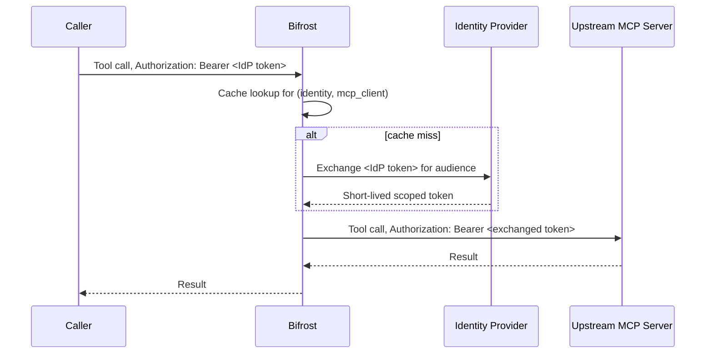

## Overview

`auth_type: "token_exchange"` lets each caller reach an upstream MCP server **as themselves**, without Bifrost ever storing a per-user credential. On every tool call, Bifrost takes the caller's own identity-provider (IdP) token and exchanges it — via [RFC 8693 Token Exchange](https://datatracker.ietf.org/doc/html/rfc8693) or the equivalent on-behalf-of grant — for a short-lived token scoped to that MCP server's audience. The exchanged token is sent upstream; the caller's original token never is.

This is strictly delegated: there is no shared service-account fallback. A caller with no identity token cannot use a `token_exchange` server — see [Identity requirements](#identity-requirements).

<Note>
Requires an **enabled SCIM identity provider** (enterprise). Token exchange runs against whichever IdP handles your SSO, using its token endpoint. See [Prerequisites](#prerequisites).
</Note>

<Warning>
Requires the `/mcp` gateway's own authentication mode — a separate, global setting from any individual MCP client's `auth_type`, see [Gateway Authentication → Authentication Modes](../gateway-auth#authentication-modes) — to be **`headers`** or **`both`**. In strict **`oauth`** mode, `/mcp` accepts only Bifrost-issued OAuth tokens and rejects everything else outright, including the caller's own identity-provider token that `token_exchange` needs. This isn't a limitation to work around: `oauth` mode's entire guarantee is "Bifrost tokens only," so it and `token_exchange` are mutually exclusive by design.
</Warning>

| | Per-User OAuth (`per_user_oauth`) | Token Exchange (`token_exchange`) |
| --- | --- | --- |
| Who authenticates | Each end-user, via a one-time browser consent | Nobody, per call — the caller's existing IdP token is reused |
| Credential stored per user | Yes — an OAuth token row per `(identity, mcp_client)` | No — nothing is stored per caller; exchanged tokens are cached in memory only |
| Upstream server sees | The user's own OAuth grant to that specific service | A token minted by your IdP representing the caller |
| Best for | Third-party SaaS (Notion, GitHub, Sentry) that runs its own OAuth | First-party/internal MCP servers that trust your organization's IdP |
| Setup | Admin OAuth app registration per service | Audience + a dedicated IdP application per MCP server |

If the upstream MCP server doesn't trust your SCIM identity provider's issuer — most third-party SaaS services — token exchange cannot work there. Use [Per-User OAuth](./per-user-oauth) instead.

This auth type is only valid for **HTTP** and **SSE** connections.

---

## Prerequisites

Token exchange needs an application registered at your identity provider with the token-exchange (or on-behalf-of) grant enabled and permission to mint tokens for your MCP servers' audiences. Each MCP client picks which application performs its exchange via `token_exchange.use_idp_credentials`:

- **`use_idp_credentials: false`** (default) — a **dedicated application**, separate from your SSO login application, configured per MCP client via `token_exchange.client_id`/`client_secret`. This is the right default for most providers: it keeps each MCP server's OBO grant scoped independently and limits what a leaked secret can reach.
- **`use_idp_credentials: true`** — reuses your **SSO login application's own credentials** instead; `client_id`/`client_secret` are then ignored.

Consult your IdP's documentation for how to register the exchange application; the exact grant name and setup steps vary by vendor:

| Provider | Grant used |
| --- | --- |
| Okta, Keycloak, Auth0, generic OIDC | RFC 8693 Token Exchange |
| Microsoft Entra ID | `jwt-bearer` grant with `requested_token_use=on_behalf_of` (Entra predates RFC 8693 and doesn't expose the standard grant) |

<Warning>
**Microsoft Entra ID requires `use_idp_credentials: true`.** Entra's on-behalf-of grant only accepts an assertion whose audience matches the application performing the exchange, and Bifrost's SSO login flow always requests a token self-audienced to the SSO application. A dedicated exchange application — a different application than the one your admins signed into Bifrost with — can never receive an assertion it's allowed to use, so the exchange fails on every call. See [Microsoft Entra ID: known setup gotchas](#microsoft-entra-id-known-setup-gotchas) below.

This isn't a Bifrost limitation: RFC 8693 servers (Okta, Auth0, Keycloak) authorize the *requesting client* for a target audience independently of whose token it presents — that's what lets a dedicated exchange app work there. Entra's OBO grant predates RFC 8693 and has no equivalent separate authorization step; it enforces the audience match directly on the assertion instead, so the requesting client and the token's original audience must be the same application. Microsoft's own OBO reference confirms this is enforced, not incidental: "This token must have an audience (`aud`) claim of the app making this OBO request... Applications can't redeem a token for a different app." ([Microsoft identity platform and OAuth2.0 On-Behalf-Of flow](https://learn.microsoft.com/en-us/entra/identity-platform/v2-oauth2-on-behalf-of-flow))
</Warning>

Bifrost derives the token endpoint and picks the correct grant shape automatically from your enabled SCIM provider — you never configure an endpoint or grant type directly.

<Warning>
**Okta specifically** ties an audience to the Authorization Server that issues it — one Authorization Server, one audience. Okta's own documented best practice is a **dedicated Custom Authorization Server per protected resource**, separate from the one your SSO login uses. If that's your setup, three additional things are required beyond the app registration above — see [Okta: per-resource Authorization Server](#okta-per-resource-authorization-server) below. Entra and Auth0 don't have this constraint: both use a single tenant-wide token endpoint regardless of target resource, so nothing extra is needed for them.
</Warning>

### Okta: per-resource Authorization Server

Skip this section if your exchange application's audience is registered on the **same** Authorization Server your SSO login uses — the defaults just work. If you followed Okta's own guidance and created a **separate Custom Authorization Server** for the resource (e.g. one per MCP server, or one shared "internal APIs" server distinct from your SSO login's server), all three of the following are required:

1. **Point the exchange at that Authorization Server explicitly.** Set `token_exchange.authorization_server_url` to its issuer URL (e.g. `https://your-domain.okta.com/oauth2/your-auth-server-id`). Without this, Bifrost sends the exchange request to the same Authorization Server your SSO login uses — which has never heard of an audience registered on a different one, and Okta rejects it with `invalid_target: Token Exchange requests must include a valid audience of the authorization server`.
2. **Register your SSO login's Authorization Server as a Trusted Server** on the resource's Authorization Server: **Security → API → (the resource's Authorization Server) → Trusted servers → Add Server**, and add the Authorization Server your SSO login uses (often `default`). Without this, Okta rejects the caller's identity token as an untrusted subject with `invalid_request: 'subject_token' is invalid` — the audience and endpoint can be entirely correct and this still fails, since it's a separate cross-server trust check.
3. **Define a custom scope on that Authorization Server** and include it in `token_exchange.scopes`. Standard OIDC scopes (`openid`, `profile`, `email`, `offline_access`) aren't valid for a service-app token exchange — Okta rejects the request with `invalid_scope: ... 'scope' must be provided` if none is set, or rejects an OIDC scope outright. Add a scope under **Security → API → (the resource's Authorization Server) → Scopes → Add Scope** (e.g. `your-resource.access`), grant it to the exchange application in that Authorization Server's Access Policy, and list it in `scopes`.

Also check that Okta's **DPoP** (sender-constrained tokens) requirement is off for the exchange application — Bifrost's token exchange sends plain bearer tokens, not DPoP-proofed ones. If your org enforces DPoP by default, disable it specifically for this application under its General settings, or the token request fails with `invalid_dpop_proof: The DPoP proof JWT header is missing`.

### Microsoft Entra ID: known setup gotchas

Entra's OBO flow surfaces several sharp edges that don't show up with Okta/Auth0/Keycloak. All of these were hit while setting up a real tenant end-to-end; fix them in this order if you see the matching error.

1. **Set `token_exchange.use_idp_credentials: true`.** This is not optional for Entra — see the warning in [Prerequisites](#prerequisites) above for why a dedicated exchange application structurally cannot work. `client_id`/`client_secret` are ignored once this is set; leave them unset.
2. **Token issuer mismatch — `oidc: id token issued by a different provider`.** Whether an app's tokens use the v1 issuer (`https://sts.windows.net/<tenant>/`) or the v2 issuer (`https://login.microsoftonline.com/<tenant>/v2.0`) is controlled by the **resource app's manifest**, not by which endpoint you called. If your MCP server validates against the v2 issuer (the standard OIDC discovery shape) but gets v1 tokens, open the resource app's registration → **Manifest** → set `"requestedAccessTokenVersion": 2` under the `api` block → Save.
3. **Audience mismatch — `oidc: expected audience "api://..." got ["..."]`.** Once an app issues v2 tokens, its access tokens carry the app's **client ID (bare GUID)** in `aud`, not the `api://...` Application ID URI you registered — even though you requested the scope using the URI form. Set `token_exchange.audience` (and the MCP server's own audience-validation config) to the bare GUID, not `api://<guid>`.
4. **`AADSTS240002: Input id_token cannot be used as 'urn:ietf:params:oauth:grant-type:jwt-bearer' grant`.** The assertion Entra's OBO endpoint accepts must be an **access token**, never an `id_token`. Bifrost's SSO session already stores the right one for real caller traffic; this only bites when hand-crafting a token for manual testing — if you hit it, you grabbed the `id_token` instead of the `access_token`.
5. **`AADSTS501461: AcceptMappedClaims is only supported for a token audience matching the application GUID...`.** If your SSO app has custom claims mapping enabled (`acceptMappedClaims: true` in its manifest — typically on if you're mapping `roles`/`groups` claims for SCIM attribute mappings), requesting an access token audienced to that app's own `api://<guid>` Application ID URI is rejected outright. This only comes up when manually minting a test token against the SSO app's own scope (e.g. `<client-id>/access_as_user`, not `api://<client-id>/access_as_user` — Entra treats an app's own client ID as an implicit alternate resource identifier alongside its App ID URI, and that form isn't subject to the same restriction); Bifrost's own runtime exchange isn't affected.
6. **Adding a scope silently drops resource access.** Entra's `.default` scope (what `audience` builds by default) cannot be combined with other delegated scopes — Microsoft's own OBO docs are explicit about this (`AADSTS70011` otherwise). Bifrost handles the one documented exception automatically: `scopes: ["offline_access"]` combines with the default (`<audience>/.default offline_access`) rather than replacing it. Any other scope you configure fully replaces the default instead, per Entra's own rule — there is no way to request `.default` alongside a named custom scope in the same call. If you need narrower, specific permissions rather than everything `.default` grants, expose named scopes on the resource app (**Expose an API** → **Add a scope**) and list only those in `scopes`, without `.default` at all.

---

## Setup

Each MCP client scopes its own exchange: which resource (`audience`) the token is minted for, and which IdP application performs the exchange.

<Tabs>
<Tab title="Web UI">


1. Navigate to **MCP Gateway** in the sidebar
2. Click **New MCP Server**
3. Pick **HTTP** or **SSE** as the connection type, fill in the **Connection URL**
4. Set **Auth Type** to **Token Exchange (On-Behalf-Of)** — only shown when an identity provider is configured
5. Fill in:
   - **Audience** — the resource identifier this server is registered as at your identity provider (e.g. `api://jira-mcp` for Okta/Auth0/Keycloak). **For Microsoft Entra ID**, this is the resource app's **Application (client) ID** — a bare GUID, not the `api://...` Application ID URI shown under "Expose an API"; see [Audience mismatch](#microsoft-entra-id-known-setup-gotchas) below for why
   - **Exchange application** — **Dedicated application** (default) or **Identity provider application**. Pick the latter, which reuses your SSO login application's credentials, if your provider requires it — Microsoft Entra ID always does; see [Prerequisites](#prerequisites)
   - **Exchange Client ID** (required) / **Exchange Client Secret** (optional for public clients) — only shown when **Dedicated application** is selected
   - **Authorization Server URL** (optional) — only needed if this audience is registered on a different Authorization Server than your SSO login uses; see [Okta: per-resource Authorization Server](#okta-per-resource-authorization-server)
   - **Scopes** (optional, comma-separated) — include `offline_access` where your identity provider supports it, so exchanges issue refresh tokens and the retained admin discovery credential stays self-renewing. For Microsoft Entra ID specifically: `offline_access` is the *only* additional scope that combines with the audience's default resource access — leave it as the sole entry to keep both; any other scope here replaces the default resource scope entirely rather than adding to it, and Entra rejects a `.default` + custom-scope combination outright — if you need narrower, specific permissions instead of the audience's default access, list only named resource scopes here (e.g. `api://jira-mcp/access_as_user`), with no `.default` entry at all
6. Click **Create** — Bifrost exchanges *your own* signed-in identity token, verifies the upstream connection, and discovers tools

</Tab>

<Tab title="config.json">

```json
{
  "mcp": {
    "client_configs": [
      {
        "name": "jira",
        "connection_type": "http",
        "connection_string": "https://jira-mcp.internal/mcp",
        "auth_type": "token_exchange",
        "token_exchange": {
          "audience": "api://jira-mcp",
          "client_id": "env.JIRA_EXCHANGE_CLIENT_ID",
          "client_secret": "env.JIRA_EXCHANGE_CLIENT_SECRET",
          "scopes": ["jira.read", "jira.write", "offline_access"]
        },
        "tools_to_execute": ["*"]
      }
    ]
  }
}
```

`audience` is always required. `client_id` is required unless `use_idp_credentials` is `true`, in which case `client_id`/`client_secret` are ignored and the exchange runs as your SSO login application instead — required for Microsoft Entra ID:

```json
"token_exchange": {
  "audience": "<entra-resource-app-client-id>",
  "use_idp_credentials": true
}
```

`client_id` and `client_secret` support `env.VAR_NAME` and `vault.path` references — plain values also work (encrypted at rest, redacted in API responses).

At boot the client lands in **`pending_verification`** state. From the MCP Gateway UI, open the client and click **Verify as me** — see [Verification](#verification) below.

<Note>
`token_exchange` cannot be combined with a `dual_credential_conflict_behavior` of `error`: token exchange relies on requests that may carry both an identity token and a virtual key, and `error` would reject exactly those requests. Creating a `token_exchange` client while the behavior is `error` (or switching the behavior to `error` while one exists) is rejected — see [Dual-credential behavior](../gateway-auth#identity-modes-at-consent) for the setting.
</Note>

</Tab>
</Tabs>

---

## How it works



1. The caller sends a request carrying their own identity-provider token (`Authorization: Bearer <token>`), or an SSO dashboard session.
2. Bifrost checks its in-memory cache for an exchanged token already minted for this `(identity, mcp_client)` pair.
3. On a miss, Bifrost exchanges the caller's token at the identity provider's token endpoint, scoped to the client's configured `audience`.
4. The exchanged token is used on an ephemeral upstream connection for that call only — nothing about it is written to the database.
5. The cache holds the exchanged token until shortly before it expires, so repeat calls from the same caller don't re-exchange every time.

If the identity provider rejects the exchange (the caller's token is invalid, revoked, or the exchange application lacks permission for the audience), the tool call fails with a message naming the identity-provider error. There is no interactive flow to complete — the caller fixes their credential and retries.

---

## Verification

Bifrost needs to prove the exchange works once before serving traffic: exchange a sample token, connect to the upstream server, and discover its tools. There is no manual token to paste — **verification always runs as the signed-in admin**, using the admin's own identity-provider token (already present on their dashboard session or API request).

- **`pending_verification`** — shown for a newly created or `config.json`-declared client with no discovered tools yet. Click **Verify as me** on the client sheet.
- **`needs_reauth`** — shown when the retained admin discovery credential (see below) has died and needs repair. Click **Re-verify as me**.

Both buttons call the same endpoint, `POST /api/mcp/client/{id}/verify-exchange`, with no request body.


<Info>
Verification requires an identity-authenticated session or request (SSO login, or a request bearing your own IdP token). An API-key-authenticated request has no identity token to exchange and verification fails with a message asking you to sign in with your identity provider first.
</Info>

### Admin discovery credential

The token exchanged during verification is retained as a client-level **admin discovery credential**, used only for periodic tool-list refresh — never for end-user tool calls, which always exchange the caller's own token. It renews automatically via the refresh token your identity provider issues alongside the exchange, provided your configured `scopes` include `offline_access` (or your provider's equivalent).

Without a refresh token, the admin credential expires within its own lifetime and the client shows **`needs_reauth`** until an admin clicks **Re-verify as me**. End-user tool calls are unaffected either way — only the periodic tool-list refresh pauses.


---

## Identity requirements

Unlike per-user OAuth and per-user headers, token exchange has **no virtual-key-only path**. A caller must present a validated identity-provider token — a virtual key alone establishes governance (budgets, rate limits, tool scoping) but carries nothing to exchange.

- **`Authorization: Bearer <IdP JWT>`** — validated against your SCIM identity provider, then used as the exchange subject.
- **A dashboard SSO session** (cookie) — the session's stored identity-provider token is used automatically; no header needed.
- **A virtual key alone** — resolves identity and governance, but a tool call against a `token_exchange` server fails: `subject_token_missing`.

Sending both an identity token and a virtual key is fine — [`dual_credential_conflict_behavior`](../gateway-auth) decides which one governance attributes the request to, while the identity token is used for the exchange either way.

---

## Configuration reference

```json
{
  "auth_type": "token_exchange",
  "token_exchange": {
    "audience": "api://jira-mcp",
    "use_idp_credentials": false,
    "client_id": "***REDACTED***",
    "client_secret": "***REDACTED***",
    "authorization_server_url": "https://your-domain.okta.com/oauth2/your-auth-server-id",
    "scopes": ["jira.read", "jira.write", "offline_access"]
  }
}
```

| Field | Type | Required | Description |
|---|---|---|---|
| `audience` | string | Yes | Resource identifier this server is scoped to at the identity provider. For Microsoft Entra ID, this is the resource app's Application (client) ID — a bare GUID, not its `api://...` Application ID URI. |
| `use_idp_credentials` | boolean | No (default `false`) | When `true`, performs the exchange as the SSO login application itself instead of `client_id`/`client_secret`, which are then ignored. Required for Microsoft Entra ID — see [Prerequisites](#prerequisites) |
| `client_id` | string | Yes, unless `use_idp_credentials` is `true` | The dedicated exchange application's client ID (env./vault. references supported) |
| `client_secret` | string | No | The exchange application's secret; omit for public clients. Ignored when `use_idp_credentials` is `true` (env./vault. references supported) |
| `authorization_server_url` | string | No | Overrides which Authorization Server the exchange is sent to. Only needed when `audience` is registered on a different Authorization Server than your SSO login uses — see [Okta: per-resource Authorization Server](#okta-per-resource-authorization-server). Leave unset for Entra and Auth0. |
| `scopes` | string[] | No | Scopes requested on the exchanged token; include `offline_access` for a self-renewing admin discovery credential. For Okta, must include a custom scope defined on the target Authorization Server — standard OIDC scopes are not valid here. For Microsoft Entra ID, `offline_access` is the only scope Bifrost will combine with the audience's default resource access (`<audience>/.default offline_access`) — any other configured scope fully replaces the default instead of adding to it, matching Entra's own restriction on combining `.default` with other delegated scopes. |

`client_id` and `client_secret` are redacted in API responses, same as other MCP credential fields.

---

## Try it yourself

[`examples/mcps/token-exchange-demo-server`](https://github.com/maximhq/bifrost/tree/main/examples/mcps/token-exchange-demo-server) is a runnable MCP server for testing this end-to-end against a real identity provider (Okta, Entra, Keycloak, Auth0, or any generic OIDC provider). It validates every request's bearer token via real OIDC discovery and JWKS signature verification — no shortcuts — and exposes a `whoami` tool that echoes back the caller's identity claims, so you can confirm each caller's own identity reached the upstream server.

---

## Next Steps

- [Per-User OAuth](./per-user-oauth) — when the upstream server runs its own OAuth and doesn't trust your IdP
- [MCP Authentication Overview](./overview) — compare all auth types
- [Gateway Authentication](../gateway-auth) — identity modes and dual-credential behavior
