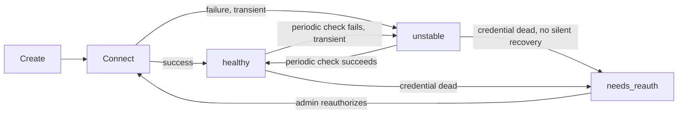
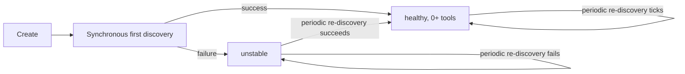
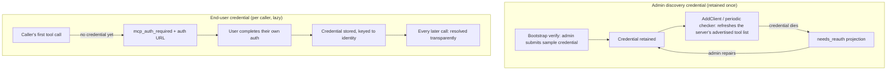

This page is the canonical reference for **connection mode** (sticky vs. per-call) and **connection state** across every MCP auth type. For the auth-type decision itself (which credential shape to use), see [MCP Authentication](./auth/overview).

---

## Two independent axes

Every MCP client sits somewhere on two independent axes:

1. **Who authenticates** — server-level (`none`, `headers`, `oauth`) vs. per-user (`per_user_headers`, `per_user_oauth`, `token_exchange`). Covered in [MCP Authentication](./auth/overview).
2. **How the connection is held** — **sticky** (one persistent upstream connection, reused for every tool call) vs. **per-call** (a fresh connection dialed per tool call, closed immediately after). This page's focus.

The two axes aren't fully independent — which connection modes are even available depends on auth type and connection type:

| Auth type | Connection type | Connection mode |
| --- | --- | --- |
| `none`, `headers`, `oauth` | `http` | **Choosable** via [`needs_session_stickiness`](./connecting-to-servers#session-stickiness-http-only) — sticky if `true`, per-call if `false`/omitted (default) |
| `none`, `headers`, `oauth` | `sse`, `stdio` | **Always sticky** — an SSE session is inherently bound to its open stream, and STDIO needs a persistent subprocess. Setting `needs_session_stickiness: false` on either is rejected at creation. |
| `per_user_headers`, `per_user_oauth`, `token_exchange` | any | **Always per-call**, regardless of `needs_session_stickiness` (the field is ignored for these auth types) — each caller's own credential is resolved fresh per request; there is no single shared connection to keep alive |

So `needs_session_stickiness` only ever has an effect on `http` connections using a server-level auth type. Everything else is fixed by construction.

<Note>
Two entirely separate credential-resolution paths exist for per-user auth types, and they're easy to conflate: the **admin discovery credential** (retained once, used only for periodically refreshing the server's tool list) and the **end-user's own credential** (resolved per request, used only for the actual tool call). See [Per-user lifecycle](#per-user-lifecycle-per_user_oauth-per_user_headers-token_exchange) below.
</Note>

---

## Connection states

| State | Meaning | Self-heals? | Gates tool execution? | Applies to |
| --- | --- | --- | --- | --- |
| `healthy` | Bifrost's own periodic connection check (ping/`list_tools` for sticky, `list_tools` for per-call) most recently succeeded. | — | No | Sticky and per-call (server-level) |
| `unstable` | The periodic check most recently failed with a transient-classified error. Purely informational — tool calls are still attempted normally regardless. Reflects only Bifrost's own health checks, never the outcome of real tool calls. | Yes — next successful check | **No** | Sticky and per-call (server-level) |
| `needs_reauth` | **Server-level:** the connection credential itself died with no way to silently recover (e.g. an OAuth refresh token rejected upstream) — a hard gate, tool calls are refused outright rather than attempted against a known-dead credential, and the periodic checker goes quiet on this client until a human reauthorizes. **Per-user** (`per_user_oauth`, `per_user_headers`, `token_exchange`): a **response-only projection**, computed at list-time, never stored in the runtime manager. It means the *retained admin discovery credential* needs repair — end-user credentials and tool calls keep working the whole time; only the periodic tool-list refresh pauses. Overlays onto both `healthy` and `unstable` runtime readings (it's a more actionable signal than either), but never onto `disabled` or `pending_verification` — those already carry a more specific, authoritative meaning of their own. | **No** — human action required either way | Server-level: **yes**. Per-user: no (only the discovery refresh pauses) | All except `none` |
| `pending_verification` | Declared (typically via `config.json`) but the one-time auth/verification flow hasn't been completed by an admin yet. | No — needs the one-time verification | Yes, implicitly (nothing to call yet) | All auth types |
| `disabled` | An admin intentionally turned the client off. Configuration is preserved; connection and background workers are shut down. Authoritative — never silently overridden by a check result or the `needs_reauth` projection. | No — needs a manual re-enable | Yes | Sticky and per-call (server-level) |
| `error` | A data-consistency fallback used only when a client is registered in the config store but missing from the runtime manager entirely — a deeper anomaly than anything in the normal lifecycle, and never assigned by the connect/health-check machinery itself. | — | Yes | All (rare) |
| `degraded` | A **read-time cluster aggregate**, never a single node's own local state: multiple instances of a distributed deployment each currently hold a different self-reported state for the same client (e.g. one instance sees `healthy` while another currently sees `unstable`). Only meaningful for states that can genuinely vary per instance (`healthy`, `unstable`, `pending_verification`); `needs_reauth`/`disabled` are config-sourced facts expected to already agree everywhere, so disagreement there is a propagation problem, not something this value covers. Never appears in a single-instance deployment. | Depends on the underlying disagreement resolving | — | Cluster deployments only |

<Note>
`pending_tools` and a bare `connected`/`disconnected` naming existed in older versions of this doc set — the current state names are exactly the seven above. If you see `connected`, `disconnected`, `connecting`, or `pending_tools` referenced anywhere else in these docs, that's stale and maps to `healthy`, `unstable`, (nothing — was never a real state), and (removed — an empty `healthy` tool map already communicates the same thing) respectively.
</Note>

---

## Lifecycle: sticky server-level (`needs_session_stickiness: true`, or `sse`/`stdio`)

- **Connect** happens once at `AddClient` (boot, or client creation) and again on every reconnect. Reconnects are [make-before-break](./gateway#reconnection-behavior): the old connection keeps serving until the new one is ready, so token rotation never causes downtime.
- **`unstable`** is purely informational — a network blip doesn't stop tool calls, and the client self-heals on the next successful check with no human involvement.
- **`needs_reauth`** is a hard gate specifically for server-level clients: the periodic checker stops retrying entirely (retrying against a known-dead credential is pointless), and tool calls are refused outright rather than attempted. Recovery is [`POST /api/mcp/client/{id}/reauthorize`](./auth/oauth#reauthorization) (also covers `oauth`; `headers`/`none` credentials don't expire the same way, so this state is effectively OAuth-only in practice for server-level clients).
- Every discovered tool list — from the initial connect and from every periodic refresh — persists to the DB, gated on the tool list actually having changed (no write on an unchanged tick), so a restart doesn't lose anything a running instance had already discovered.

---

## Lifecycle: per-call server-level (`needs_session_stickiness: false`/omitted, `http` only)

- No persistent connection ever exists — every tool call dials fresh and closes immediately after. There's nothing to reconnect (`POST /reconnect` returns `400` for this mode), and `needs_reauth` doesn't apply here (there's no single connection credential to die — `headers`/`none`/`oauth` per-call clients cycle through a fresh credential resolution on every call).
- `AddClient` runs a **synchronous** first discovery pass if no tools are already known (e.g. from a prior successful discovery persisted to the DB) — without this, a client would sit at `healthy`/0-tools until the periodic checker's slow first tick, which can be minutes away for an already-`healthy` client.
- The periodic checker's ongoing ticks are the *only* thing revisiting this client afterward — same content-hash gating as the sticky case, so an unchanged tool list doesn't cause a write.

---

## Lifecycle: per-user (`per_user_oauth`, `per_user_headers`, `token_exchange`)

Per-user clients have **two entirely separate credential paths**, which is the single most important thing to understand about them:

**Admin discovery credential** — exists purely to keep the *advertised tool list* current, independent of any individual user:

1. **Bootstrap.** An admin submits a sample credential once (`POST /verify-headers`, `POST /verify-exchange`, or the `complete-oauth` callback for `per_user_oauth`). This is the one and only time a live admin session is required. As a side effect, that credential is **retained** server-side.
2. **Ongoing refresh.** `AddClient`'s own synchronous first-discovery pass and the periodic checker's ongoing ticks both reuse the *retained* credential (never a fresh admin login) to keep the tool list current — same content-hash-gated persistence as server-level clients.
3. **Repair.** If the retained credential itself dies (OAuth refresh fails, or a header schema change flips it to stale), it projects as `needs_reauth` in the client list — but only when the underlying runtime reading is `healthy` or `unstable`; a client sitting in `pending_verification` or `disabled` keeps that state instead. Repair is auth-type-specific: `POST /verify-headers` (headers), `POST /verify-exchange` (token exchange), or `reauthorize` → `complete-oauth` (`per_user_oauth`).

**End-user credential** — resolved per caller, on the actual tool-call path, with no relationship to the admin credential above:

1. A caller's request carries an identity (VK, signed-in user, or session ID — see [Identity modes](./auth/overview#identity-modes)).
2. Bifrost looks up that identity's own stored credential for this MCP client. Found and active → the call proceeds transparently. Missing or stale → an `mcp_auth_required` payload with an auth URL is returned instead of executing the tool.
3. The caller completes their own auth (OAuth consent, or submitting header values) once; every later call resolves transparently from then on.

<Warning>
Because these two paths are independent, a per-user client's tool list can go stale (admin credential dead) while every end-user's actual tool calls keep working perfectly, or vice versa — a specific user can be locked out (their own credential expired) while the tool list stays perfectly current for everyone else. Don't assume `needs_reauth` on a per-user client means anyone is blocked; check which credential it actually refers to.
</Warning>

---

## Recovery endpoints by combination

| Endpoint | Sticky server-level | Per-call server-level | Per-user |
| --- | --- | --- | --- |
| `POST /api/mcp/client/{id}/reconnect` | ✅ Re-dials the persistent connection | ❌ `400` — nothing to reconnect | ❌ `400` — nothing to reconnect |
| `POST /api/mcp/client/{id}/reauthorize` | ✅ Re-establishes a dead `oauth` credential | ✅ Same, for `oauth` | ✅ Re-establishes the *admin discovery* credential for `per_user_oauth` only |
| `POST /api/mcp/client/{id}/verify-headers` | — (`headers` has no expiring credential) | — | ✅ `per_user_headers` bootstrap + repair |
| `POST /api/mcp/client/{id}/verify-exchange` | — | — | ✅ `token_exchange` bootstrap + repair |
| `POST /api/mcp/client/{id}/initiate-verification` | ✅ `oauth` clients still in `pending_verification` (config.json bootstrap) | ✅ Same | ✅ `per_user_oauth` bootstrap (first step of the two-step OAuth dance) |
| `POST /api/mcp/client/{oauth_config_id}/complete-oauth` | ✅ Completes the bootstrap or reauthorize OAuth dance | ✅ Same | ✅ Completes `per_user_oauth` bootstrap or admin-credential repair |
| `PUT /api/mcp/client/{id}` (disable/enable, non-credential edits) | ✅ | ✅ | ✅ |

A `reconnect`/`reauthorize`/`close` call that doesn't apply to a client's current connection mode returns a consistent error (`client uses per-call connections; there is no persistent connection to reconnect/close`) rather than one that implies something is specifically wrong with per-user auth — the same message applies to any per-call client, shared or per-user.

---

## Next Steps

- [Session Stickiness](./connecting-to-servers#session-stickiness-http-only) — how to set `needs_session_stickiness`
- [MCP Authentication](./auth/overview) — which auth type to pick
- [MCP Gateway](./gateway) — reconnection behavior, dynamic tool discovery, health monitoring
