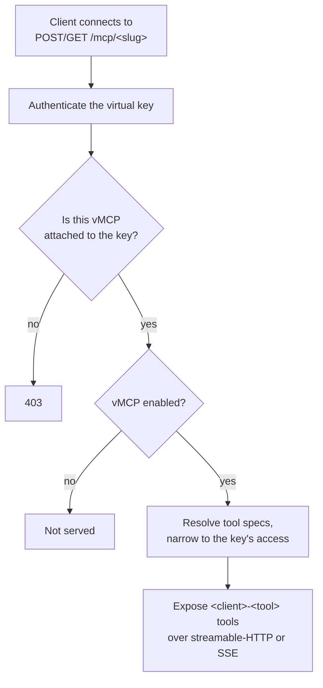

## Overview

A **Virtual MCP** (vMCP) is a named bundle of tools drawn from one or more of your MCP servers, exposed as its own MCP endpoint at `/mcp/<slug>`. Instead of pointing a client at a raw MCP server and hoping it only calls the right tools, you curate a subset once, give it a stable URL, and attach it to the virtual keys that should reach it.

<Info>
Virtual MCPs were previously called **MCP Tool Groups**. The feature is now part of open-source Bifrost (it requires [governance](/features/governance/virtual-keys) to be enabled). Enterprise adds extra scoping on top: see [Virtual MCPs (Enterprise)](/enterprise/virtual-mcps).
</Info>

**Key benefits:**

- **One curated endpoint** - Group tools from several MCP servers behind a single `/mcp/<slug>` URL.
- **Per-tool selection** - Include all tools from a server, or a named subset.
- **Stable, immutable slug** - The endpoint path is derived from the name (or set explicitly) and never changes, so clients don't break.
- **Virtual key scoped** - A vMCP is reachable only through the virtual keys it's attached to (enterprise can also grant it through [access profiles](/enterprise/virtual-mcps)).
- **No extra request latency** - Resolution happens against an in-process index, not extra database lookups.
- **Master enable / disable** - Turn a vMCP off to stop serving it without deleting it or its assignments.

---

## How it works

A Virtual MCP bundles tools you choose from one or more of your MCP servers. For each server you add, you either expose all of its tools or pick a specific subset. One vMCP can pull from several servers, so a single endpoint can span them.

Each vMCP is served at its own URL, `/mcp/<slug>`, and is reachable only through the virtual keys it's attached to. On enterprise, [access profiles](/enterprise/virtual-mcps) can also grant a vMCP (reachable through the profile's auto-allocated keys).

### The endpoint slug

Every vMCP is served at `/mcp/<slug>`:

- The slug is **derived from the name** when you don't set one (lowercased, non-alphanumeric runs collapsed to a single `-`, edges trimmed). "My Cool Tools" becomes `my-cool-tools`.
- It must be **unique across all vMCPs and all direct MCP clients** (they share the `/mcp/<slug>` namespace). A collision on create is auto-suffixed (`-2`, `-3`, ...) when derived, or rejected when set explicitly.
- It is **immutable after creation**. A request that changes it is silently ignored so existing client connections never break.

### Serving



Tools appear to the connected client as `<server>-<tool>`. A disabled vMCP, a slug the key isn't attached to, and a request with no valid key are all rejected. If a source MCP client is later removed, it silently contributes nothing and the rest of the vMCP keeps working.

---

## Two ways to consume a Virtual MCP

This is the most important mental model, because the two paths behave differently.

### Through the MCP Gateway (`/mcp/<slug>`)

Point an MCP client at `http(s)://<host>/mcp/<slug>`. The slug **narrows** the connection to exactly that one vMCP: `tools/list` returns only that vMCP's tools, even if the same virtual key has other vMCPs or direct MCP grants. The connecting client executes each `tools/call` itself.

The plain `/mcp` endpoint (no slug) is different: it exposes the **whole-key union** (all the key's vMCPs plus its direct MCP client grants), not a single vMCP.

### Through the LLM Gateway (`/v1/chat/completions`)

On a chat request, there is **no slug selection**. Every vMCP attached to the virtual key on the request has its tools folded into that key's tool union, and that union is what the model sees. A vMCP and a raw MCP grant are indistinguishable once folded. Auto-executable tools run server-side in the agent loop; others are returned to the caller to execute.

<Note>
Same key, same vMCPs: the MCP gateway isolates per slug, while the LLM gateway always gives the whole union. Use [MCP tool filtering](/features/governance/mcp-tools) headers (`x-bf-mcp-include-clients` / `x-bf-mcp-include-tools`) to narrow the LLM path further; they can only narrow the key's grant, never widen it.
</Note>

---

## Configuration

<Tabs group="config-method">
<Tab title="Web UI">

### Create

1. Navigate to **Workspace** -> **Virtual MCPs**, then click **Create**. A four-step wizard opens: **General -> Tools -> Access -> Review**.

<Frame>
  
</Frame>

2. **General** - Enter a **Name** (required). Optionally set an **Endpoint slug** (leave blank to derive it from the name) and a **Description**, and toggle **Enabled**. The page you'll be served at is previewed as `/mcp/<slug>`.

<Frame>
  
</Frame>

3. **Tools** - Add one or more MCP servers. For each, choose **Allow All Tools** (`*`) or pick a specific subset.

<Frame>
  
</Frame>

4. **Access** - Optionally stage one or more virtual keys to attach on creation.

<Frame>
  
</Frame>

5. **Review** - Confirm the endpoint URL, per-server tool summary, and staged keys, then **Create**.

### Edit, toggle, delete

- Open a row to edit it in a sheet with **General / Tools / Access / Connect** tabs. The **Connect** tab shows the full endpoint URL and how to point a client at it. The slug field is read-only here (immutable after creation).
- The table's **Enabled** switch toggles serving without opening the sheet.
- **Delete** is confirmed via dialog and warns that the vMCP stops being served at `/mcp/<slug>` and is removed from any virtual keys it's assigned to.

</Tab>
<Tab title="API">

Base path: `/api/mcp/virtual-mcps`. Requires governance to be enabled.

**Create:**

```bash
curl -X POST http://localhost:8080/api/mcp/virtual-mcps \
  -H "Content-Type: application/json" \
  -d '{
    "name": "Support Tools",
    "endpoint_slug": "support-tools",
    "description": "Ticketing + docs search",
    "enabled": true,
    "tools": [
      { "mcp_client_id": "zendesk", "tool_names": ["*"] },
      { "mcp_client_id": "docs-search", "tool_names": ["query", "get_page"] }
    ]
  }'
```

**Response:**

```json
{
  "virtual_mcp": {
    "id": 12,
    "name": "Support Tools",
    "endpoint_slug": "support-tools",
    "description": "Ticketing + docs search",
    "enabled": true,
    "tools": [
      { "mcp_client_id": "zendesk", "tool_names": ["*"] },
      { "mcp_client_id": "docs-search", "tool_names": ["query", "get_page"] }
    ],
    "virtual_key_ids": [],
    "created_at": "2026-09-04T10:00:00Z",
    "updated_at": "2026-09-04T10:00:00Z"
  }
}
```

**Other endpoints:**

| Method | Path | Description |
|--------|------|-------------|
| `GET` | `/api/mcp/virtual-mcps` | List (supports `search`, `limit`, `offset`) |
| `GET` | `/api/mcp/virtual-mcps/{id}` | Get one |
| `PUT` | `/api/mcp/virtual-mcps/{id}` | Update (`endpoint_slug` is ignored) |
| `DELETE` | `/api/mcp/virtual-mcps/{id}` | Delete |
| `POST` | `/api/mcp/virtual-mcps/{id}/virtual-keys/{vkId}` | Attach to a virtual key |
| `DELETE` | `/api/mcp/virtual-mcps/{id}/virtual-keys/{vkId}` | Detach from a virtual key |

**Request fields:**

| Field | Type | Required | Description |
|-------|------|----------|-------------|
| `name` | string | Yes | Display name |
| `endpoint_slug` | string | No | Honored on create only; derived from `name` when omitted; immutable after |
| `description` | string | No | Free text |
| `enabled` | boolean | No | Defaults to `true` |
| `tools` | array | Yes | Tool specs: `mcp_client_id` + `tool_names` (`["*"]` = all current and future tools, `[]` = none) |

<Note>
Unknown `mcp_client_id`s are rejected on save. Unknown tool **names** are not validated on save; they're enforced at call time. A slug already used by another vMCP or a direct MCP client returns `409`.
</Note>

</Tab>
<Tab title="config.json">

Virtual MCPs are declared under `mcp.virtual_mcps`. They are reconciled into the config store at load and served at `/mcp/<endpoint_slug>`:

```json
{
  "mcp": {
    "virtual_mcps": [
      {
        "name": "Support Tools",
        "endpoint_slug": "support-tools",
        "description": "Ticketing + docs search",
        "enabled": true,
        "tools": [
          { "mcp_client_name": "zendesk", "tool_names": ["*"] },
          { "mcp_client_name": "docs-search", "tool_names": ["query", "get_page"] }
        ],
        "virtual_key_ids": ["vk-support"]
      }
    ]
  }
}
```

| Field | Type | Required | Description |
|-------|------|----------|-------------|
| `id` | integer | No | Positive integer (>= 1). When set, the reconciler matches by this ID first and falls back to name when no stored vMCP has that ID; a name match keeps its existing stored ID |
| `name` | string | Yes | Display name (unique) |
| `endpoint_slug` | string | No | Lowercase URL-safe kebab-case (pattern `^[a-z0-9]+(-[a-z0-9]+)*$`) path served at `/mcp/<endpoint_slug>`. Derived from the name when omitted; immutable after creation; unique across vMCPs and direct MCP clients |
| `description` | string | No | Free text |
| `enabled` | boolean | No | Defaults to `true`. A disabled vMCP is not served |
| `tools` | array | Yes | At least one entry. Each item needs `mcp_client_id` or `mcp_client_name`, plus `tool_names` (`["*"]` = all current and future tools, `[]` = none) |
| `virtual_key_ids` | string[] | No | Virtual keys the vMCP is attached to |

When `source_of_truth` is `config.json` and `mcp.virtual_mcps` is present, it is authoritative for vMCPs: any stored vMCP absent from it is removed, and an explicit `"virtual_mcps": []` prunes them all. Omitting `mcp.virtual_mcps` leaves stored vMCPs unchanged. In `split` mode the file creates and updates vMCPs but never prunes runtime-managed ones.

<Note>
`mcp.tool_groups` is the deprecated former name for this key and is kept for backward compatibility. It carries legacy attachment arrays (`team_ids`, `customer_ids`, `user_ids`, `provider_names`, `api_key_ids`) and does not expose `endpoint_slug`. Prefer `mcp.virtual_mcps` for new setups; when both keys are present, `mcp.virtual_mcps` wins and `mcp.tool_groups` is ignored.
</Note>

The same fields are available in the Helm chart under `bifrost.mcp.virtualMcps` (camelCase keys, e.g. `endpointSlug`, `virtualKeyIds`), which renders into `mcp.virtual_mcps`.

</Tab>
</Tabs>

---

## Assigning to virtual keys

A vMCP is only reachable through the virtual keys it's attached to. Attach from the vMCP's **Access** tab, from the virtual key's **Virtual MCP Server Configurations** section, or via the attach/detach API.

<Note>
On enterprise, [access profiles](/enterprise/virtual-mcps) are a second way to grant a vMCP: every user in the profile reaches it through their auto-allocated keys, without a direct attachment.
</Note>

Attaching a vMCP to a key changes what that key sees on both paths:

- **MCP gateway** - the key can now reach `/mcp/<slug>` (previously `403`), and that slug returns only this vMCP's tools.
- **LLM gateway** - the vMCP's tools are added to the key's tool union that the model sees, alongside any tools the key already grants directly.

Detaching reverses both. A tool reachable both directly and via a vMCP appears once, not duplicated.

---

## Direct MCP client endpoints

Individual MCP clients can also be served directly at `/mcp/<slug>` using their own `endpoint_slug`, in the same namespace as Virtual MCPs. When a client connects to a slug, Bifrost resolves it as a Virtual MCP first, then falls back to a single MCP client. This is why slugs must be unique across both. Use a direct client endpoint to expose one server as-is; use a Virtual MCP to curate and combine tools across servers.

---

## Enterprise scoping

Enterprise builds add scoping on top of the open-source feature:

- **Access profiles** grant a whole vMCP (and all its tools) to every user in the profile.
- **Data Access Control** governs which vMCPs each operator can see in the UI.
- **Projects** can be assigned vMCPs.
- **Clustering** propagates vMCP definition and assignment changes across nodes.

See **[Virtual MCPs (Enterprise)](/enterprise/virtual-mcps)** for details.

---

## Troubleshooting

### A client gets 403 at `/mcp/<slug>`
**Cause:** the virtual key isn't attached to that vMCP (or the key is invalid/expired).
**Fix:** attach the vMCP to the key, and confirm the key is active.

### The endpoint returns nothing / the vMCP isn't served
**Cause:** the vMCP is disabled, or all its source clients were removed.
**Fix:** enable it from the table toggle; check its source MCP clients still exist.

### A tool is missing from `tools/list`
**Cause:** the tool isn't in the vMCP's per-client selection, or it's blocked by the key's own MCP allow-list.
**Fix:** add the tool to the vMCP's spec; check the key's [MCP tool filtering](/features/governance/mcp-tools).

### I can't change the slug
**Expected:** slugs are immutable after creation. Create a new vMCP with the desired slug and migrate clients if you need a different path.

---

## Next steps

- **[MCP tool filtering](/features/governance/mcp-tools)** - Per-key allow-lists that also apply to vMCP tools.
- **[Tool execution](/mcp/tool-execution)** - How tool calls are resolved and run.
- **[Virtual Keys](/features/governance/virtual-keys)** - The credential a vMCP attaches to.
- **[Virtual MCPs (Enterprise)](/enterprise/virtual-mcps)** - Access-profile, DAC, project, and cluster scoping.
