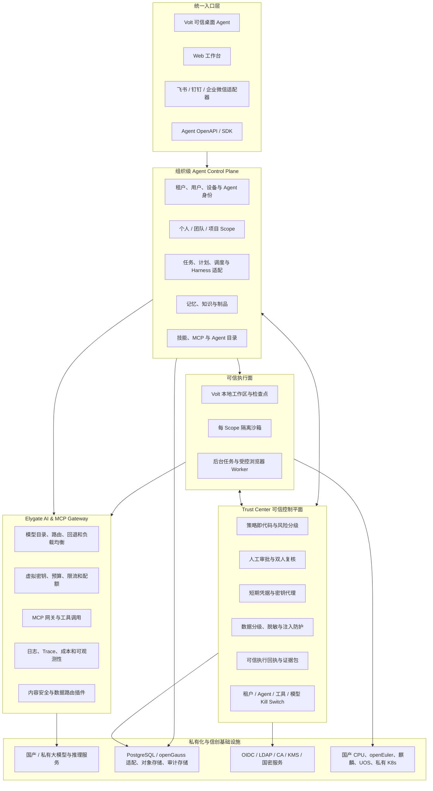

# Elygate 可信信创智能体一体化解决方案

> 文档状态：立项方案草案 v0.1
>
> 日期：2026-08-10
>
> 规划模式：Full PRD
>
> 工作名称：**Elygate TrustAgent Suite / 西谷智灯可信智能体平台**
>
> 说明：产品名称、工期、团队规模和量化目标均为立项建议，需在 Phase 0 评审后冻结。

> **范围修订（2026-08-30）**：本文保留为长期 TrustAgent 愿景，不是当前版本的交付承诺。当前执行基线已收敛为中小企业单机版，详见 [Elygate 中小企业 AI 网关产品规划](./elygate-smb-ai-gateway-roadmap-zh.md)。当前版本不验收 Kubernetes/Helm、多节点 HA、Redis、外部 KMS、WORM、SBOM/镜像签名和完整信创矩阵；这些内容仅作为未来客户定制或强监管版本的候选项。

## 1. 执行摘要

本项目不是“AI 网关 + 桌面 Agent + QM”三个产品的简单拼接，而是一套面向中国政企、国企、金融、制造、能源和研发组织的**可信、信创、可私有化部署的企业智能体解决方案**。

产品以四个统一为核心：

1. **统一入口**：所有模型调用和远程 MCP 工具流量经过 Elygate AI Gateway。
2. **统一身份**：用户、智能体、设备、技能、工具、模型和服务都有可验证身份。
3. **统一策略**：数据分级、模型路由、工具权限、网络出口、预算和人工审批由同一策略体系决策。
4. **统一证据**：从用户意图、模型推理、工具执行到业务副作用形成完整、可签名、可复核的可信执行回执。

三项现有资产的产品边界如下：

| 资产 | 在一体化产品中的定位 | 主要复用能力 | 不承担的职责 |
| --- | --- | --- | --- |
| `elygate` | AI/MCP 数据面与治理中枢 | 多模型统一 API、路由与容灾、虚拟密钥、预算与限流、MCP 网关、插件、日志与可观测性 | 不直接承担桌面操作和用户工作区执行 |
| `volt-gui` | 端侧 Agent 与可信执行终端 | 离线优先、多模型、MCP、权限、沙箱、检查点、技能、桌面/CLI 工作台 | 不承担组织级多租户控制面和统一模型治理 |
| `qm` | 组织级 Agent Core 的架构来源 | 个人/共享 Scope、持久沙箱、记忆、任务调度、技能共享、Harness 抽象、组织管理思路 | 不直接作为“已可信、已信创”的成品引入 |

关键结论：**一个产品不等于一个进程或一个代码仓库。** 建议保留网关、组织控制面和端侧 Agent 的清晰边界，通过版本化协议、统一控制台和统一发行清单形成一套产品，避免把三套运行时硬合并成不可维护的单体。

## 2. 产品定位

### 2.1 一句话定位

一套可在国产化基础设施和企业内网中部署、能调用多种国产/私有模型、能安全使用工具完成真实工作的可信智能体平台。

### 2.2 核心客户

- 政府和事业单位：政务办公、材料处理、知识检索、辅助分析。
- 国央企和大型集团：内网知识、研发协同、流程自动化、运营辅助。
- 金融、能源、制造等强监管行业：代码研发、故障分析、报表、合规辅助、受控运维。
- 软件和研发团队：本地 AI 编码、代码理解、测试、内部平台操作。
- 信创集成商：需要可交付、可验收、可适配国产软硬件的智能体底座。

### 2.3 客户要完成的工作

- 在数据不出域的前提下使用大模型和 Agent。
- 让 Agent 不仅“回答问题”，还能在可控权限内完成真实任务。
- 管理 Agent 能访问哪些模型、数据、工具、系统和网络目标。
- 对每次高风险动作进行审批、追溯、复核和紧急终止。
- 在国产 CPU、操作系统、数据库和密码体系上形成可验证的兼容证据。
- 避免被单一模型厂商、单一 Agent Harness 或单一云平台绑定。

## 3. 现状判断与融合原则

### 3.1 Elygate 现状

当前仓库以 Bifrost Go 网关为基础，已经具备多提供商统一接口、回退与负载均衡、MCP、治理插件、预算/限流、日志、遥测、OpenTelemetry 和插件扩展等基础能力。轻量 Svelte 管理面正在补齐旧控制台能力，企业 RBAC、审计、Guardrail、集群等能力存在扩展接口，但不能把“有入口或占位页”表述为“企业能力已经完成”。

因此 Elygate 最适合成为：

- 模型访问唯一出口；
- MCP 工具注册和远程调用入口；
- 用量、预算、成本、限流和模型路由中枢；
- 统一追踪 ID 和审计事件的起点；
- 数据分级路由和内容安全插件的执行点。

### 3.2 Volt GUI 现状

`volt-gui` 已形成离线优先的 Go/Wails Agent，支持多模型、MCP、技能、记忆、权限、计划模式、检查点和端侧工具。其单机、本地、内网友好特征与信创终端场景高度吻合。

需要补齐的产品级能力包括：

- 设备身份与设备可信状态；
- 组织策略下发与本地策略不可放宽约束；
- 所有模型请求强制经过 Elygate；
- 远程任务的签名领取、租约、回执和重放防护；
- Linux 国产桌面环境下的浏览器、沙箱、安装包、升级和外设适配；
- 本地 SQLite 数据的加密、迁移、备份、组织托管与擦除边界。

### 3.3 QM 现状

QM 的个人/共享 Scope、隔离工作区、记忆、密钥视图、权限、定时任务、Web 应用、技能共享和 Harness 抽象，适合作为组织级 Agent Core 的产品参考。

但 QM 官方安全说明明确把自身定位为早期实验软件，并披露了命令策略可绕过、部分浏览器动作绕过核心门禁、沙箱凭据使用时为明文、筛查不完整、出口控制有条件、数据可能长期保留、部分模型调用绕过预期网关、组织 Kill Switch 不完整等限制。因此融合策略必须是：

| 处理方式 | 能力 |
| --- | --- |
| 直接借鉴 | Scope 模型、Harness 抽象、部署目录、任务调度、技能归属、持久沙箱接口 |
| 适配后使用 | Postgres 存储、组织身份、管理门户、Web/消息渠道、记忆、后台任务 |
| 必须重做或加固 | 模型网关强制路径、凭据代理、网络出口、审批、审计回执、保留策略、Kill Switch、浏览器动作门禁 |
| 企业版禁用 | 无门禁的 Dangerous 模式、长期明文凭据、无法撤销的能力链接、绕过网关的模型路径 |

### 3.4 AgentConfig 候选能力

当前工作区还存在 AgentConfig Bundle 草案，可作为模型、MCP、技能和 Agent 配置的便携格式。建议将其发展为**受管配置交付协议**，但企业版本需要增加：

- 组织签名和发行者身份；
- 配置版本、到期时间、撤销列表和防回滚；
- KMS/国密密码服务适配；
- Secret 只引用密钥句柄，不在普通配置包内传递长期凭据；
- 导入前差异预览、风险扫描和管理员批准；
- SBOM、技能包摘要和来源证明。

## 4. 产品目标与非目标

### 4.1 产品目标

- 建成“Agent + Gateway + Trust Center + 信创发行”的一体化产品。
- 支持个人 Agent、团队共享 Agent、后台任务 Agent 和端侧执行 Agent。
- 支持国产模型、企业私有模型及 OpenAI/Anthropic 兼容模型的可插拔接入。
- 让模型输出永远只是建议，不直接等价于授权；真实副作用必须经过确定性策略门禁。
- 对每个任务形成可查询、可导出、可验签的证据链。
- 支持完全离线、内网、专有云和私有 Kubernetes 部署。
- 建立以实测报告为准的国产化兼容矩阵。

### 4.2 非目标

- 首版不建设基础模型训练平台或通用 AI 云市场。
- 首版不面向匿名公众提供开放式多租户 Agent 服务。
- 首版不允许无人审批执行转账、采购、生产控制、删除核心数据等高风险动作。
- 不以“用了国产模型”替代完整的信创适配和安全验收。
- 不在没有证据时宣称通过等保、密评、信创认证或国家标准认证。
- 不把 QM、Elygate 和 Volt 的源码直接复制到一个单体仓库。

## 5. 总体架构

### 5.1 架构原则

1. **控制面与数据面分离**：管理身份不能使用普通模型 API Key；模型数据面 Token 不能调用企业控制面。
2. **策略与执行分离**：Agent 和沙箱都不能自己决定权限；Trust Center 做最终授权。
3. **云端与端侧协同**：本地 Agent 可离线运行，连接组织后接受更严格策略，但组织策略不能被本地放宽。
4. **默认拒绝**：未知工具、未知模型、未知数据级别和未知网络目标默认拒绝或转人工。
5. **可撤销**：身份、授权、技能、工具、模型、配置和能力令牌都必须可过期、可撤销。
6. **可验证而非仅可观察**：日志说明“发生过”，回执还要说明“由谁授权、按哪条策略、执行了什么、结果是否验证”。

## 6. 核心产品模块

### 6.1 Elygate AI & MCP Gateway

Must：

- 统一 OpenAI/Anthropic/主流国产模型兼容接口。
- 模型目录包含提供商、部署区域、数据出域属性、能力、上下文、价格、健康状态和允许数据级别。
- 按租户、用户、Agent、项目、数据级别、任务类型进行路由。
- 支持回退、熔断、限流、预算、配额、并发和超时。
- 所有模型与 MCP 调用生成统一 `trace_id`、用量记录和策略结果。
- 禁止组织 Agent Core 存在绕过 Elygate 的模型调用路径。
- 提供无外网模式和明确的运行时网络清单。

Should：

- 支持推理端健康探测、容量感知和国产模型能力基准。
- 支持 Prompt/响应脱敏、敏感词、密钥检测和数据分类插件。
- 支持 Shadow Routing 和 Shadow Policy，只记录决策而不影响请求，用于上线前校准。

### 6.2 组织级 Agent Core

Must：

- 租户、组织、团队、项目、个人和会话 Scope。
- 每个 Scope 独立的工作区、记忆、密钥视图、预算、技能和权限。
- Agent Harness 适配接口，首批接入 Volt 原生 Harness，可选适配 Pi、OpenCode、Codex 等。
- 任务状态机：`draft -> planned -> awaiting_approval -> running -> verifying -> completed/failed/cancelled`。
- 后台任务、Cron、Watch、队列、幂等键、租约、取消和超时。
- 个人与共享 Scope 的显式授权，禁止隐式跨 Scope 记忆拼接。
- 所有 Agent 运行必须绑定 Agent Passport。

Should：

- 团队协作频道和项目房间。
- 国内消息渠道适配：飞书、钉钉、企业微信；Slack 仅作为可选国际适配器。
- 工作流模板、行业 Skill Pack 和管理员批准的组织级技能发布。

### 6.3 Volt 可信执行终端

Must：

- 本地 CLI/桌面双形态，共享会话、权限、沙箱和检查点语义。
- 组织模式下只使用 Elygate 下发的短期模型凭据或代理令牌。
- 文件写入、Shell、浏览器、桌面控制、远程 SSH 等工具独立分级。
- 修改前后保存可验证 Diff；支持检查点、回滚和失败恢复。
- 接收远程任务时校验任务签名、租约、Agent 身份、策略版本和过期时间。
- 离线状态可视；离线期间禁止执行需要在线授权的高风险任务。
- 国产桌面 Linux 不依赖 Windows Edge 假设，浏览器执行采用可配置、可审计的 Chromium 适配层。

Should：

- 设备证明：安装包签名、设备证书、版本、策略哈希和安全状态。
- 本地数据导出、备份、组织擦除和个人数据保留边界。
- 在国产桌面发行版上提供原生安装包、升级包和离线依赖仓库。

### 6.4 Trust Center

Must：

- 用户、服务、Agent、设备、工具、技能和模型的统一身份关系图。
- 策略版本化、评审、发布、灰度、回滚和不可绕过的组织底线。
- 工具风险分级、参数级策略、数据级别策略、网络出口策略和预算策略。
- 高风险动作人工审批；特高风险动作双人复核或禁止自动执行。
- 短期能力令牌和密钥代理，不向沙箱发放长期管理凭据。
- 全局、租户、Agent、工具、模型五级 Kill Switch。
- 追加式审计和可信执行回执。

Should：

- Prompt Injection/间接注入检测与来源标签。
- 策略仿真、回放、红队规则包和异常行为检测。
- 面向审计员的一键证据包导出。

### 6.5 管理控制台

- 总览：成功率、成本、任务状态、风险事件、审批积压、异常 Agent。
- 模型中心：模型目录、能力、数据等级、健康、成本和路由。
- Agent 中心：Agent Passport、负责人、版本、工具、预算、运行状态。
- 工具与技能中心：来源、签名、SBOM、风险级别、权限和版本。
- 策略中心：数据、模型、工具、网络、预算、保留和审批策略。
- 审批中心：待审批动作、参数 Diff、影响面、风险解释和撤销方式。
- 审计中心：因果链查询、回执验签、证据导出和合规映射。
- 信创中心：软硬件兼容矩阵、测试证据、版本和已知限制。

## 7. 可信机制设计

### 7.1 Agent Passport

每个可运行 Agent 都有一份受签名保护的“Agent 护照”，至少包含：

- `agent_id`、租户、所有者、用途和责任人；
- 允许的模型、技能、工具、数据域和网络域；
- 自主等级、风险上限、预算、并发和有效期；
- 运行时、镜像、二进制、策略和 Skill Pack 摘要；
- 可否后台运行、可否代表用户、可否调用其他 Agent；
- 紧急联系人、撤销状态和上次证明时间。

没有有效护照的 Agent 只能进入只读诊断态，不能执行有副作用的工具。

### 7.2 风险分级

| 等级 | 典型动作 | 默认控制 |
| --- | --- | --- |
| R0 观察 | 搜索、读取已授权资料、模型问答 | 自动允许，完整记录 |
| R1 可逆 | 创建草稿、生成文件、运行测试、创建本地检查点 | 策略允许，可自动执行 |
| R2 外部副作用 | 发送消息、写业务系统、创建 PR、修改配置 | 参数级策略 + 人工审批或预授权 |
| R3 高风险 | 删除数据、生产变更、权限授予、资金/采购、外发敏感数据 | 双人复核、强制验证、优先禁止 |
| R4 禁止 | 绕过审计、关闭安全控制、导出密钥、自我提权 | 确定性拒绝 |

风险等级由平台根据**工具、参数、数据级别、目标环境和影响范围**确定，模型的自我声明不能降低风险。

### 7.3 可信执行流水线

### 7.4 可信执行回执

每个有副作用的动作都生成回执，至少记录：

- 用户、Agent、设备、服务身份和代理链；
- 用户请求、计划、模型、Prompt 模板、技能和工具版本摘要；
- 输入来源、数据等级和脱敏结果；
- 命中的策略、拒绝/允许原因和审批记录；
- 工具名、规范化参数、目标、开始/结束时间和退出状态；
- 文件 Diff、API 响应或业务副作用的摘要与哈希；
- Token、成本、预算变化和网络出口；
- 验证步骤、验证结果、回滚点和签名。

产品亮点不是“我们有日志”，而是“每项工作都有一份能证明责任链和结果的可信回执”。

### 7.5 数据与 Prompt Injection 防护

- 所有外部网页、邮件、聊天、文档和工具结果携带来源标签。
- 外部内容只能作为数据，不能自动提升为系统指令或组织策略。
- 模型上下文按 Scope、数据等级、授权受众和用途过滤。
- 高敏数据优先路由到本地模型；禁止路由到不满足数据域要求的模型。
- 对命令输出、浏览器内容、多模态和 Webhook 补齐统一筛查，不能只筛查文本工具结果。
- 筛查模型只是风险信号，不替代 RBAC、能力令牌、沙箱和人工审批。

### 7.6 工具与技能供应链

- MCP Server、Skill Pack、插件和浏览器 Worker 必须登记来源、许可证、维护者和版本。
- 发布包需要签名、哈希、SBOM、漏洞扫描和风险等级。
- 工具自己声明的 `readOnlyHint` 只是参考，平台根据工具契约和实测决定风险。
- 新工具先进入 Shadow 模式，只读观察调用参数和失败模式，再开放写权限。
- 技能升级需要差异评审、自动测试、灰度和撤销。
- 组织级技能只能由管理员提升，个人技能不能静默发布到全组织。

### 7.7 凭据与网络出口

- 用户长期凭据保存在组织 KMS/密钥服务，不写入 Agent 配置、Prompt、日志或普通环境变量。
- 任务执行时签发最小范围、短有效期、绑定 Agent/Scope/目标的能力令牌。
- 沙箱访问外部网络必须经过出口代理，按域名、IP、协议、数据级别和租户策略控制。
- 浏览器网络也必须进入同一出口审计路径，不能绕过核心门禁。
- 发生异常时可同时撤销 Agent 护照、能力令牌、工具和出口规则。

## 8. 信创适配方案

### 8.1 基本原则

“信创支持”必须是测试结论，不是宣传标签。每一项支持都要提供：安装、启动、核心功能、安全能力、性能、升级、回滚和已知限制证据。

### 8.2 建议适配矩阵

| 维度 | P0 首批 | P1 增强 | P2 生态扩展 |
| --- | --- | --- | --- |
| CPU | 海光/兆芯 x86_64、鲲鹏/飞腾 ARM64 | 龙芯 LoongArch PoC | 更多国产加速卡与专用终端 |
| 服务器 OS | openEuler、银河麒麟服务器版、统信 UOS 服务器版 | 行业定制镜像 | 其他信创目录版本 |
| 桌面 OS | Windows 10/11、银河麒麟桌面版、统信 UOS 桌面版 | openEuler Desktop | 行业专用桌面 |
| 容器 | containerd/Kubernetes、Podman | KubeSphere/国产 K8s 发行版适配 | 边缘集群 |
| 中央数据库 | PostgreSQL | openGauss 兼容层与专项测试 | 达梦/人大金仓适配评估 |
| 端侧数据库 | SQLite | 加密 VFS/KMS 适配 | 国产嵌入式数据库评估 |
| 身份 | OIDC、LDAP、企业 AD | CA/USBKey、国产 IAM | 行业统一身份平台 |
| 密码 | 标准 TLS、KMS 接口 | SM2/SM3/SM4、TLCP/国密网关 | 密评专项组件 |
| 模型 | DeepSeek、通义千问、智谱 GLM、企业私有 OpenAI-compatible | 多模态/行业模型 | 国产推理芯片调度优化 |
| 消息渠道 | Web、飞书、钉钉、企业微信 | 邮件、内部 IM | 行业门户 |

注意事项：

- QM 当前依赖 Node.js 24，LoongArch 和部分国产 OS 的运行时、原生依赖与镜像可用性是高风险项，必须单独 PoC。
- Volt 的 Go 核心有利于多架构发行，但 Wails/WebView、浏览器自动化和系统沙箱仍需逐平台验证。
- `openGauss` 不能仅凭“兼容 PostgreSQL”直接声明支持；需要对迁移、事务、JSON、队列、锁、通知和备份恢复逐项验证。
- 国密适配优先采用密码服务/KMS 抽象，避免在业务代码中散落密码算法实现。

### 8.3 三种交付形态

1. **单机一体机/PoC**：Elygate、Agent Core、PostgreSQL、对象存储和管理面以容器运行；适合演示和试点。
2. **生产高可用集群**：私有 Kubernetes，网关、控制面、Worker、数据库、对象存储和审计存储独立扩缩容。
3. **完全离线版**：离线镜像仓库、模型仓库、依赖仓库、许可证清单、升级包和签名验证工具；运行时零外网依赖。

## 9. 数据与持久化设计

### 9.1 存储分工

| 数据 | 建议存储 | 原因 |
| --- | --- | --- |
| 租户、身份、Scope、任务、策略、审批、预算、回执索引 | PostgreSQL，后续 openGauss 适配 | 多用户事务、关系约束、审计查询 |
| 端侧会话、缓存、检查点索引、本地设置 | SQLite | 本地优先、单用户、可嵌入 |
| 大文件、截图、模型制品、任务附件 | S3 兼容对象存储 | 生命周期、版本、容量和归档 |
| 审计原文和长期证据 | 追加式/WORM 存储 | 防篡改和合规保留 |
| 指标和 Trace | OpenTelemetry 兼容后端 | 可观测性与跨组件关联 |

### 9.2 核心实体

- Tenant、Organization、Team、Project、Principal、Device；
- AgentPassport、Scope、Workspace、Session、Task、Plan、Step、Run；
- Model、ModelDeployment、Tool、ToolVersion、Skill、SkillPack；
- Policy、PolicyVersion、Decision、Approval、CapabilityGrant；
- MemoryItem、Artifact、Checkpoint、ActionReceipt、AuditEvent；
- UsageLedger、Budget、RateLimit、EgressEvent、SecurityIncident。

### 9.3 数据等级建议

| 等级 | 示例 | 模型/工具策略 |
| --- | --- | --- |
| D0 公开 | 公开网页、公开文档 | 可按成本和质量路由 |
| D1 内部 | 内部制度、一般代码 | 仅企业批准模型和工具 |
| D2 敏感 | 客户资料、未发布代码、运营数据 | 本地/专有模型，严格脱敏和出口控制 |
| D3 核心 | 密钥、生产凭据、核心经营/政务数据 | 不进入模型上下文；仅句柄化、确定性工具处理 |

## 10. 合规与标准对齐

本方案不是法律意见。正式商用前应由法务、安全和测评机构按行业、服务对象、数据类型和部署形态确认适用范围。

建议基线：

- `GB/T 22239-2019`《信息安全技术 网络安全等级保护基本要求》；
- `GB/T 45654-2025`《网络安全技术 生成式人工智能服务安全基本要求》；
- 《中华人民共和国数据安全法》；
- 《中华人民共和国个人信息保护法》；
- 面向境内公众提供生成式 AI 服务时，评估《生成式人工智能服务管理暂行办法》、备案/登记和安全评估要求；
- 对外生成、下载、复制或传播内容时，评估《人工智能生成合成内容标识办法》的显式/隐式标识与日志要求；
- 跟踪 2026 年立项的强制性国家标准《智能体应用安全基本要求》，提前覆盖身份标识、系统权限、工具调用、数据使用、高风险人工介入、输入输出安全、日志监测、异常阻断和紧急关停；
- 跟踪 TC260 于 2026-07-29 发布的《智能体交互安全要求》和《AI 浏览器安全实践指南》征求意见稿。

产品应维护“标准条款 -> 产品控制 -> 测试用例 -> 证据文件 -> 责任人”的合规矩阵，避免仅在文档中罗列法规。

## 11. 用户故事与验收标准

### 11.1 企业研发人员

作为研发人员，我希望用本地 Agent 完成代码分析、修改和测试，同时保证源代码不被发送到未经批准的模型。

验收：

- 当项目标记为 D2 时，只能选择允许处理 D2 的私有模型。
- 文件写入前显示 Diff 和风险级别，写入后生成检查点。
- `git push`、创建 PR 和生产操作按组织策略触发审批。
- 管理员可通过 `trace_id` 查到模型、工具、Diff、审批和验证回执。

### 11.2 业务用户

作为业务用户，我希望在企业微信/飞书中让 Agent 汇总资料并生成草稿，但不能私自向外发送。

验收：

- Agent 只能读取当前用户和群组授权的 Scope。
- 外部资料带来源标签，不能成为系统级指令。
- 草稿生成可自动完成，真正发送消息必须二次确认或满足预授权策略。
- 发送动作记录收件人、内容摘要、审批人和服务端响应。

### 11.3 安全管理员

作为安全管理员，我希望设置组织底线并在异常时快速阻断所有 Agent。

验收：

- 子组织和个人策略只能收紧，不能放宽组织底线。
- Kill Switch 在目标时限内停止新任务、撤销令牌并阻断工具/模型调用。
- 管理员可以模拟策略变更对历史任务的影响。
- 所有策略发布、回滚和管理员读取敏感内容都进入审计。

### 11.4 审计人员

作为审计人员，我希望不接触明文密钥也能证明某次 Agent 行为是否合法、由谁批准、产生了什么影响。

验收：

- 可导出指定时间、租户、Agent 或任务的证据包。
- 回执可以离线验签，哈希与原始制品一致。
- 证据包含策略版本、审批、模型/工具版本、输入来源和副作用验证。
- 敏感字段按审计角色脱敏，读取行为本身被审计。

## 12. 成功指标

以下为建议目标，基线均需在 Phase 0/1 实测后确定。

| 维度 | 指标 | 建议目标 |
| --- | --- | --- |
| 可追溯 | 模型和工具调用具备统一 Trace | 100% |
| 高风险控制 | R3 动作未经复核被执行 | 0 |
| 权限隔离 | 自动化跨 Scope 越权测试 | 0 个成功逃逸 |
| 网关约束 | 组织 Agent 绕过 Elygate 的模型调用 | 0 条路径 |
| 离线能力 | 完全离线模式运行时外连 | 0 个非白名单连接 |
| 供应链 | 发行组件具备 SBOM 和签名 | 100% |
| 证据 | 有副作用动作具备可信回执 | 100% |
| 稳定性 | 企业版控制面月可用性 | 建议不低于 99.9% |
| 性能 | Trust/Gateway 增加的 p95 延迟，不含模型/工具执行 | 建议低于 100 ms，实测冻结 |
| 恢复 | 生产建议 RPO/RTO | 建议 5 分钟 / 30 分钟，按客户等级调整 |
| 信创 | P0 兼容组合通过安装、升级、回滚和核心业务流 | 100% 计划组合 |

## 13. 路线图

### Phase 0：立项与可信基线（第 1-4 周）

交付：

- 产品边界、威胁模型、数据流、信任边界和 ADR；
- Elygate/Volt/QM 代码与许可证/SBOM 基线；
- Agent Passport、Task、Policy、Approval、Receipt、Event 协议 v0.1；
- P0 信创软硬件实机或云实验环境；
- 端到端 PoC：Volt -> Elygate -> 一个国产/私有模型；
- QM 融合 PoC：个人 Scope、任务队列、隔离沙箱；
- 现行/在研标准合规矩阵。

退出门槛：架构评审通过，所有高风险假设有 PoC 或明确降级路线。

### Phase 1：可信单 Agent MVP（第 5-12 周）

交付：

- Volt 组织登录、设备身份和 Elygate-only 模型路径；
- Elygate 模型目录、虚拟密钥、预算、数据等级路由和统一 Trace；
- 基础 Trust Center：R0-R4、审批、短期能力令牌、Kill Switch；
- 端侧文件/Shell/浏览器动作回执和检查点；
- 单机私有化安装包和离线部署包；
- 第一批 P0 国产服务器 OS/CPU 验证。

退出门槛：完成“登录 -> 创建任务 -> 模型规划 -> 审批 -> 工具执行 -> 验证 -> 回执”的真实闭环。

### Phase 2：组织级多 Agent Beta（第 13-20 周）

交付：

- 个人、团队、项目 Scope；
- QM 架构来源的任务调度、后台工作、记忆和 Harness 接口；
- 每 Scope 隔离沙箱、对象存储和 PostgreSQL 持久化；
- 技能/MCP 目录、组织级发布审批和版本治理；
- 飞书、钉钉或企业微信至少一个真实渠道；
- 管理控制台和审计查询。

退出门槛：多用户隔离、并发任务、取消恢复、跨 Scope 越权、技能升级回滚测试通过。

### Phase 3：可信加固与生产版（第 21-28 周）

交付：

- 全量网络出口代理和浏览器流量纳管；
- KMS/密钥代理、短期凭据和凭据用途约束；
- Prompt Injection、DLP、内容安全和异常检测；
- 回执签名、WORM 审计、证据包和离线验签；
- 高可用、备份恢复、灾难演练、灰度与回滚；
- 红队、渗透、故障注入和供应链测试。

退出门槛：安全评审无未处置的严重问题；生产业务流和灾备演练通过。

### Phase 4：信创增强与行业版（第 29-40 周）

交付：

- P0 兼容矩阵完整证据；
- openGauss 和国密服务专项适配；
- LoongArch/更多数据库 PoC；
- 等保、密评、行业测评所需材料与整改闭环；
- 政务、研发、制造或运维行业 Skill Pack；
- 一体化部署手册、运维手册、培训和售后体系。

退出门槛：目标客户环境完成试点验收；产品声明与实测证据一致。

## 14. 工程组织与仓库策略

### 14.1 建议组件边界

- `elygate`：AI/MCP 网关、治理、模型目录、统一管理面和 Trust 插件入口。
- `volt-gui`：本地/桌面/CLI Agent、端侧工具、检查点、设备身份和本地沙箱。
- `elygate-agent-core`：组织级 Agent Core；吸收 QM 架构，保持与上游可追踪的同步边界。
- `elygate-distribution`：私有化部署、离线制品、信创矩阵、统一版本清单、SBOM 和验收脚本。
- 共享协议：以版本化 OpenAPI/JSON Schema/事件 Schema 发行，避免复制数据结构。

### 14.2 QM 融合策略

推荐顺序：

1. 先冻结 Elygate 与 Volt 的协议，不让 QM 的内部模型成为产品公共协议。
2. 用 QM 做组织 Core 的加速器，而不是网关、身份或安全决策源。
3. 企业特定内容放在部署层/适配层，通用修复尽量回馈上游。
4. 无法上游的安全改动维护为小而清晰的补丁队列，并设置同步测试。
5. 每次 QM 上游升级都执行协议、权限、出口、数据库迁移和真实业务流回归。

### 14.3 统一发行

每个发行版生成一份 Release Manifest：

- 产品版本与各组件不可变版本；
- 支持的 OS/CPU/数据库组合；
- 容器/二进制摘要和签名；
- SBOM、许可证和漏洞例外；
- 数据库迁移和回滚路径；
- 策略、Skill Pack 和模型目录版本；
- 已知限制、升级前置条件和验收脚本版本。

## 15. 团队与工期建议

按 7-10 个月完成生产版和首批信创增强，建议 10-13 人核心团队：

- 产品负责人/行业解决方案：1；
- 总体架构/技术负责人：1；
- Go 网关与安全插件：2；
- TypeScript Agent Core：2；
- Volt 端侧/桌面：2；
- 管理面前端：1；
- 安全与合规：1-2；
- DevSecOps、测试与兼容实验室：2。

精简到 6-8 人可以完成 MVP，但信创矩阵、安全加固和多渠道应顺延，不能用缩减测试代替缩减范围。

## 16. 主要风险与缓解

| 风险 | 影响 | 缓解 |
| --- | --- | --- |
| 把三套系统硬合并 | 架构耦合、升级困难 | 统一产品与协议，保持运行时边界 |
| QM 仍属实验性软件 | 安全与稳定性不可直接背书 | 选择性融合、威胁建模、补齐确定性门禁 |
| Agent Prompt Injection 无法完全消除 | 误操作和数据泄漏 | 来源标记、最小权限、沙箱、出口、审批、回执多层防护 |
| 网关成为单点 | 全部 Agent 受影响 | 高可用、限流、熔断、离线降级和灾备 |
| 国产平台运行时碎片化 | 工期和维护成本上升 | P0/P1/P2 分级，实机矩阵，统一验收脚本 |
| Node/Wails/WebView 在国产架构兼容性不足 | 部分平台无法交付 | Phase 0 PoC，必要时拆分纯 Go Worker 与 Web 控制面 |
| openGauss/国密被当成配置切换 | 数据或安全故障 | 专项适配、兼容测试、密钥服务抽象 |
| 长期凭据进入沙箱 | 凭据泄漏和横向移动 | 凭据代理、短期令牌、出口限制、快速撤销 |
| “可信/信创”宣传超出证据 | 商务和合规风险 | 兼容证据中心、第三方测评、已知限制公开 |
| 上游同步造成回归 | 发布不稳定 | 适配层、补丁队列、固定版本、同步回归门禁 |
| 项目范围过大 | MVP 延误 | 首版聚焦研发/知识场景，延后高风险业务自动化 |

## 17. 建议的首个标杆场景

建议先做“**可信研发 Agent**”，原因是现有 Volt 能力基础最好、业务效果容易量化、检查点和 Diff 天然适合可信回执，同时可以验证网关、模型、工具、审批、沙箱、审计和信创终端的完整链路。

首个闭环：

1. 用户在国产桌面或 Windows 上登录 Volt；
2. 选择企业代码仓库，项目自动标记 D1/D2；
3. Volt 通过 Elygate 使用批准的国产/私有模型；
4. Agent 读取代码、生成计划、修改文件并运行测试；
5. 文件变更自动形成检查点和 Diff；
6. 创建 PR 或推送触发审批；
7. 系统验证 CI/测试结果；
8. Trust Center 生成任务级可信证据包。

完成该场景后，再扩展到企业知识助手、运维助手和办公流程 Agent。

## 18. 商业化与版本建议

| 版本 | 目标 | 主要能力 |
| --- | --- | --- |
| Developer | 个人与研发试用 | Volt + 单机 Elygate、本地模型/MCP、检查点 |
| Team | 中小团队 | 共享 Scope、组织模型、技能、预算、基础审批 |
| Enterprise | 大型组织 | HA、RBAC、审计、策略、KMS、沙箱、渠道和后台任务 |
| Xinchuang/Regulated | 政企与强监管 | 国产化适配、离线发行、国密、证据包、测评支持和行业模板 |

差异化卖点：

1. **网关原生可信**：模型和工具在同一治理入口，不依赖每个 Agent 自觉守规。
2. **Agent 护照**：每个 Agent 的身份、能力、数据域和责任人可验证、可撤销。
3. **可信执行回执**：从意图到副作用形成可验签证据，不止是聊天记录。
4. **本地 + 组织双形态**：Volt 端侧生产力与组织级 Agent Core 使用同一策略和审计。
5. **模型/Harness 中立**：可替换模型、推理服务和 Agent Harness，降低供应商锁定。
6. **数据分级路由**：按数据敏感度选择模型、工具和网络路径，而不是只按价格路由。
7. **信创证据中心**：把兼容清单升级为安装、运行、性能、升级和回滚证据。
8. **技能供应链治理**：技能/MCP 与代码依赖一样有来源、签名、SBOM、灰度和撤销。
9. **离线可运营**：不仅能离线启动，还包含模型、依赖、镜像、升级和审计全链路。
10. **面向未来标准设计**：提前对齐在研智能体安全要求中的身份、权限、人工介入、日志、阻断和紧急关停。

## 19. Engineering Handoff

- Suggested Task Contract goal：完成 Phase 0 架构基线和 Volt -> Elygate -> 国产模型 -> 工具 -> 回执的最小可信闭环。
- Non-goals：不部署生产、不宣称认证、不引入高风险业务动作、不整体合并 QM 源码。
- Acceptance criteria：协议 v0.1、威胁模型、信创 PoC、端到端演示、标准映射和风险清单全部评审通过。
- Required skills/conventions：Delegation Gate、TDD、TypeScript、Go 现有规范、PostgreSQL、SQLite、桌面/信创环境验证、安全独立评审。
- Expected modules：Elygate gateway/trust plugin、Volt gateway/identity adapter、Agent Core PoC、shared contracts、distribution PoC。
- Verification plan：单元/集成/契约测试、真实模型调用、真实工具副作用、审批、回执验签、离线网络探测、国产 OS/CPU 实机测试。
- Risks and rollback：所有数据库变更可回滚；Agent Core 可旁路关闭；Volt 保留纯本地模式；Elygate 新策略先 Shadow 后 Enforcement。
- Follow-up tasks：威胁模型、协议 ADR、QM gap audit、信创实验室矩阵、首个标杆客户需求访谈、商业版许可证设计。

## 20. 待决问题

1. 首个标杆行业是研发、政务办公、制造还是运维？
2. 首批必须通过的国产 CPU/OS/数据库具体型号和版本是什么？
3. 产品是否只面向组织内部，还是未来面向境内公众提供服务？
4. 是否已有 OIDC/LDAP、CA、KMS、国密网关和日志平台需要对接？
5. 首批必须接入的国产模型和推理平台是什么？
6. Elygate 企业管理面是否继续采用当前轻量 Svelte/svadmin 路线？
7. QM 采用私有上游分支、npm 依赖还是接口级重实现，团队可承受多大上游同步成本？
8. 审计证据保留周期、数据本地化要求和等保目标等级是什么？
9. Volt 首批终端是 Windows、麒麟/UOS，还是二者并行？
10. 商业模式是软件许可、订阅、软硬一体机还是集成项目？

## 21. 参考依据

- [Elygate 当前仓库 README](../../README.md)
- [Volt GUI / 西谷智灯暗涌系统](https://github.com/zuohuadong/volt-gui)
- [QM：组织级多人 Agent Harness](https://github.com/yc-software/qm)
- [QM Security Policy](https://github.com/yc-software/qm/blob/main/SECURITY.md)
- [GB/T 45654-2025《网络安全技术 生成式人工智能服务安全基本要求》](https://openstd.samr.gov.cn/bzgk/std/newGbInfo?hcno=F67D3F376E0A0A0FF5317FB36B32A30A)
- [GB/T 22239-2019《信息安全技术 网络安全等级保护基本要求》](https://std.samr.gov.cn/gb/search/gbDetailedCNF?id=88F4E6DA63434198E05397BE0A0ADE2D)
- [《智能体应用安全基本要求》国家标准项目](https://std.samr.gov.cn/gb/search/gbDetailed?id=4C5277928DA2411EE06397BE0A0AE436)
- [TC260《智能体交互安全要求》《AI 浏览器安全实践指南》征求意见通知](https://www.tc260.org.cn/portal/article/2/d0a9e0e6b027443881b26aa971fa558c)
- [《生成式人工智能服务管理暂行办法》](https://www.cac.gov.cn/2023-07/13/c_1690898326795531.htm)
- [《人工智能生成合成内容标识办法》](https://www.cac.gov.cn/2025-03/14/c_1743654684782215.htm)
- [《中华人民共和国数据安全法》](https://www.npc.gov.cn/npc/c2/c30834/202106/t20210610_311888.html)
- [《中华人民共和国个人信息保护法》](https://www.cac.gov.cn/2021-08/20/c_1631050028355286.htm)
