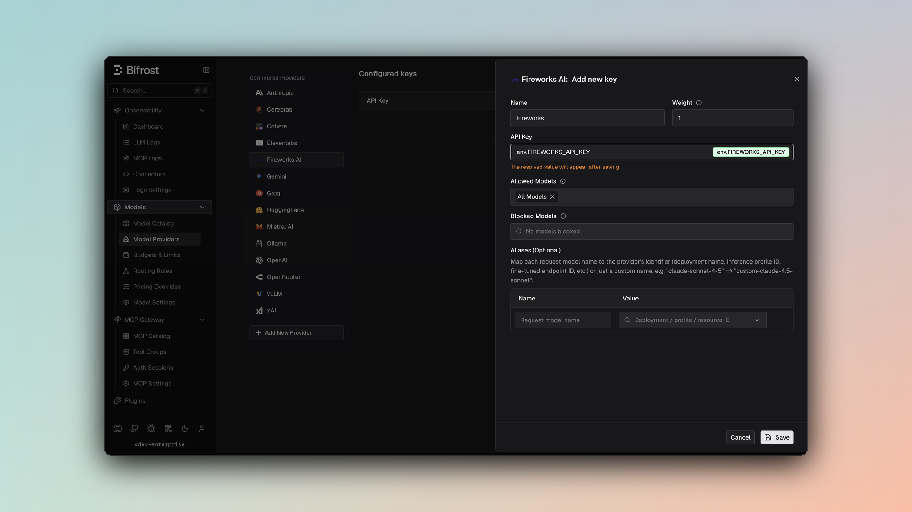

## Overview

Fireworks is an **OpenAI-compatible provider** in Bifrost with native support for:
- **Chat Completions** via `/v1/chat/completions`
- **Responses API** via `/v1/responses`
- **Text Completions** via `/v1/completions`
- **Embeddings** via `/v1/embeddings`
- **Streaming** for chat, responses, and completions
- **Tool calling** for chat and responses
- **Optional Anthropic-compatible mode** via `/v1/messages`, enabled per key or per alias with `use_anthropic_endpoints`

Unless noted below, Fireworks follows the standard OpenAI-compatible request and response behavior described in [OpenAI](./openai).

### Supported Operations

| Operation | Non-Streaming | Streaming | Endpoint (default) | Endpoint (`use_anthropic_endpoints: true`) |
|-----------|---------------|-----------|--------------------|--------------------------------------------|
| Chat Completions | ✅ | ✅ | `/v1/chat/completions` | `/v1/messages` |
| Responses API | ✅ | ✅ | `/v1/responses` | `/v1/messages` |
| Text Completions | ✅ | ✅ | `/v1/completions` | `/v1/completions` (unaffected) |
| Embeddings | ✅ | ❌ | `/v1/embeddings` | `/v1/embeddings` (unaffected) |
| List Models | ✅ | - | `/v1/models` | `/v1/models` (unaffected) |
| Images | ❌ | ❌ | - | - |
| Speech / Transcription | ❌ | ❌ | - | - |
| Files | ❌ | ❌ | - | - |
| Batch | ❌ | ❌ | - | - |
| Count Tokens | ❌ | ❌ | - | - |

<Note>
By default, Fireworks Responses support is **native** in Bifrost. Requests are sent to Fireworks’ `/v1/responses` endpoint directly, so fields such as `previous_response_id`, `max_tool_calls`, and `store` are preserved. With `use_anthropic_endpoints` on, Responses are converted to the Anthropic Messages format instead, and those Responses-only fields do not apply.
</Note>

## Setup & Configuration

Configure Fireworks as a provider.

<Tabs>
<Tab title="Web UI">



1. Navigate to **Models** > **Model Providers**. Look for **Fireworks** under **Configured Providers**. If it is missing, click on **Add New Provider** and select **Fireworks**.
2. Click **Add Key** or edit an existing key.
3. Set a name for your key.
4. Paste your API key directly or use an environment variable (for example, `env.FIREWORKS_API_KEY`).
5. Set **Allowed Models** to **All Models** (default) or the specific model allowlist you want this key to serve.
6. Save the provider configuration.

</Tab>
<Tab title="config.json">

```json
{
  "providers": {
    "fireworks": {
      "keys": [
        {
          "name": "fireworks-key-1",
          "value": "env.FIREWORKS_API_KEY",
          "models": [
            "*"
          ],
          "weight": 1.0
        }
      ]
    }
  }
}
```

</Tab>
<Tab title="API">
Refer to the API documentation for [Provider Keys Management](https://docs.getbifrost.ai/api-reference/providers/create-a-key-for-a-provider).
</Tab>
<Tab title="Go SDK">

```go
case schemas.Fireworks:
    return []schemas.Key{{
        Name:   "fireworks-key-1",
        Value:  *schemas.NewSecretVar("env.FIREWORKS_API_KEY"),
        Models: []string{"*"},
        Weight: 1.0,
    }}, nil
```

</Tab>
</Tabs>

---

## Anthropic-Compatible Endpoints (optional)

Fireworks exposes an Anthropic-compatible Messages endpoint (`/v1/messages`) alongside its default OpenAI-compatible APIs. Setting `use_anthropic_endpoints` routes Chat Completions and the Responses API through that endpoint instead. Text Completions and Embeddings are unaffected and always use their OpenAI-compatible endpoints.

Authentication does not change between the two modes: Bifrost sends `Authorization: Bearer <key>` either way.

The setting can be configured per key, and overridden per model alias:

- **Key-level** - Sets the default endpoint mode for every request made with that key.
- **Alias-level** - Overrides the key-level default for a single alias, so one key can serve some aliases through the OpenAI-compatible endpoints and others through the Anthropic-compatible endpoint.

If neither is set, requests fall back to Fireworks' OpenAI-compatible endpoints.

<Tabs>
<Tab title="Web UI">

On the key form, toggle **Use Anthropic Endpoints** (off by default). To override this for a specific alias, open that alias's expanded row in the deployments table and toggle **Use Anthropic endpoints** under **Fireworks overrides**, which takes priority over the key-level setting for that alias only.

</Tab>
<Tab title="API">
The `use_anthropic_endpoints` boolean is part of the same key payload used by [Provider Keys Management](https://docs.getbifrost.ai/api-reference/providers/create-a-key-for-a-provider), and the alias payload for that key's `models` entries.
</Tab>
<Tab title="config.json">

```json
{
  "providers": {
    "fireworks": {
      "keys": [
        {
          "name": "fireworks-key-1",
          "value": "env.FIREWORKS_API_KEY",
          "models": [
            "*"
          ],
          "weight": 1.0,
          "use_anthropic_endpoints": true
        }
      ]
    }
  }
}
```

To override this per-alias (for example, on a virtual key's model config), set `use_anthropic_endpoints` alongside the alias's `model_id`:

```json
{
  "model_id": "accounts/fireworks/models/deepseek-v3p2",
  "use_anthropic_endpoints": false
}
```

| Field | Type | Required | Description |
|-------|------|----------|--------------|
| `use_anthropic_endpoints` | boolean | No | Routes chat completions and responses requests through Anthropic-compatible endpoints. Default: `false`. |

</Tab>
</Tabs>

<Warning>
Anthropic's server and client tools (`web_search`, `web_fetch`, `code_execution`, `computer`, `bash`, `memory`, `text_editor`, `tool_search`, `mcp_toolset`) run on Anthropic-operated infrastructure and do not exist on this endpoint. Bifrost drops them from the request rather than letting Fireworks reject the whole call. Your own function tools are never affected.

This matters most for clients that enable a built-in web search by default. Codex is one: forwarding its `web_search` tool made Fireworks answer `tools: server-side web search ("web_search_20250305") is not supported on this endpoint`.
</Warning>

---

# 1. Chat Completions

Fireworks chat completions use the standard OpenAI-compatible wire format.

## Fireworks-specific handling

- `prediction` is preserved and forwarded.
- Bifrost maps `prompt_cache_key` to Fireworks `prompt_cache_isolation_key` for chat-completion cache isolation.
- Assistant `reasoning_content` is preserved for Fireworks chat-completion models that support reasoning history.

## Filtered Parameters

For Fireworks chat completions, Bifrost removes or rewrites a small set of OpenAI-specific fields before sending the request upstream:

- `prompt_cache_key` is mapped to Fireworks `prompt_cache_isolation_key`
- `prompt_cache_retention` is removed
- `verbosity` is removed
- `store` is removed
- `web_search_options` is removed

## Example

```bash
curl -X POST http://localhost:8080/v1/chat/completions \
  -H "Content-Type: application/json" \
  -d '{
    "model": "fireworks/accounts/fireworks/models/deepseek-v3p2",
    "messages": [
      {"role": "user", "content": "Reply with exactly: fireworks ok"}
    ]
  }'
```

---

# 2. Responses API

Fireworks Responses use the native Fireworks endpoint:

```text
/v1/responses
```

This preserves Responses-only fields and semantics, including:
- `previous_response_id`
- `max_tool_calls`
- `store`
- native responses streaming

With `use_anthropic_endpoints` enabled on the key or alias, Responses are converted to the Anthropic Messages format and sent to `/v1/messages` instead. See [Anthropic-Compatible Endpoints](#anthropic-compatible-endpoints-optional).

## Example

```bash
curl -X POST http://localhost:8080/v1/responses \
  -H "Content-Type: application/json" \
  -d '{
    "model": "fireworks/accounts/fireworks/models/deepseek-v3p2",
    "input": [
      {"role": "user", "content": "Reply with exactly: responses ok"}
    ],
    "max_tool_calls": 2
  }'
```

For continuation requests, Fireworks also supports `previous_response_id`.

---

# 3. Text Completions

Fireworks text completions are sent to the native completions endpoint:

```text
/v1/completions
```

## Example

```bash
curl -X POST http://localhost:8080/v1/completions \
  -H "Content-Type: application/json" \
  -d '{
    "model": "fireworks/accounts/fireworks/models/deepseek-v3p2",
    "prompt": "In fruits, A is for apple and B is for"
  }'
```

For Fireworks text completions, Bifrost extracts `prompt_cache_key` from `extra_params` and maps it to Fireworks `prompt_cache_isolation_key`.

---

# 4. Embeddings

Fireworks embeddings are sent to:

```text
/v1/embeddings
```

Embedding-capable models may be different from chat/completions models.

## Example

```bash
curl -X POST http://localhost:8080/v1/embeddings \
  -H "Content-Type: application/json" \
  -d '{
    "model": "fireworks/nomic-ai/nomic-embed-text-v1.5",
    "input": "embedding test"
  }'
```

Fireworks documents additional embedding-specific fields such as `prompt_template`, `return_logits`, and `normalize`. This page describes the standard embeddings flow currently covered by Bifrost.

---

# 5. Unsupported Features

The following operations are still unsupported by the Fireworks provider in Bifrost:

| Feature | Status |
|---------|--------|
| Image generation / editing / variations | ❌ |
| Speech / TTS | ❌ |
| Transcription / STT | ❌ |
| Files | ❌ |
| Batch | ❌ |
| Count tokens | ❌ |
| Rerank | ❌ |

---

# 6. Caveats

<Accordion title="Prompt Caching Semantics">
For Fireworks chat completions, Bifrost maps `prompt_cache_key` to Fireworks `prompt_cache_isolation_key`, which is the Fireworks body field for cache isolation. Fireworks also accepts the header form `x-prompt-cache-isolation-key`. For text completions, Bifrost extracts `prompt_cache_key` from `extra_params` and maps it to the same Fireworks body field. If you need Fireworks session-affinity behavior, pass `user`, configure `x-session-affinity` in provider extra headers, or send it through the HTTP gateway via `x-bf-eh-x-session-affinity`. Live cache-hit behavior remains model and deployment dependent.
</Accordion>

<Accordion title="Reasoning History">
Bifrost preserves assistant `reasoning_content` for Fireworks chat models that support reasoning history. Fireworks-specific reasoning controls such as `reasoning_history` are not given special typed handling in this provider page.
</Accordion>
