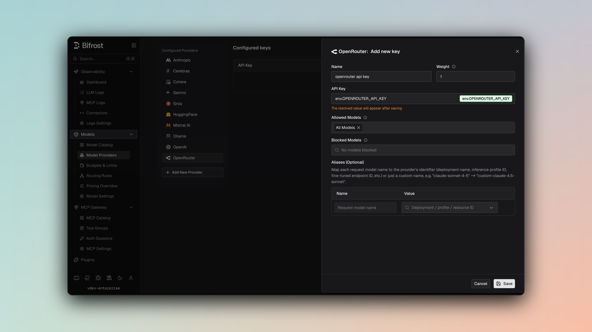

## Overview

OpenRouter is an **OpenAI-compatible provider routing service** that accesses models from multiple providers (OpenAI, Anthropic, Google, Meta, etc.) through a unified interface. Bifrost delegates to the OpenAI implementation with special handling for reasoning models. Key features:
- **Provider aggregation** - Access 100+ models from multiple vendors
- **Reasoning support** - Extended thinking for supported models
- **Parameter compatibility** - Intelligent reasoning effort conversion
- **Streaming support** - Full SSE support with usage tracking
- **Tool calling** - Complete function definition and execution

### Supported Operations

| Operation | Non-Streaming | Streaming | Endpoint |
|-----------|---------------|-----------|----------|
| Chat Completions | ✅ | ✅ | `/v1/chat/completions` |
| Responses API | ✅ | ✅ | `/v1/responses` |
| Text Completions | ✅ | ✅ | `/v1/completions` |
| List Models | ✅ | - | `/v1/models` |
| Embeddings | ✅ | - | `/v1/embeddings` |
| Speech (TTS) | ✅ | ❌ | `/v1/audio/speech` |
| Transcriptions (STT) | ✅ | ❌ | `/v1/audio/transcriptions` |
| Image Generation | ❌ | ❌ | - |
| Files | ❌ | ❌ | - |
| Batch | ❌ | ❌ | - |

<Note>
**Unsupported Operations** (❌): Image Generation, Files, Batch, and streaming Speech/Transcriptions are not supported by the upstream OpenRouter API. These return a `BifrostError` with an error code of `"unsupported_operation"`.

**Note**: OpenRouter's Responses API is currently in **beta**.
</Note>

## Setup & Configuration

Configure OpenRouter as a provider.

<Tabs>
<Tab title="Web UI">



1. Navigate to **Models** > **Model Providers**. Look for **OpenRouter** under **Configured Providers**. If it is missing, click on **Add New Provider** and select **OpenRouter**.
2. Click **Add Key** or edit an existing key.
3. Set a name for your key.
4. Paste your API key directly or use an environment variable (for example, `env.OPENROUTER_API_KEY`).
5. Set **Allowed Models** to **All Models** (default) or the specific model allowlist you want this key to serve.
6. Save the provider configuration.

</Tab>
<Tab title="config.json">

```json
{
  "providers": {
    "openrouter": {
      "keys": [
        {
          "name": "openrouter-key-1",
          "value": "env.OPENROUTER_API_KEY",
          "models": [
            "*"
          ],
          "weight": 1.0
        }
      ]
    }
  }
}
```

</Tab>
<Tab title="API">
Refer to the API documentation for [Provider Keys Management](https://docs.getbifrost.ai/api-reference/providers/create-a-key-for-a-provider).
</Tab>
<Tab title="Go SDK">

```go
case schemas.OpenRouter:
    return []schemas.Key{{
        Name:   "openrouter-key-1",
        Value:  *schemas.NewSecretVar("env.OPENROUTER_API_KEY"),
        Models: []string{"*"},
        Weight: 1.0,
    }}, nil
```

</Tab>
</Tabs>

OpenRouter key validation uses `/v1/auth/key` when provider key validation is enabled.

---

# 1. Chat Completions

## Request Parameters

OpenRouter supports all standard OpenAI chat completion parameters. For full parameter reference and behavior, see [OpenAI Chat Completions](/providers/supported-providers/openai#1-chat-completions).

### Reasoning Parameter Handling

OpenRouter supports extended thinking on compatible models:

```json
// Bifrost request
{
  "reasoning": {
    "effort": "high",
    "max_tokens": 10000
  }
}

// OpenRouter conversion
{
  "reasoning_effort": "high"
}
```

**Reasoning Models:** gpt-oss-120b and compatible models with special handling for reasoning content.

### Prompt Caching

Bifrost forwards Anthropic-style cache breakpoints to OpenRouter, but the two API
surfaces take them in different shapes. Bifrost translates automatically, so you
send `cache_control` either way.

**Chat Completions** accepts per-block `cache_control` directly, and Bifrost
passes it through unchanged:

```json
{
  "messages": [{
    "role": "user",
    "content": [{
      "type": "text",
      "text": "<REUSABLE_PREFIX>",
      "cache_control": {"type": "ephemeral"}
    }]
  }]
}
```

**Responses** does not expose per-block `cache_control`. Bifrost converts each
marked `input_text` block into the `prompt_cache_breakpoint` that OpenRouter
turns back into an Anthropic breakpoint:

```json
// You send
{"input": [{"role": "user", "content": [
  {"type": "input_text", "text": "<REUSABLE_PREFIX>",
   "cache_control": {"type": "ephemeral"}}
]}]}

// Bifrost sends to OpenRouter
{"input": [{"role": "user", "content": [
  {"type": "input_text", "text": "<REUSABLE_PREFIX>",
   "prompt_cache_breakpoint": {"mode": "explicit"}}
]}]}
```

<Note>
Anthropic accepts at most **four** cache breakpoints per request and rejects a
fifth outright. On the Responses path Bifrost limits only the markers it
**converts** from `cache_control`, and only to the capacity your own
`prompt_cache_breakpoint` values leave free. When it has to trim, it drops the
**earliest** converted markers, because caching is cumulative and a later
breakpoint anchors a longer prefix.

Breakpoints you set yourself are never modified or dropped. If you supply four or
more of them, Bifrost converts nothing further; if you supply more than four, they
are forwarded as written and OpenRouter's upstream will reject the request.
</Note>

<Note>
A converted breakpoint carries no TTL. OpenRouter turns `prompt_cache_breakpoint`
into a **default** Anthropic breakpoint, so `{"type": "ephemeral", "ttl": "1h"}`
caches for the default 5 minutes on the Responses path. Use Chat Completions,
which forwards `cache_control` verbatim, when you need the 1-hour TTL.

Only `"type": "ephemeral"` is converted. It is the sole cache type Anthropic
defines, so a `cache_control` carrying any other value is dropped rather than
turned into a breakpoint.
</Note>

Two markers have no Responses representation and are still dropped: `cache_control`
on tool definitions (OpenRouter documents no tool-level Responses breakpoint) and on
`function_call_output` blocks (a text-only output array is collapsed to a single
string before it reaches the wire). Put your breakpoints on `input_text` blocks.

Verify caching worked by reading `cached_tokens` in the response usage. A `200`
alone does not mean the cache was hit.

Bifrost can also add the marker for clients that send none, which is what makes this
work for agentic tools that emit no cache directives at all. See
[Prompt caching](/features/prompt-caching).

See [OpenRouter prompt caching](https://openrouter.ai/docs/features/prompt-caching#anthropic-claude)
for the upstream contract.

### Filtered Parameters

Removed for OpenRouter compatibility:
- `verbosity` - Anthropic-specific
- `store` - Not supported
- `service_tier` - OpenAI-specific

`prompt_cache_key` is forwarded on the Responses path, and on Chat Completions
only when the model's datasheet marks it supported. Either way it is not a
caching switch: OpenRouter uses it as a sticky-routing key, so it does not enable
Anthropic prompt caching on its own. Use a cache breakpoint for that.

OpenRouter supports all standard OpenAI message types, tools, responses, and streaming formats. For details on message handling, tool conversion, responses, and streaming, refer to [OpenAI Chat Completions](/providers/supported-providers/openai#1-chat-completions).

---

# 2. Responses API

OpenRouter's Responses API is handled as a distinct endpoint at `/v1/responses`. This API is currently in **beta** on OpenRouter.

Same parameter support as Chat Completions, with requests forwarded directly to the Responses API endpoint without conversion to Chat Completions.

**Special Message Handling (gpt-oss vs other models):**
For details on how reasoning is handled differently between gpt-oss and other models, see [OpenAI Responses API documentation](/providers/supported-providers/openai) for the comprehensive explanation of reasoning conversion (summaries vs. content blocks).

---

# 3. Text Completions

OpenRouter supports legacy text completion format:

| Parameter | Mapping |
|-----------|---------|
| `prompt` | Direct pass-through |
| `max_tokens` | max_tokens |
| `temperature`, `top_p` | Direct pass-through |
| `stop` | Stop sequences |

---

# 4. List Models

Lists 100+ models available through OpenRouter, including:
- OpenAI (GPT-4, GPT-4 Turbo, etc.)
- Anthropic (Claude 3 family)
- Google (Gemini)
- Meta (Llama)
- Mistral
- And many more

---

# 5. Embeddings

OpenRouter supports embeddings through their OpenAI-compatible API. This allows you to generate vector embeddings for text using models from various providers.

| Parameter | Mapping |
|-----------|---------|
| `input` | Direct pass-through (string or array of strings) |
| `model` | Model ID (e.g., `cohere/embed-multilingual-v3.0`, `amazon/amazon-embeddings-v2`) |
| `dimensions` | Number of dimensions for the output embedding |
| `encoding_format` | Output format (`float` or `base64`) |

**Supported Models:** OpenRouter supports various embedding models including:
- Cohere (embed-multilingual-v3.0, embed-english-v3.0, etc.)
- Amazon (amazon-embeddings-v2)
- And other providers

The embedding request/response follows the standard OpenAI format.

---

## Speech (TTS) & Transcription (STT)

<Info>Speech and Transcription support for OpenRouter is available in **Bifrost v2.0.0 and above**.</Info>

OpenRouter exposes OpenAI-compatible audio endpoints, so Bifrost routes Speech and Transcription requests the same way it does for OpenAI: `/v1/audio/speech` for text-to-speech and `/v1/audio/transcriptions` for speech-to-text.

| Parameter | Mapping |
|-----------|---------|
| `model` | TTS/STT model ID (e.g., `openai/gpt-4o-mini-tts`, `openai/whisper-1`) |
| `voice` | Required for Speech; voice availability depends on the underlying model |
| `response_format` | Speech: `mp3` or `pcm` (`pcm` if omitted). Transcription: `json` (default) or `verbose_json` |
| `speed` | Optional playback speed multiplier for Speech (provider-dependent) |
| `language` | Optional ISO-639-1 code for Transcription; auto-detected if omitted |

Streaming Speech and Transcription are not supported by the upstream OpenRouter API and return a `BifrostError` with `"unsupported_operation"`.

---

## Unsupported Features

| Feature | Reason |
|---------|--------|
| Image Generation | Not offered by OpenRouter API |
| Streaming Speech/TTS | Not offered by OpenRouter API |
| Streaming Transcription/STT | Not offered by OpenRouter API |
| Batch Operations | Not offered by OpenRouter API |
| File Management | Not offered by OpenRouter API |

---

## Caveats

<Accordion title="Cache Control Stripped">
**Severity**: Medium
**Behavior**: Anthropic cache control directives are removed
**Impact**: Prompt caching features unavailable
**Code**: Stripped during JSON marshaling
</Accordion>

<Accordion title="Parameter Filtering">
**Severity**: Low
**Behavior**: OpenAI-specific parameters filtered
**Impact**: prompt_cache_key, verbosity, store removed
**Code**: filterOpenAISpecificParameters
</Accordion>

<Accordion title="User Field Size Limit">
**Severity**: Low
**Behavior**: User field > 64 characters silently dropped
**Impact**: Longer user identifiers are lost
**Code**: SanitizeUserField enforces 64-char max
</Accordion>
