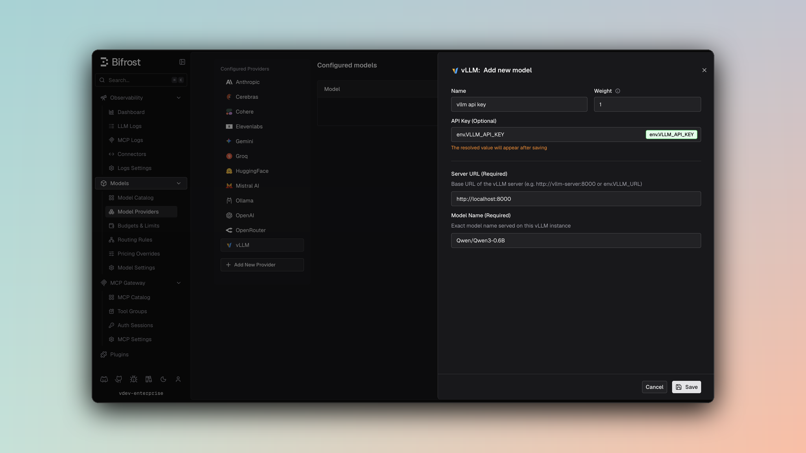

## Overview

vLLM is a self-hosted inference provider with OpenAI- and Anthropic-compatible API surfaces. Bifrost uses the OpenAI-compatible endpoints by default and can route Chat Completions and Responses requests through vLLM's Anthropic-compatible Messages endpoint per key or model alias. Key characteristics:
- **Native Responses API** - Bifrost sends Responses requests directly to `/v1/responses`; it does not translate them to Chat Completions
- **Optional Anthropic-compatible mode** - Set `use_anthropic_endpoints` to route Chat Completions and Responses through `/v1/messages`
- **OpenAI compatibility** - Chat and text completions, embeddings, rerank, transcription, and streaming
- **Self-hosted** - Typically runs at `http://localhost:8000` or your own server
- **Optional authentication** - API key often omitted for local instances

### Supported Operations

| Operation | Non-Streaming | Streaming | Default endpoint | `use_anthropic_endpoints: true` |
|-----------|---------------|-----------|------------------|---------------------------------|
| Chat Completions | ✅ | ✅ | `/v1/chat/completions` | `/v1/messages` |
| Responses API | ✅ | ✅ | `/v1/responses` | `/v1/messages` |
| Text Completions | ✅ | ✅ | `/v1/completions` | Unchanged |
| Embeddings | ✅ | - | `/v1/embeddings` | Unchanged |
| Rerank | ✅ | - | `/v1/rerank` (fallback: `/rerank`) | Unchanged |
| Transcriptions (STT) | ✅ | ✅ | `/v1/audio/transcriptions` | Unchanged |
| Count Tokens | ✅ | - | `/v1/messages/count_tokens` | Same endpoint |
| List Models | ✅ | - | `/v1/models` | Unchanged |
| Image operations | ❌ | ❌ | - | - |
| Speech (TTS) | ❌ | ❌ | - | - |
| OCR | ❌ | - | - | - |
| Video operations | ❌ | - | - | - |
| Files, Batch, Containers, Compaction, Passthrough | ❌ | ❌ | - | - |

<Note>
**Unsupported Operations** (❌) return `UnsupportedOperationError`. Upstream capabilities vary by vLLM version and loaded model; in particular, the server must expose the selected OpenAI- or Anthropic-compatible endpoint.
</Note>

---

## Setup & Configuration

Configure vLLM as a provider.

<Tabs>
<Tab title="Web UI">



1. Navigate to **Models** > **Model Providers**. Look for **vLLM** under **Configured Providers**. If it is missing, click on **Add New Provider** and select **vLLM**.
2. Click **Add New Model** or edit an existing key.
3. Set a name for your key.
4. Leave **API Key** blank for local servers. If your endpoint requires auth, paste a bearer token directly or use an environment variable.
5. Set **vLLM URL** to `http://localhost:8000` and **Model Name** to the exact model loaded by the server.
6. Leave **Use Anthropic Endpoints** off to use vLLM's OpenAI-compatible endpoints. Enable it only when the server exposes `/v1/messages` and you want Chat Completions and Responses routed through that endpoint.
7. Set **Allowed Models** to **All Models** (default) or the specific model allowlist you want this key to serve.
8. Save the provider configuration.

</Tab>
<Tab title="config.json">

```json
{
  "providers": {
    "vllm": {
      "keys": [
        {
          "name": "vllm-local",
          "value": "",
          "models": [
            "meta-llama/Llama-3.2-1B-Instruct"
          ],
          "weight": 1.0,
          "vllm_key_config": {
            "url": "http://localhost:8000",
            "model_name": "meta-llama/Llama-3.2-1B-Instruct"
          },
          "use_anthropic_endpoints": false
        }
      ]
    }
  }
}
```

</Tab>
<Tab title="API">
Refer to the API documentation for [Provider Keys Management](https://docs.getbifrost.ai/api-reference/providers/create-a-key-for-a-provider).
</Tab>
<Tab title="Go SDK">

```go
case schemas.VLLM:
    return []schemas.Key{{
        Name:   "vllm-local",
        Value:  *schemas.NewSecretVar(""),
        Models: []string{"meta-llama/Llama-3.2-1B-Instruct"},
        Weight: 1.0,
        VLLMKeyConfig: &schemas.VLLMKeyConfig{
            URL:       *schemas.NewSecretVar("http://localhost:8000"),
            ModelName: "meta-llama/Llama-3.2-1B-Instruct",
        },
        UseAnthropicEndpoints: schemas.Ptr(false),
    }}, nil
```

</Tab>
</Tabs>

---

## Endpoint Mode

`use_anthropic_endpoints` affects only Chat Completions and the Responses API:

- **Key-level** - Sets the default for requests using that key.
- **Alias-level** - Overrides the key-level value for a specific model alias.
- **Default** - `false`; requests use vLLM's OpenAI-compatible endpoints.

The alias-level setting takes precedence when both are present. Count Tokens always uses `/v1/messages/count_tokens`, regardless of this setting.

<Note>
Authentication remains `Authorization: Bearer <key>` in both modes. Bifrost omits the header when the key value is empty.
</Note>

---

## Getting started

1. Run a vLLM server (Docker or pip). Example with Docker:
   ```bash
   docker run --gpus all -p 8000:8000 vllm/vllm-openai:latest --model meta-llama/Llama-3.2-1B-Instruct
   ```
2. Verify the server:
   ```bash
   curl http://localhost:8000/v1/models
   ```
3. Use Bifrost with model prefix `vllm/<model_id>` (e.g. `vllm/meta-llama/Llama-3.2-1B-Instruct`).

---

# 1. Chat Completions

By default, vLLM supports standard OpenAI chat completion parameters on `/v1/chat/completions`. For the full parameter reference, see [OpenAI Chat Completions](/providers/supported-providers/openai#1-chat-completions). Message types, tools, extra parameters, and streaming follow the shared OpenAI-compatible behavior.

With `use_anthropic_endpoints: true`, Bifrost builds an Anthropic Messages request and sends it to `/v1/messages`. For request conversion behavior, see [Anthropic Chat Completions](/providers/supported-providers/anthropic#1-chat-completions).

---

# 2. Responses API

Bifrost uses vLLM's native Responses endpoint by default for both non-streaming and streaming requests:

```
BifrostResponsesRequest
  → OpenAI Responses request
  → POST /v1/responses
  → ToBifrostResponsesResponse()
```

With `use_anthropic_endpoints: true`, Bifrost instead converts the request to Anthropic Messages format, sends it to `/v1/messages`, and converts the result to a Bifrost Responses response.

<Warning>
Bifrost does not automatically retry Responses requests through `/v1/chat/completions`. An older vLLM deployment without `/v1/responses` must be upgraded, or configured with `use_anthropic_endpoints: true` if it exposes `/v1/messages`.
</Warning>

---

# 3. Text Completions

| Parameter | Mapping |
|-----------|---------|
| `prompt` | Sent as-is |
| `max_tokens` | max_tokens |
| `temperature` | temperature |
| `top_p` | top_p |
| `stop` | stop sequences |

---

# 4. Embeddings

vLLM supports `/v1/embeddings`. Use model IDs exposed by your vLLM server (e.g. `BAAI/bge-m3`).

---

# 5. List Models

Lists models from your vLLM instance via `/v1/models`. Available models depend on what is loaded on the server.

---

# 6. Rerank

vLLM supports reranking for pooling/cross-encoder reranker models. Bifrost sends requests to `/v1/rerank` and automatically falls back to `/rerank` when required by your vLLM deployment.

```bash
curl -X POST http://localhost:8080/v1/rerank \
  -H "Content-Type: application/json" \
  -d '{
    "model": "vllm/BAAI/bge-reranker-v2-m3",
    "query": "What is machine learning?",
    "documents": [
      {"text": "Machine learning is a subset of AI."},
      {"text": "Python is a programming language."},
      {"text": "Deep learning uses neural networks."}
    ],
    "params": {
      "return_documents": true
    }
  }'
```

<Note>
Your upstream vLLM server must be started with a rerank-capable model (pooling/cross-encoder task support).
</Note>

---

# 7. Transcriptions

vLLM supports non-streaming and streaming transcription requests through `/v1/audio/transcriptions`. Bifrost sends multipart form data in the OpenAI-compatible format; streaming requests set `stream: true` and consume SSE transcription events.

---

# 8. Count Tokens

Count Tokens uses vLLM's Anthropic-compatible `/v1/messages/count_tokens` endpoint. This route is independent of `use_anthropic_endpoints`, so the upstream vLLM server must expose it even when Chat Completions and Responses use the default OpenAI-compatible endpoints.

---

## Caveats

<Accordion title="Per-key BaseURL Required">
**Severity**: High
**Behavior**: vLLM resolves request routing from `vllm_key_config.url`.
**Impact**: Requests fail without `vllm_key_config.url`, even if a provider-level `network_config.base_url` is present.
</Accordion>

<Accordion title="Error responses with HTTP 200">
**Severity**: Low  
**Behavior**: vLLM may return HTTP 200 with an error payload (e.g. `{"error": {"code": 404, "message": "..."}}`) instead of 4xx/5xx.  
**Impact**: Bifrost normalizes these into standard error responses so clients see consistent error handling.  
</Accordion>
